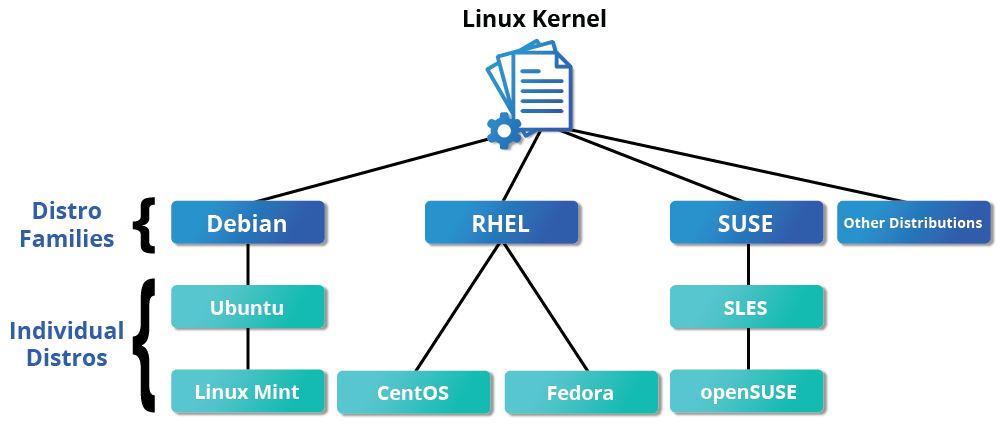
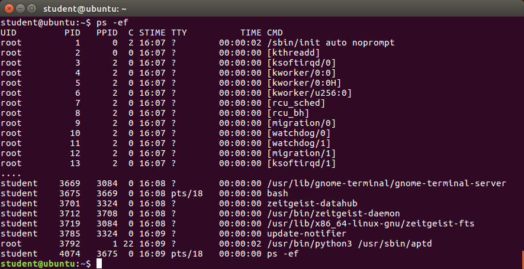

# Introduction to Linux

## 1 - The Linux Foundation

### Introduction to the Linux Foundation

The Linux Foundation is a non-profit consortium that promotes, protects, and advances Linux and collaborative development. It provides a neutral forum for collaboration and education by hosting collaborative projects, organizing events, and providing training and certification programs.


### Linux Distribution Families

A Linux distribution is a collection of software that includes the Linux kernel and additional software such as system libraries, tools, and applications. There are many different Linux distributions, each with its own unique features and characteristics. Some of the most popular Linux distribution families include:

- Debian: Known for its stability and package management system (Ubuntu, Linux Mint)
- Red Hat: Known for its enterprise features and support (Fedora, CentOS)
- Arch: Known for its simplicity and customization options (Arch Linux, Manjaro)
- SUSE: Known for its focus on enterprise and open-source software (openSUSE, SUSE Linux Enterprise)



### The Red Hat Family

Red Hat Enterprise Linux (RHEL) heads the family that includes CentOS, CentOS Stream, Fedora and Oracle Linux.

Fedora has a close relationship with RHEL and contains significantly more software than Red Hat's enterprise version. One reason for this is that a diverse community is involved in building Fedora, with many contributors who do not work for Red Hat. Furthermore, it is used as a testing platform for future RHEL releases.

We will use CentOS Stream and CentOS more often for activities, demonstrations, and labs because there is no cost to the end user, and there is a longer release cycle than for Fedora (which releases a new version every six months or so).

The basic version of CentOS is also virtually identical to RHEL, the most popular Linux distribution in enterprise environments. However, CentOS 8 has no scheduled updates after 2021. The replacement is CentOS 8 Stream. The difference between the two versions is CentOS Stream gets updates before RHEL, while CentOS gets them after. For most purposes this matters very little and not at all for this course. While there are alternatives to CentOS Stream that look more like the older CentOS, for this course we find CentOS 8 Stream works just fine.

Some of the key facts about the Red Hat distribution family are:

- Fedora serves as an upstream testing platform for RHEL.
- CentOS is a close clone of RHEL; in fact, CentOS has been part of Red Hat since 2014.
- A heavily patched version 4.18 kernel is used in RHEL/CentOS 8 Stream, while version 5.14 is used in RHEL/CentOS 9 Stream.
- It supports multiple hardware platforms.
- It uses dnf, the RPM-based package manager (covered in detail later) to install, update, and remove packages in the system.
- RHEL is widely used by enterprises which host their own systems.

### The SUSE Family

The relationship between SUSE (SUSE Linux Enterprise Server, or SLES) and openSUSE is similar to the one described between RHEL, CentOS, and Fedora.

We use openSUSE as the reference distribution for the SUSE family, as it is available to end users at no cost. Because the two products are extremely similar, the material that covers openSUSE can typically be applied to SLES with few problems.

Some of the key facts about the SUSE distribution family are:

- SUSE Linux Enterprise Server (SLES) is upstream for openSUSE.
- Kernel version 5.14 is used in openSUSE Leap 15.4.
- It uses the RPM-based zypper package manager (we cover it in detail later) to install, update, and remove packages in the system.
- It includes the YaST (Yet Another Setup Tool) application for system administration purposes.
- SLES is widely used in retail and many other sectors.

### The Debian Family

The Debian distribution is upstream for several other distributions, including Ubuntu. In turn, Ubuntu is upstream for Linux Mint and a number of other distributions. It is commonly used on both servers and desktop computers. Debian is a pure open source community project (not owned by any corporation) and has a strong focus on stability.

Debian provides by far the largest and most complete software repository to its users of any Linux distribution.

Ubuntu aims at providing a good compromise between long term stability and ease of use. Since Ubuntu gets most of its packages from Debian’s stable branch, it also has access to a very large software repository. For those reasons, we will use Ubuntu LTS (Long Term Support) as the reference to Debian family distributions for this course.

Some key facts about the Debian family are listed below:

- The Debian family is upstream for Ubuntu, and Ubuntu is upstream for Linux Mint and others.
- Kernel version 5.19 is used in Ubuntu 22.04 LTS.
- It uses the DPKG-based APT package manager (using apt, apt-get, apt-cache, etc., which we cover in detail later) to install, update, and remove packages in the system.
- Ubuntu has been widely used for cloud deployments.
- While Ubuntu is built on top of Debian and is GNOME-based under the hood, it differs visually from the interface on standard Debian, as well as other distributions.

## 2 - Linux philosophy and concepts

### Linux History

Linux is an open source computer operating system, initially developed on and for Intel x86-based personal computers. It has been subsequently ported to an astoundingly long list of other hardware platforms, from tiny embedded appliances to the world's largest supercomputers.

In this section, we follow the surprising history of how Linux evolved from a project of one Finnish college student, into a massive effort with an enormous impact on today's world.

Linus Torvalds was a student in Helsinki, Finland, in 1991, when he started a project: writing his own operating system kernel. He also collected together and/or developed the other essential ingredients required to construct an entire operating system with his kernel at the center. It wasn't long before this became known as the Linux kernel.

In 1992, Linux was re-licensed using the General Public License (GPL) by GNU (a project of the Free Software Foundation or FSF, which promotes freely available software), which enabled it to build a worldwide community of developers. By combining the kernel with other system components from the GNU project, numerous other developers created complete systems called Linux Distributions, which first appeared in the mid-90s.

The Linux distributions created in the mid-90s provided the basis for fully free (in the sense of freedom, not zero cost) computing and became a driving force in the open source software movement. In 1998, major companies like IBM and Oracle announced their support for the Linux platform and began major development efforts as well.

Today, Linux powers more than half of the servers on the Internet, the majority of smartphones (via the Android system, which is built on top of Linux), more than 90 percent of the public cloud workload, and all of the world’s most powerful supercomputers.


### Linux Philosophy

Every successful project or organization needs an implicit or explicit philosophy that frames its objectives and projects its growth path. This section contains a description of the philosophy adopted by the Linux community and how it has impacted Linux's amazing evolution.

Linux is constantly enhanced and maintained by a network of developers from all over the world collaborating over the Internet, with Linus Torvalds at the head. Technical skills, a desire to contribute, and the ability to collaborate with others are the only qualifications for participating.

Linux borrows heavily from the well-established family of UNIX operating systems. It was written to be a free and open source alternative; at the time, UNIX was designed for computers much more powerful than PCs, and furthermore, it was quite expensive.

Files are stored in a hierarchical filesystem, with the top node of the system being the root or simply "/". Whenever possible, Linux makes its components available via files or objects that look like files. Processes, devices, and network sockets are all represented by file-like objects and can often be worked with using the same utilities used for regular files. Linux is a fully multitasking (i.e., multiple threads of execution are performed simultaneously), multiuser operating system with built-in networking and service processes known as daemons in the UNIX world.

### Linux Community

Suppose that, as part of your job, you need to configure a Linux file server, and you run into some difficulties. If you are not able to figure out the answer yourself or get help from a co-worker, the Linux community might just save the day!

There are many ways to engage with the Linux community, even if you are not a developer:

- Post queries on relevant discussion forums.
- Subscribe to discussion threads.
- Join local Linux groups that meet in your area.

The Linux community is a far-reaching ecosystem consisting of developers, system administrators, users, and vendors who use many different forums to connect with one another. Among the most popular are:

- Internet Relay Chat (IRC) software (such as WeeChat, HexChat, Pidgin, and XChat)
- Online communities and discussion boards including Linux User Groups (both local and online)
- Many collaborative projects hosted on services such as GitHub and GitLab
- Newsgroups and mailing lists, including the Linux Kernel Mailing List
- Community events, e.g., Hackathons, Install Fests, Open Source Summits Embedded Linux Conferences, and many other conferences and get-togethers.

A portal to one of the most powerful online user communities can be found at linux.com. This site is hosted by The Linux Foundation and serves over one million unique visitors every month.

### Linux Distributions

So, what is a Linux distribution, and how does it relate to the Linux kernel?

The Linux kernel is the core of the operating system. A full Linux distribution consists of the kernel plus a number of other software tools for file-related operations, user management, and software package management. Each of these tools provides a part of the complete system. Each tool is often its own separate project, with its own developers working to perfect that piece of the system.

While the most recent Linux kernel (and earlier versions) can always be found in the Linux Kernel Archives, Linux distributions may be based on different kernel versions. For example, the very popular RHEL 8 distribution is based on the 4.18 kernel, which is not new, but is extremely stable, while the newer RHEL 9 distribution is based on the much later 5.14 kernel. Other distributions may move more quickly in adopting the latest kernel releases. It is important to note that the kernel is not an all-or-nothing proposition. For example, RHEL/CentOS has incorporated many of the more recent kernel improvements into their customized older versions, as have Ubuntu, openSUSE, Fedora, etc.

Examples of other essential tools and ingredients provided by distributions include the C/C++ and Clang compilers, the gdb debugger, the core system libraries applications need to link with in order to run, the low-level interface for drawing graphics on the screen, as well as the higher-level desktop environment, and the system for installing and updating the various components, including the kernel itself. And all distributions come with a rather complete suite of applications already installed.


The vast variety of Linux distributions are designed to cater to many different audiences and organizations according to their specific needs and tastes. However, large organizations, such as companies and governmental institutions, and other entities, tend to choose the major commercially-supported distributions from Red Hat, SUSE, and Canonical (Ubuntu).

CentOS and CentOS Stream are popular free (as in no cost) alternatives to Red Hat Enterprise Linux (RHEL) and are often used by organizations that are comfortable operating without paid technical support. Note that new versions of CentOS disappeared at the end of 2021 in favor of CentOS Stream. However, at least two new RHEL-derived substitutes, Alma Linux and Rocky Linux, have established a healthy foothold.

The RHEL variants, such as CentOS and AlmaLinux, are designed to be binary-compatible with RHEL; i.e., in most cases, binary software packages will install properly across the distributions.

Ubuntu and Fedora are widely used by developers and are also popular in the educational realm. Many commercial distributors, including Red Hat, Ubuntu, SUSE, and Oracle, provide long-term fee-based support for their distributions, as well as hardware and software certification. All major distributors provide update services for keeping your system primed with the latest security and bug fixes and performance enhancements, as well as provide online support resources.


## 3 - Linux basics and system startup

### The Boot Process

The Linux boot process is the procedure for initializing the system. It consists of everything that happens from when the computer power is first switched on until the user interface is fully operational.

Having a good understanding of the steps in the boot process may help you with troubleshooting problems, as well as with tailoring the computer's performance to your needs.

On the other hand, the boot process can be rather technical, and you can start using Linux without knowing all the details.


#### BIOS - First step

While Linux runs on many kinds of hardware, we will concentrate on the x86 family, which is the basis of almost all desktop and laptop PCs. Starting an x86-based Linux system involves a number of steps. When the computer is powered on, the Basic Input/Output System (BIOS) initializes the hardware, including the screen and keyboard, and tests the main memory. This process is also called POST (Power On Self Test).

The BIOS software is stored on a read-only memory (ROM) chip on the motherboard. After this, the remainder of the boot process is controlled by the operating system (OS).


#### Master Boot Record (MBR), EFI Partition and Boot Loader

Once the POST is completed, system control passes from the BIOS to the boot loader. The boot loader is usually stored on one of the system’s storage devices, such as a hard disk or SSD drive, either in the boot sector (for traditional BIOS/MBR systems) or the EFI partition (for more recent (Unified) Extensible Firmware Interface or EFI/UEFI systems). Up to this stage, the machine does not access any mass storage media. Then, information on the date, time, and the most important peripherals are loaded from the CMOS values (after a technology used for the battery-powered memory store, which allows the system to keep track of the date and time even when it is powered off).

A number of boot loaders exist for Linux; the most common ones are GRUB (for GRand Unified Boot loader), ISOLINUX (for booting from removable media), and DAS U-Boot (for booting on embedded devices/appliances). Most Linux boot loaders can present a user interface for choosing alternative options for booting Linux and even other operating systems that might be installed. When booting Linux, the boot loader is responsible for loading the kernel image and the initial RAM disk or filesystem (which contains some critical files and device drivers needed to start the system) into memory.


#### Boot Loader in Action

The boot loader has two distinct stages:

For systems using the BIOS/MBR method, the boot loader resides at the first sector of the hard disk, also known as the Master Boot Record (MBR). The size of the MBR is just 512 bytes. In this stage, the boot loader examines the partition table and finds a bootable partition. Once it finds a bootable partition, it then searches for the second stage boot loader, for example GRUB, and loads it into RAM (Random Access Memory). For systems using the EFI/UEFI method, UEFI firmware reads its Boot Manager data to determine which UEFI application is to be launched and from where (i.e., from which disk and partition the EFI partition can be found). The firmware then launches the UEFI application, for example GRUB, as defined in the boot entry in the firmware's boot manager. This procedure is more complicated but more versatile than the older MBR methods.

The second stage boot loader resides under /boot. A splash screen is displayed, which allows us to choose which operating system (OS) and/or kernel to boot. After the OS and kernel are selected, the boot loader loads the kernel of the operating system into RAM and passes control to it. Kernels are almost always compressed, so the first job they have is to uncompress themself. After this, it will check and analyze the system hardware and initialize any hardware device drivers built into the kernel.

#### The initial RAM disk (initrd) or initial RAM filesystem (initramfs)

The initramfs filesystem image contains programs and binary files that perform all actions needed to mount the proper root filesystem, including providing the kernel functionality required for the specific filesystem that will be used, and loading the device drivers for mass storage controllers, by taking advantage of the udev system (for user device), which is responsible for figuring out which devices are present, locating the device drivers they need to operate properly, and loading them. After the root filesystem has been found, it is checked for errors and mounted.

The mount program instructs the operating system that a filesystem is ready for use and associates it with a particular point in the overall hierarchy of the filesystem (the mount point). If this is successful, the initramfs is cleared from RAM, and the init program on the root filesystem (/sbin/init) is executed.

init handles the mounting and pivoting over to the final real root filesystem. If special hardware drivers are needed before the mass storage can be accessed, they must be in the initramfs image.


#### Text Mode login

Near the end of the boot process, init starts a number of text-mode login prompts. These enable you to type your username, followed by your password, and to eventually get a command shell. However, if you are running a system with a graphical login interface, you will not see these at first.

The terminals which run the command shells can be accessed using the ALT key plus a function key. Most distributions start six text terminals and one graphics terminal starting with F1 or F2. Within a graphical environment, switching to a text console requires pressing CTRL-ALT + the appropriate function key (with F7 or F1 leading to the GUI).

Usually, the default command shell is bash (the GNU Bourne Again Shell), but there are a number of other advanced command shells available. The shell prints a text prompt, indicating it is ready to accept commands; after the user types the command and presses Enter, the command is executed, and another prompt is displayed after the command is done.


### Kernel, init and Services

#### The Linux Kernel

The boot loader loads both the kernel and an initial RAM–based file system (initramfs) into memory, so it can be used directly by the kernel.

When the kernel is loaded in RAM, it immediately initializes and configures the computer’s memory and also configures all the hardware attached to the system. This includes all processors, I/O subsystems, storage devices, etc. The kernel also loads some necessary user space applications.


#### /sbin/init and Services

Once the kernel has set up all its hardware and mounted the root filesystem, the kernel runs /sbin/init. This then becomes the initial process, which then starts other processes to get the system running. Most other processes on the system trace their origin ultimately to init; exceptions include the so-called kernel processes. These are started by the kernel directly, and their job is to manage internal operating system details.

Besides starting the system, init is responsible for keeping the system running and for shutting it down cleanly. One of its responsibilities is to act when necessary as a manager for all non-kernel processes; it cleans up after them upon completion, and restarts user login services as needed when users log in and out, and does the same for other background system services.

Traditionally, this process startup was done using conventions that date back to the 1980s and the System V variety of UNIX. This serial process (called SysVinit) had the system pass through a sequence of runlevels containing collections of scripts that start and stop services. Each runlevel supported a different mode of running the system. Within each runlevel, individual services could be set to run, or to be shut down if running.

However, all major distributions have moved away from this sequential method of system initialization, although they usually can emulate many System V utilities for compatibility purposes. Next, we discuss the new methods, of which systemd has become dominant.


#### Startup Alternatives

SysVinit viewed things as a serial process, divided into a series of sequential stages. Each stage required completion before the next could proceed. Thus, startup did not easily take advantage of the parallel processing that could be done with the multiple processors or cores found on modern systems.

Furthermore,  starting up and rebooting were seen as relatively rare events; exactly how long they took was not considered important. This is no longer true, especially with mobile devices and embedded Linux systems. Some modern methods, such as the use of containers, can require almost instantaneous startup times. Thus, systems now require methods with faster and enhanced capabilities. Finally, the older methods required rather complicated startup scripts, which were difficult to keep universal across distribution versions, kernel versions, architectures, and types of systems. The two main alternatives developed were:

**Upstart**

- Developed by Ubuntu and first included in 2006
- Adopted in Fedora 9 (in 2008) and in RHEL 6 and its clones

**systemd**

- Adopted by Fedora first (in 2011)
- Adopted by RHEL 7 and SUSE
- Replaced Upstart in Ubuntu 16.04

While the migration to systemd was rather controversial, it has been adopted by all major distributions, and so we will not discuss the older System V method or Upstart, which has become a dead end. Regardless of how one feels about the controversies or the technical methods of systemd, almost universal adoption has made learning how to work on Linux systems simpler, as there are fewer differences among distributions. We enumerate systemd features next.

#### systemd Features

Systems with systemd start up faster than those with earlier init methods. This is largely because it replaces a serialized set of steps with aggressive parallelization techniques, which permits multiple services to be initiated simultaneously.

Complicated startup shell scripts are replaced with simpler configuration files, which enumerate what has to be done before a service is started, how to execute service startup, and what conditions the service should indicate have been accomplished when startup is finished. One thing to note is that /sbin/init now just points to /lib/systemd/systemd; i.e. systemd takes over the init process.

One systemd command (systemctl) is used for most basic tasks. While we have not yet talked about working at the command line, here is a brief listing of its use:

- Starting, stopping, restarting a service (using httpd, the Apache web server, as an example) on a currently running system:

```bash
    sudo systemctl start|stop|restart httpd.service
```

- Enabling or disabling a system service from starting up at system boot:

```bash
    sudo systemctl enable|disable httpd.service
```

- Checking on the status of a service:

```bash
    sudo systemctl status httpd.service
```

In most cases, the .service can be omitted. There are many technical differences with older methods that lie beyond the scope of our discussion.


### Linux Filesystem Basics

#### Linux Filesystems

Libraries separate books and other media into multiple sections; this organization will depend on the subject matter, audience, media type, and frequency of retrieval. The same concept applies to a filesystem, which is the embodiment of a method of storing and organizing arbitrary collections of data in a human-usable form.

Different types of filesystems supported by Linux:

- Conventional disk filesystems: ext3, ext4, XFS, Btrfs, JFS, NTFS, vfat, exfat, etc.
- Flash storage filesystems: ubifs, jffs2, yaffs, etc.
- Database filesystems
- Special purpose filesystems: procfs, sysfs, tmpfs, squashfs, debugfs, fuse, etc.

#### Partitions and Filesystems

A partition is a  dedicated subsection of physical storage media.  Historically this meant a physically contiguous portion of a hard disk; today’s storage devices can be more complicated, but we still think of a partition as a fixed area to be treated as a whole.

A filesystem is just a method of storing and accessing files.

One can think of a partition as a container in which a filesystem resides. However, in some circumstances, a filesystem can span more than one partition if one uses symbolic links, which we will discuss much later.

Make a table comparison between filesystems in Windows and Linux.

|                              | WINDOWS                | LINUX                         |
|------------------------------|------------------------|-------------------------------|
| **Partition**                | Disk1, Disk2, etc.     | /dev/sda1, /dev/sdb1, etc.    |
| **Filesystem**               | NTFS, FAT32, exFAT     | ext3, ext4, XFS, Btrfs, etc.  |
| **Mount point**              | C:, D:, etc.           | /, /home, /var, etc.          |
| **Base folder**              | C:\                    | /                             |
| **Path separator**           | \                      | /                             |

#### Filesystem Hierarchy Standard (FHS)

Linux systems store their important files according to a standard layout called the Filesystem Hierarchy Standard (FHS), which has long been maintained by the Linux Foundation. For more information, take a look at the following document: "Filesystem Hierarchy Standard" created by LSB Workgroup. Having a standard is designed to ensure that users, administrators, and developers can move between distributions without having to re-learn how the system is organized.

Linux uses the ‘/’ character to separate paths (as sis UNIX unlike Windows, which uses ‘\’) and does not have drive letters. Multiple drives and/or partitions are mounted as directories in the single filesystem. Removable media such as USB drives and CDs, and DVDs will show up as mounted at /run/media/yourusername/disklabel for recent Linux systems or under /media for older distributions. For example, if your username is student, a USB pen drive labeled FEDORA might end up being found at /run/media/student/FEDORA, and a file README.txt on that disc would be at /run/media/student/FEDORA/README.txt.


All Linux filesystem names are case-sensitive, so /boot, /Boot, and /BOOT represent three different directories (or folders). Many distributions distinguish between core utilities needed for proper system operation and other programs, and place the latter in directories under /usr (think user). To get a sense for how the other programs are organized, find the /usr directory in the diagram from the previous page and compare the subdirectories with those that exist directly under the system root directory (/).

### Linux Distribution Installation

Determining which Linux distribution to deploy requires thoughtful planning. The figure shows some, but not all, choices. Note that many embedded Linux systems use custom-crafted contents rather than Android or Yocto.


The partition layout is best decided at the time of installation; it can be difficult to change later. While Linux systems handle multiple partitions by mounting them at specific points in the filesystem, and you can always modify the design later, it is always easier to try and get it right to begin with.


Nearly all Linux distribution installers provide a reasonable default layout, with either all space dedicated to normal files on one big partition and a smaller swap partition or with separate partitions for some space-sensitive areas like /home and /var. You may need to override the defaults and do something different if you have special needs or if you want to use more than one disk.

All installations include the bare minimum software for running a Linux distribution.

Distributions also provide options for adding categories of software. Common applications (such as the Firefox web browser and LibreOffice office suite), developer tools (like the vi and emacs text editors, which we will explore later in this course), and other popular services (such as the Apache web server tools or MySQL database) are usually included. In addition, for any system with a graphical desktop, a chosen desktop (such as GNOME or KDE) is installed by default.

Modern distributions tend to do a simple and quick install first and then let you make these choices once the system is running in at least some basic fashion. In earlier times, there were a lot of choices to make during first installation, which could be intimidating and confusing to a new user, and also make the install take a much longer time.

All installers set up some initial security features on the new system. One basic step consists of setting the password for the superuser (root) and setting up an initial user. In some cases (such as with Fedora and Ubuntu), only an initial user is set up; direct root login is not configured, and root access requires logging in first as a normal user and then using sudo, as we will describe later. Some distributions will also install more advanced security frameworks, such as SELinux or AppArmor. For example, all Red Hat-based systems, including Fedora and CentOS, always use SELinux by default, and Ubuntu comes with AppArmor up and running.

## 4 - Graphical Interface

- GNOME is a popular desktop environment and graphical user interface that runs on top of the Linux operating system.
- The default display manager for GNOME is called gdm.
- The gdm display manager presents the user with the login screen, which prompts for the login username and password.
- Logging out through the desktop environment kills all processes in your current X session and returns to the display manager login screen.
- Linux enables users to switch between logged-in sessions.
- Suspending puts the computer into sleep mode.
- For each key task, there is generally a default application installed.
- Every user created in the system will have a home directory.
- The Places menu contains entries that allow you to access different parts of the computer and the network.
- Nautilus gives three formats to view files.
- Most text editors are located in the Accessories submenu.
- Each Linux distribution comes with its own set of desktop backgrounds.
- GNOME comes with a set of different themes which can change the way your applications look.

## 5 - System Configuration

### Installing and Updating Software

Each package in a Linux distribution provides one piece of the system, such as the Linux kernel, the C compiler, utilities for manipulating text or configuring the network, or for your favorite web browsers and email clients.

Packages often depend on each other. For example, because your email client can communicate using SSL/TLS, it will depend on a package that provides the ability to encrypt and decrypt SSL and TLS communication and will not install unless that package is also installed at the same time.

All systems have a lower-level utility that handles the details of unpacking a package and putting the pieces in the right places. However, most of the time, you will be working with a higher-level utility that knows how to download and install packages directly from the Internet and can manage dependencies and groups for you.

In this section, you will learn how to install and update software in Linux using the Debian packaging system (used by systems such as Ubuntu as well) and RPM packaging systems (which are used by both Red Hat and SUSE family systems). These are the main ones in use, although others work well for other distributions which have a smaller user base, such as Archlinux and Gentoo.


**Debian Package Management**

Let’s look at the package management for the Debian family system.

dpkg is the underlying package manager for these systems. It can install, remove, and build packages. Unlike higher-level package management systems, it does not automatically download and install packages and satisfy their dependencies.

For Debian-based systems, the higher-level package management system is the Advanced Package Tool (APT) system of utilities. Generally, while each distribution within the Debian family uses APT, it creates its own user interface on top of it (for example, apt and apt-get, synaptic, gnome-software, Ubuntu Software Center, etc). Although apt repositories are generally compatible with each other, the software they contain generally is not. Therefore, most repositories target a particular distribution (like Ubuntu), and often software distributors ship with multiple repositories to support multiple distributions. Demonstrations are shown later in this section.


**Red Hat Package Manager**

Red Hat Package Manager (RPM) is the other package management system popular on Linux distributions. It was developed by Red Hat and adopted by a number of other distributions, including Fedora, CentOS, SUSE/openSUSE, Oracle Linux, and others.

The higher-level package manager differs between distributions. Red Hat family distributions historically use RHEL/CentOS, and Fedora uses dnf, while SUSE family distributions such as openSUSE also use RPM but use the zypper interface.


**OpenSUSE YaST Software Management**

The Yet another Setup Tool (YaST) software manager is similar to other graphical package managers. It is an RPM-based application. You can add, remove, or update packages using this application very easily. To access the YaST software manager:

1. Click Activities
2. In the Search box, type "YaST"
3. Click the YaST icon
4. Click Software Management

You can also find YaST by clicking on Applications > Other-YaST, which is a strange place to put it.

openSUSE’s YaST software management application is similar to the graphical package managers in other distributions. A demonstration of the YaST software manager is shown later in this section.

## 6 - Command Line

The UNIX operating system provides a set of basic commands used for performing system administration tasks. These commands are used to manage files and directories on the system and to carry out system administration tasks.

Basic commands are used to perform tasks such as:

- Navigating the file system.
- Creating, modifying, and deleting files and directories.
- Changing file and directory permissions.
- Viewing file contents.
- Compressing and decompressing files.
- Copying, moving, and renaming files and directories.
- Searching for files and directories.
- Displaying system information.

### Navigating the File System

The `pwd` command is used to display the current working directory. The working directory is the directory where the user is located when they log into the system.

```bash
pwd
```

The `cd` command is used to change directories. The `cd` command is used to move around the file system. To change to the system's root directory, use the `cd` command followed by a slash (/).

```bash
# Change to the system's root directory
cd /
```

The `ls` command is used to display the contents of a directory. The `ls` command lists the files and directories within a directory. To show hidden files and directories, use the `ls` command followed by the `-a` option.

```bash
# Display the contents of the current directory
ls
# Display the contents of the current directory, including hidden files and directories
ls -a
```


### Creating, Modifying, and Deleting Files and Directories

The `touch` command is used to create an empty file. The `touch` command creates an empty file in the current directory. If the file already exists, it updates the file's modification date.

```bash
touch file
```

The `mkdir` command is used to create a directory. The `mkdir` command creates a directory in the current directory. If the directory already exists, an error message is displayed.

```bash
mkdir directory
```

The `rm` command is used to delete a file or directory. The `rm` command deletes a file or directory in the current directory. If the file or directory does not exist, an error message is displayed.

```bash
# Delete a file
rm file
# Delete a directory
rm -r directory
```

### Changing File and Directory Permissions

The `chmod` command is used to change the permissions of a file or directory. The `chmod` command changes the permissions of a file or directory in the current directory. Permissions are specified using an octal number.

The octal number is composed of three digits, representing the permissions of the owner, the group, and other users. Each digit consists of three bits, representing read, write, and execute permissions.

```bash
# Change the permissions of a file to read and write for the owner, and read-only for the group and other users
chmod 644 file
# Change the permissions of a directory to read, write, and execute for the owner, and read and execute for the group and other users
chmod 755 directory
```

### Viewing File Contents

The `cat` command is used to display the contents of a file. The `cat` command shows the contents of a file on the standard output. If the file is very large, the `cat` command will display the file contents on the screen.

```bash
cat file
```

The `more` command is used to display file contents page by page. The `more` command shows the contents of a file page by page on the standard output. If the file is very large, the `more` command will display the file contents page by page.

```bash
more file
```

The `less` command is used to display file contents page by page. The `less` command shows the contents of a file page by page on the standard output. If the file is very large, the `less` command will display the file contents page by page.

```bash
less file
```

### Compressing and Decompressing Files

The `gzip` command is used to compress a file. The `gzip` command compresses a file in the current directory. The `gzip` command creates a compressed file with the `.gz` extension.

```bash
gzip file
```

The `gunzip` command is used to decompress a file. The `gunzip` command decompresses a file in the current directory. The `gunzip` command creates an uncompressed file without the `.gz` extension.

```bash
gunzip file.gz
```

The `tar` command is used to create a tar archive. The `tar` command creates a tar archive in the current directory. The `tar` command creates a tar archive with the specified files and directories.

```bash
tar -cvf archive.tar file1 file2 directory
```

The `tar` command is also used to extract a tar archive. The `tar` command extracts a tar archive in the current directory. The `tar` command extracts a tar archive with the specified files and directories.

```bash
tar -xvf archive.tar
```

### Copying, Moving, and Renaming Files and Directories

The `cp` command is used to copy a file or directory. The `cp` command copies a file or directory in the current directory. The `cp` command creates a copy of the file or directory with the specified name.

```bash
# Copy a file
cp file1 file2
# Copy a directory
cp -r directory1 directory2
```

The `mv` command is used to move a file or directory. The `mv` command moves a file or directory in the current directory. The `mv` command moves the file or directory with the specified name.

```bash
# Move a file
mv file1 file2
# Move a directory
mv directory1 directory2
```

The `mv` command is also used to rename a file or directory. The `mv` command renames a file or directory in the current directory. The `mv` command renames the file or directory with the specified name.

```bash
# Rename a file
mv file1 file2
# Rename a directory
mv directory1 directory2
```

### Searching for Files and Directories

The `find` command is used to search for files and directories. The `find` command searches for files and directories in the file system. The `find` command searches for files and directories that match the specified criteria.

```bash
# Search for files and directories in the current directory
find . -name file
# Search for files and directories in the current directory and subdirectories
find . -name file -type f
```

Virtual terminals (VT) in Linux are consoles, or command line terminals that use the connected monitor and keyboard.
Different Linux distributions start and stop the graphical desktop in different ways.
A terminal emulator program on the graphical desktop works by emulating a terminal within a window on the desktop.
The Linux system allows you to either log in via text terminal or remotely via the console.
When typing your password, nothing is printed to the terminal, not even a generic symbol to indicate that you typed.
The preferred method to shut down or reboot the system is to use the shutdown command.
There are two types of pathnames: absolute and relative.
An absolute pathname begins with the root directory and follows the tree, branch by branch, until it reaches the desired directory or file.
A relative pathname starts from the present working directory.
Using hard and soft (symbolic) links is extremely useful in Linux.
cd remembers where you were last, and lets you get back there with cd -.
locate performs a database search to find all file names that match a given pattern.
find locates files recursively from a given directory or set of directories.
find is able to run commands on the files that it lists, when used with the -exec option.
touch is used to set the access, change, and edit times of files, as well as to create empty files.
The Advanced Packaging Tool (apt) package management system is used to manage installed software on Debian-based systems.
You can use the dnf command-line package management utility for the RPM-based Red Hat Family Linux distributions.
The zypper package management system is based on RPM and used for openSUSE.

```bash
# Search for text within files in the current directory
grep text file
# Search for text within files in the current directory and subdirectories
grep -r text directory
```

### System Information

The `date` command is used to display the system date and time. The `date` command shows the system date and time on the standard output. The `date` command displays the date and time in the specified format.

```bash
date
```

The `who` command is used to display the users logged into the system. The `who` command shows the users logged into the system on the standard output. The `who` command displays the users logged into the system with the specified information.

```bash
who
```

The `ps` command is used to display the processes running on the system. The `ps` command shows the processes running on the system on the standard output. The `ps` command displays the processes running on the system with the specified information.

```bash
ps
```

### Redirection and Pipelines

Redirection is used to change the input and output of commands. Redirection is used to send the output of a command to a file and to send the input of a command from a file.

```bash
# Redirect the output of a command to a file
command > file
# Redirect the input of a command from a file
command < file
```

Pipelines are used to combine the output of one command with the input of another command. Pipelines are used to send the output of one command to the input of another command.

```bash
# Combine the output of one command with the input of another command
command1 | command2
```

### Locating applications

Depending on the specifics of your particular distribution's policy, programs and software packages can be installed in various directories. In general, executable programs and scripts should live in the /bin, /usr/bin, /sbin, /usr/sbin directories, or somewhere under /opt. They can also appear in /usr/local/bin and /usr/local/sbin, or in a directory in a user's account space, such as /home/student/bin.

One way to locate programs is to employ the which utility. For example, to find out exactly where the diff program resides on the filesystem:

```bash
which application
```

If which does not find the program, whereis is a good alternative because it looks for packages in a broader range of system directories:

```bash
whereis application
```

### Environment Variables

Environment variables are used to store information about the system environment. Environment variables are used to store information about the system, such as the username, working directory, and system configuration.

```bash
# Display the value of an environment variable
echo $variable
# Assign a value to an environment variable
variable=value
```

### Steps for Setting Up and Running sudo

If your system does not already have sudo set up and enabled, you need to do the following steps:

You will need to make modifications as the administrative, or superuser, root. While sudo will become the preferred method of doing this, we do not have it set up yet, so we will need to use su instead. At the command line prompt, type su and press Enter. You will then be prompted for the root password, so enter it and press Enter. You will notice that nothing is printed; this is so others cannot see the password on the screen. You should end up with a different looking prompt, often ending with ‘#’. For example:

```bash
su Password:
# 
```

Now, you need to create a configuration file to enable your user account to use sudo. Typically, this file is created in the /etc/sudoers.d/ directory with the name of the file the same as your username. For example, for this demo, let’s say your username is student. After doing step 1, you would then create the configuration file for student by doing this:

```bash
echo "student ALL=(ALL) ALL" > /etc/sudoers.d/student
```

Finally, some Linux distributions will complain if you do not also change permissions on the file by doing:

```bash
chmod 440 /etc/sudoers.d/student
```

That should be it. For the rest of this course, if you use sudo you should be properly set up. When using sudo, by default you will be prompted to give a password (your own user password) at least the first time you do it within a specified time interval. It is possible (though very insecure) to configure sudo to not require a password or change the time window in which the password does not have to be repeated with every sudo command.

### Turning off the graphical interface

If you are running a graphical interface and want to turn it off, you can do so by running the following command:

```bash
sudo systemctl stop gdm
```

This will stop the graphical interface and return you to the command line. To start the graphical interface again, run the following command:

```bash
sudo systemctl start gdm
```

### Wildcards and matching filenames

Wildcards are used to match filenames. Wildcards are used to match filenames in the file system. Wildcards are used to match filenames that contain a specified pattern.

| Wildcard | Description |
|----------|-------------|
| *        | Matches zero or more characters |
| ?        | Matches a single character |
| [ ]      | Matches a range of characters |
| [! ]     | Matches a character not in the range |

### To find and locate files

find is an extremely useful and often-used utility program in the daily life of a Linux system administrator. It recurses down the filesystem tree from any particular directory (or set of directories) and locates files that match specified conditions. The default pathname is always the present working directory.

For example, administrators sometimes scan for potentially large core files (which contain diagnostic information after a program fails) that are more than several weeks old in order to remove them.

It is also common to remove files non-essential or outdated files in /tmp (and other volatile directories, such as those under /var/cache/ containing dispensable cached files) that have not been accessed recently. Many Linux distributions use shell scripts that run periodically (through cron usually) to perform such house cleaning.

```bash
# Search for files and directories in the current directory
find . -name file
# Search for files and directories in the current directory and subdirectories
find . -name file -type f
```

The `locate` command is used to search for files and directories in the file system. The `locate` command searches for files and directories that match the specified criteria.

```bash
# Search for files and directories in the file system
locate file
```

The {} (squiggly brackets) is a placeholder that will be filled with all the file names that result from the find expression, and the preceding command will be run on each one individually.

Please note that you have to end the command with either ‘;’ (including the single-quotes) or \;. Both forms are fine.

One can also use the -ok option, which behaves the same as -exec, except that find will prompt you for permission before executing the command. This makes it a good way to test your results before blindly executing any potentially dangerous commands.


### Basic package management

The Advanced Packaging Tool (apt) is the underlying package management system that manages software on Debian-based systems. While it forms the backend for graphical package managers, such as the Ubuntu Software Center and synaptic, its native user interface is at the command line, with programs that include apt (or apt-get) and apt-cache.

dnf is the open source command-line package-management utility for the RPM-compatible Linux systems that belong to the Red Hat family.

zypper is the package management system for the SUSE/openSUSE family and is also based on RPM. zypper also allows you to manage repositories from the command line. zypper is fairly straightforward to use and closely resembles dnf.


|Operation | Debian-based | Red Hat-based | SUSE-based |
|----------|---------------|---------------|------------|
|Install package | sudo apt install package | sudo dnf install package | sudo zypper install package |
|Remove package | sudo apt remove package | sudo dnf remove package | sudo zypper remove package |
|Update package | sudo apt update package | sudo dnf update package | sudo zypper update package |
|Search package | sudo apt search package | sudo dnf search package | sudo zypper search package |
|List installed packages | dpkg -l | rpm -qa | zypper se --installed-only |
|Update entire system | sudo apt update && sudo apt upgrade | sudo dnf update | sudo zypper update |
|Show package information | apt show package | dnf info package | zypper info package |

### Summary

- Virtual terminals (VT) in Linux are consoles, or command line terminals that use the connected monitor and keyboard.
- Different Linux distributions start and stop the graphical desktop in different ways.
- A terminal emulator program on the graphical desktop works by emulating a terminal within a window on the desktop.
- The Linux system allows you to either log in via text terminal or remotely via the console.
- When typing your password, nothing is printed to the terminal, not even a generic symbol to indicate that you typed.
- The preferred method to shut down or reboot the system is to use the shutdown command.
- There are two types of pathnames: absolute and relative.
  - An absolute pathname begins with the root directory and follows the tree, branch by branch, until it reaches the desired directory or file.
  - A relative pathname starts from the present working directory.
- Using hard and soft (symbolic) links is extremely useful in Linux.
- `cd` remembers where you were last, and lets you get back there with cd -.
- `locate` performs a database search to find all file names that match a given pattern.
- `find` locates files recursively from a given directory or set of directories.
- `find` is able to run commands on the files that it lists, when used with the -exec option.
- `touch` is used to set the access, change, and edit times of files, as well as to create empty files.
- The Advanced Packaging Tool (apt) package management system is used to manage installed software on Debian-based systems.
- You can use the dnf command-line package management utility for the RPM-based Red Hat Family Linux distributions.
The zypper package management system is based on RPM and used for openSUSE.

|Command | Description | Example |
|--------|-------------|---------|
|`pwd` | Display the current working directory | `pwd` |
|`cd` | Change directories | `cd /` |
|`ls` | List files and directories | `ls` |
|`touch` | Create an empty file | `touch file` |
|`mkdir` | Create a directory | `mkdir directory` |
|`rm` | Remove a file or directory | `rm file` |
|`chmod` | Change the permissions of a file or directory | `chmod 644 file` |
|`cat` | Display the contents of a file | `cat file` |
|`more` | Display file contents page by page | `more file` |
|`less` | Display file contents page by page | `less file` |
|`gzip` | Compress a file | `gzip file` |
|`gunzip` | Decompress a file | `gunzip file.gz` |
|`tar` | Create a tar archive | `tar -cvf archive.tar file1 file2 directory` |
|`tar` | Extract a tar archive | `tar -xvf archive.tar` |
|`cp` | Copy a file or directory | `cp file1 file2` |
|`mv` | Move a file or directory | `mv file1 file2` |
|`mv` | Rename a file or directory | `mv file1 file2` |
|`find` | Search for files and directories from a directory | `find . -name file` |
|`locate` | Search for files and directories throughout a prebuilt database | `locate file` |
|`grep` | Search for text within files | `grep text file` |
|`date` | Display the system date and time | `date` |
|`who` | Display the users logged into the system | `who` |
|`ps` | Display the processes running on the system | `ps` |
|`echo` | Display the value of an environment variable | `echo $variable` |
|`variable=value` | Assign a value to an environment variable | `variable=value` |

Important Linux documentation sources include:

- The man pages (short for manual pages)
- GNU Info
- The help command and --help option
- Other documentation sources, e.g., Gentoo Handbook, Ubuntu Documentation, or Fedora Documentation.


## 7 - Processes

### Process Management

A process is simply an instance of one or more related tasks (threads) executing on your computer. It is not the same as a program or a command. A single command may actually start several processes simultaneously. Some processes are independent of each other and others are related. A failure of one process may or may not affect the others running on the system.

Processes use many system resources, such as memory, CPU (central processing unit) cycles, and peripheral devices, such as network cards, hard drives, printers, and displays. The operating system (especially the kernel) is responsible for allocating a proper share of these resources to each process and ensuring overall optimized system utilization.


A terminal window (one kind of command shell) is a process that runs as long as needed. It allows users to execute programs and access resources in an interactive environment. You can also run programs in the background, which means they become detached from the shell.

Processes can be of different types according to the task being performed.

|Process Type | Description | Example |
|-------------|-------------|---------|
| Interactive | Need to be started by a user, either at a command line or through a graphical interface such as an icon or a menu selection.| bash, firefox, Slack |
| Batch | Automatic processes which are scheduled from and then disconnected from the terminal. These tasks are queued and work on a FIFO (First-In, First-Out) basis. | updatedb, backup scripts |
| Daemons | Server processes that run continuously. Many are launched during system startup and then wait for a user or system request indicating that their service is required | httpd, sshd, cupsd |
| Threads | Lightweight processes. These are tasks that run under the umbrella of a main process, sharing memory and other resources, but are scheduled and run by the system on an individual basis. An individual thread can end without terminating the whole process and a process can create new threads at any time. Many non-trivial programs are multi-threaded. | dconf-service, gnome-terminal-server |
| Kernel Threads | Kernel tasks that users neither start nor terminate and have little control over. These may perform actions like moving a thread from one CPU to another, or making sure input/output operations to disk are completed.| kthreadd, migration, ksoftirqd |

### Process States

A critical kernel function called the scheduler constantly shifts processes on and off the CPU, sharing time according to relative priority, how much time is needed and how much has already been granted to a task.

When a process is in a so-called running state, it means it is either currently executing instructions on a CPU, or is waiting to be granted a share of time (a time slice) so it can execute. All processes in this state reside on what is called a run queue and on a computer with multiple CPUs, or cores, there is a run queue on each. As noted, the word running is a little misleading as the process may actually be swapped out, waiting its turn to get back in the race.


However, sometimes processes go into what is called a sleep state, generally when they are waiting for something to happen before they can resume, perhaps for the user to type something. In this condition, a process is said to be sitting in a wait queue.

There are some other less frequent process states, especially when a process is terminating. Sometimes, a child process completes, but its parent process has not asked about its state. Amusingly, such a process is said to be in a zombie state; it is not really alive, but still shows up in the system's list of processes.

At any given time, there are always multiple processes being executed. The operating system keeps track of them by assigning each a unique process ID (PID) number. The PID is used to track process state, CPU usage, memory use, precisely where resources are located in memory, and other characteristics.

New PIDs are usually assigned in ascending order as processes are born. Thus, PID 1 denotes the init process (system initialization process), and succeeding processes are gradually assigned higher numbers.

|ID type | Description |
|--------|-------------|
|PID | Unique process ID number |
|PPID | Process (Parent) that started this process. If the parent dies, the PPID will refer to an adoptive parent; on modern kernels, this is kthreadd which has PPID=2|
|TID | Thread ID number. This is the same as the PID for single-threaded processes. For a multi-threaded process, each thread shares the same PID, but has a unique TID.|

To terminate a process, you can use the kill command. The kill command sends a signal to a process, which can be used to terminate the process. The kill command sends a signal to a process with the specified PID.

```bash
# Terminate a process
kill -SIGKILL PID 
kill -9 PID
```

Note, however, you can only kill your own processes; those belonging to another user are off-limits unless you are root (the name kill is historical and somewhat misleading; the command can be used to send any kind of signal to a process, not just a termination one)

### User and Group IDs

Many users can access a system simultaneously, and each user can run multiple processes. The operating system identifies the user who starts the process by the Real User ID (RUID) assigned to the user.

The user who determines the access rights for the users is identified by the Effective UID (EUID). The EUID may or may not be the same as the RUID.

Users can be organized into enumerated groups. Each group is identified by the Real Group ID (RGID). The access rights of the group are determined by the Effective Group ID (EGID). Each user can be a member of one or more groups.

Most of the time we ignore these details and just talk about the User ID (UID) and Group ID (GID).


### Priorities and nice values

At any given time, many processes are running (i.e. in the run queue) on the system. However, a CPU can actually accommodate only one task at a time, just like a car can have only one driver at a time. Some processes are more important than others, so Linux allows you to set and manipulate process priority. Higher priority processes get preferential access to the CPU.

The priority for a process can be set by specifying a nice value, or niceness, for the process. The lower the nice value, the higher the priority. Low values are assigned to important processes, while high values are assigned to processes that can wait longer. A process with a high nice value simply allows other processes to be executed first. In Linux, a nice value of -20 represents the highest priority and +19 represents the lowest. While this may sound backwards, this convention (the nicer the process, the lower the priority) goes back to the earliest days of UNIX.

You can also assign a so-called real-time priority to time-sensitive tasks, such as controlling machines through a computer or collecting incoming data. This is just a very high priority and is not to be confused with what is called hard real-time, which is conceptually different and has more to do with making sure a job gets completed within a very well-defined time window.


Using the renice command, you can change the priority of a running process. The renice command changes the priority of a running process by specifying a nice value.

```bash
# Change the priority of a running process
renice -n value -p PID
```

### Load Average

The load average is the average of the load number for a given period of time. It takes into account processes that are:

- Actively running on a CPU.
- Considered runnable, but waiting on the run queue for a CPU to become available.
- Sleeping: i.e. waiting for some kind of resource (typically, I/O) to become available.

Linux differs from other UNIX-like operating systems in that it includes the sleeping processes. Furthermore, it only includes so-called uninterruptible sleepers, those which cannot be awakened easily.

The load average can be viewed by running w, top or uptime.

The load average is displayed using three numbers (0.45, 0.17, and 0.12) in the below screenshot. Assuming our system is a single-CPU system, the three load average numbers are interpreted as follows:

- 0.45: For the last minute the system has been 45% utilized on average.
- 0.17: For the last 5 minutes utilization has been 17%.
- 0.12: For the last 15 minutes utilization has been 12%.

If we saw a value of 1.00 in the second position, that would imply that the single-CPU system was 100% utilized, on average, over the past 5 minutes; this is good if we want to fully use a system. A value over 1.00 for a single-CPU system implies that the system was over-utilized: there were more processes needing CPU than CPU was available.

If we had more than one CPU, say a quad-CPU system, we would divide the load average numbers by the number of CPUs. In this case, for example, seeing a 1 minute load average of 4.00 implies that the system as a whole was 100% (4.00/4) utilized during the last minute.

Short-term increases are usually not a problem. A high peak you see is likely a burst of activity, not a new level. For example, at start up, many processes start and then activity settles down. If a high peak is seen in the 5 and 15 minute load averages, it may be cause for concern.

### Jobs

Linux supports background and foreground job processing. A job in this context is just a command launched from a terminal window. Foreground jobs run directly from the shell, and when one foreground job is running, other jobs need to wait for shell access (at least in that terminal window if using the GUI) until it is completed. This is fine when jobs complete quickly. But this can have an adverse effect if the current job is going to take a long time (even several hours) to complete.

In such cases, you can run the job in the background and free the shell for other tasks. The background job will be executed at lower priority, which, in turn, will allow smooth execution of the interactive tasks, and you can type other commands in the terminal window while the background job is running. By default, all jobs are executed in the foreground. You can put a job in the background by suffixing & to the command, for example: updatedb &.

You can use CTRL-Z to suspend a foreground job (i.e., put it in background) and CTRL-C to terminate it. You can always use the bg command to run a suspended process in the background, or the fg command to run a background process in the foreground.

The jobs utility displays all jobs running in background. The display shows the job ID, state, and command name, as shown here.

jobs -l provides the same information as jobs, and adds the PID of the background jobs.

The background jobs are connected to the terminal window, so, if you log off, the jobs utility will not show the ones started from that window.


### Listing processes

ps (process status) provides information about currently running processes keyed by PID. If you want a periodic update of this status, you can use top or other commonly installed variants (such as htop, atop, or btop) from the command line, or invoke your distribution's graphical system monitor application (such as gnome-system-monitor or ksysguard).

ps has many options for specifying exactly which tasks to examine, what information to display about them, and precisely what output format should be used.

Without options, ps will display all processes running under the current shell. You can use the -u option to display information of processes for a specified username. The command ps -ef displays all the processes in the system in full detail. The command ps -eLf goes one step further and displays one line of information for every thread (remember, a process can contain multiple threads).



ps has another style of option specification, which stems from the BSD variety of UNIX, where options are specified without preceding dashes. For example, the command ps aux displays all processes of all users. The command ps axo allows you to specify which attributes you want to view.

The screenshot shows a sample output of ps with the aux and axo qualifiers.


pstree displays the processes running on the system in the form of a tree diagram showing the relationship between a process and its parent process and any other processes that it created. Repeated entries of a process are not displayed, and threads are displayed in curly braces.


While a static view of what the system is doing is useful, monitoring the system performance live over time is also valuable. One option would be to run ps at regular intervals, say, every few seconds. A better alternative is to use top to get constant real-time updates (every two seconds by default), until you exit by typing q.top clearly highlights which processes are consuming the most CPU cycles and memory (using appropriate commands from within top).


The first line of the top output displays a quick summary of what is happening in the system, including:

- How long the system has been up
- How many users are logged on
- What is the load average

The load average determines how busy the system is. A load average of 1.00 per CPU indicates a fully subscribed, but not overloaded, system. If the load average goes above this value, it indicates that processes are competing for CPU time. If the load average is very high, it might indicate that the system is having a problem, such as a runaway process (a process in a non-responding state).

The second line of the top output displays the total number of processes, the number of running, sleeping, stopped, and zombie processes. Comparing the number of running processes with the load average helps determine if the system has reached its capacity or perhaps a particular user is running too many processes. The stopped processes should be examined to see if everything is running correctly.

The third line of the top output indicates how the CPU time is being divided between the users (us) and the kernel (sy) by displaying the percentage of CPU time used for each.

The percentage of user jobs running at a lower priority (niceness - ni) is then listed. Idle mode (id) should be low if the load average is high, and vice versa. The percentage of jobs waiting (wa) for I/O is listed. Interrupts include the percentage of hardware (hi) vs. software interrupts (si). Steal time (st) is generally used with virtual machines, which has some of its idle CPU time taken for other uses.

The fourth and fifth lines of the top output indicate memory usage, which is divided in two categories:

- Physical memory (RAM)
- Swap space

Both categories display total memory, used memory, and free space.

You need to monitor memory usage very carefully to ensure good system performance. Once the physical memory is exhausted, the system starts using swap space (temporary storage space on the hard drive) as an extended memory pool, and since accessing disk is much slower than accessing memory, this will negatively affect system performance.

If the system starts using swap often, you can add more swap space. However, adding more physical memory should also be considered.

Each line in the process list of the top output displays information about a process. By default, processes are ordered by highest CPU usage. The following information about each process is displayed:

- Process Identification Number (PID)
- Process owner (USER)
- Priority (PR) and nice values (NI)
- Virtual (VIRT), physical (RES), and shared memory (SHR)
- Status (S)
- Percentage of CPU (%CPU) and memory (%MEM) used
- Execution time (TIME+)
- Command (COMMAND).

Besides reporting information, top can be utilized interactively for monitoring and controlling processes. While top is running in a terminal window, you can enter single-letter commands to change its behavior. For example, you can view the top-ranked processes based on CPU or memory usage. If needed, you can alter the priorities of running processes or you can stop/kill a process.

|Command | Output |
|--------|--------|
| `h` or `?` | Display available interactive keys and their function |
| `t` | Display or hide summary information (rows 1-3) |
| `m` | Display or hide memory information (rows 4-5) |
| `l` | Display or hide load average and uptime information |
| `d` | Change display refresh interval |
| `A` | Sort processes by top CPU consumers |
| `M` | Sort processes by top memory consumers |
| `k` | Kill a process by entering its PID |
| `r` | Renice a process by entering its PID |
| `f` | Enter the top configuration screen |
| `q` | Quit top |
| `o` | Change the order of the displayed columns |

Most of these interactive keys are actually toggles; hitting them a second time reverts to the original display. There are many more interactive options; see the man page for top for a comprehensive list.

There are a number of alternatives to top with both prettier displays and additional capabilities, including atop, btop and htop; each program has its fans. We show a screenshot showing all four programs operating simultaneously to get a sense of what they provide

### Starting processes in the future

Suppose you need to perform a task on a specific day sometime in the future. However, you know you will be away from the machine on that day. How will you perform the task? You can use the at utility program to execute any non-interactive command at a specified time, as illustrated in the screenshot below:


cron is a time-based scheduling utility program. It can launch routine background jobs at specific times and/or days on an ongoing basis. cron is driven by a configuration file called /etc/crontab (cron table), which contains the various shell commands that need to be run at the properly scheduled times. There are both system-wide crontab files and individual user-based ones. Each line of a crontab file represents a job, and is composed of a so-called CRON expression, followed by a shell command to execute.

Typing crontab -e will open the crontab editor to edit existing jobs or to create new jobs. Each line of the crontab file will contain 6 fields: 

|Field | Description | Values |
|------|-------------|--------|
|MIN | Minutes | 0-59 |
|HOUR | Hours | 0-23 |
|DOM | Day of the month | 1-31 |
|MON | Month | 1-12 |
|DOW | Day of the week | 0-6 (0=Sunday) |
|CMD | Command to execute | Any command |

```Example: 0 0 * * * /usr/bin/updatedb```

While cron has been used in UNIX-like operating systems for decades, modern Linux distributions have moved over to a newer facility: anacron. This was because cron implicitly assumed the machine was always running. However, If the machine was powered off, scheduled jobs would not run. anacron will run the necessary jobs in a controlled and staggered manner when the system is up and running.


Note that anacron still makes use of the cron infrastructure for submitting jobs on a daily, weekly, and monthly basis, but it defers running them until opportune times when the system is actually alive.

Sometimes, a command or job must be delayed or suspended. Suppose, for example, an application has read and processed the contents of a data file and then needs to save a report on a backup system. If the backup system is currently busy or not available, the application can be made to sleep (wait) until it can complete its work. Such a delay might be to mount the backup device and prepare it for writing.  An even simpler and frequent case is one where a system process needs to run periodically to take care of any work that has been queued up for it to deal with and then has to lurk in the background until it is needed again.

sleep suspends execution for at least the specified period of time, which can be given as the number of seconds (the default), minutes, hours, or days. After that time has passed (or an interrupting signal has been received), execution will resume.

The syntax is:

```bash
sleep time
```

where time can be a number followed by a unit (s for seconds, m for minutes, h for hours, d for days).

sleep and at are quite different; sleep delays execution for a specific period, while at starts execution at a specific designated later time.

You can see if the job is queued up by using the atq command. If you want to remove a job from the queue, you can use the atrm command.

### Summary

- Processes are used to perform various tasks on the system.
- Processes can be single-threaded or multi-threaded.
- Processes can be of different types, such as interactive and non-interactive.
- Every process has a unique identifier (PID) to enable the operating system to keep track of it.
- The nice value, or niceness, can be used to set priority.
- ps provides information about the currently running processes.
- You can use top to get constant real-time updates about overall system performance, as well as - information about the processes running on the system.
- Load average indicates the amount of utilization the system is under at particular times.
- Linux supports background and foreground processing for a job.
- at executes any non-interactive command at a specified time.
- cron is used to schedule tasks that need to be performed at regular intervals.

## 8 - File Operations

### Filesystems

### Filesystem layout

### Comparinf files and file types

### Backing up and compressing data

