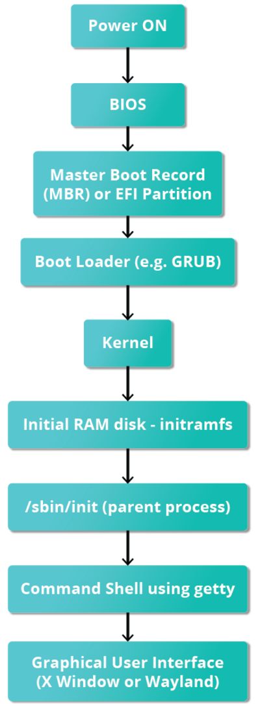
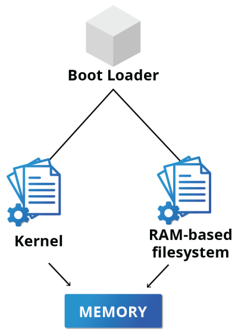
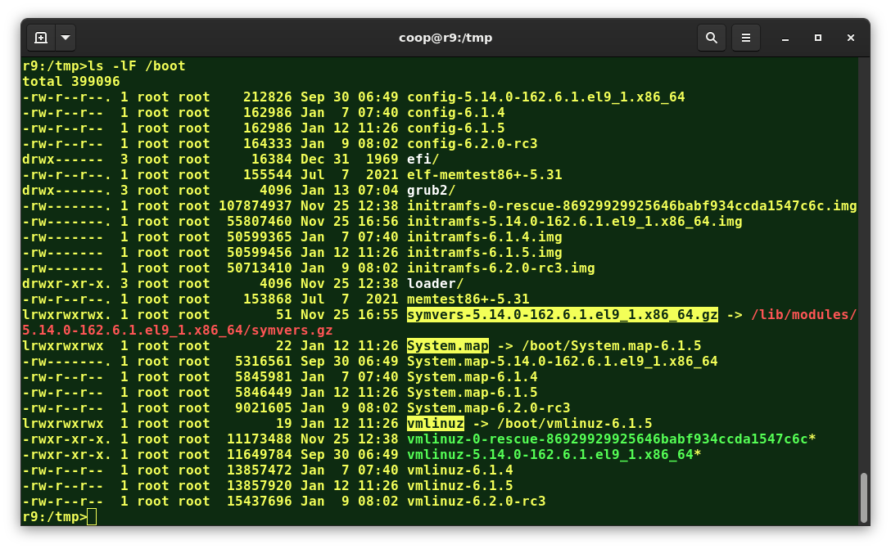
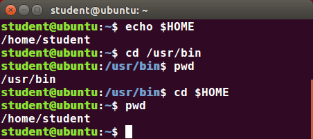
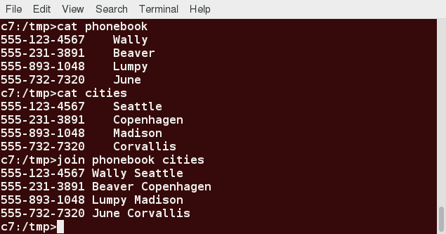
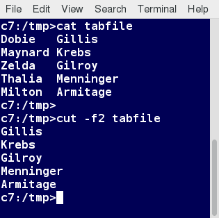
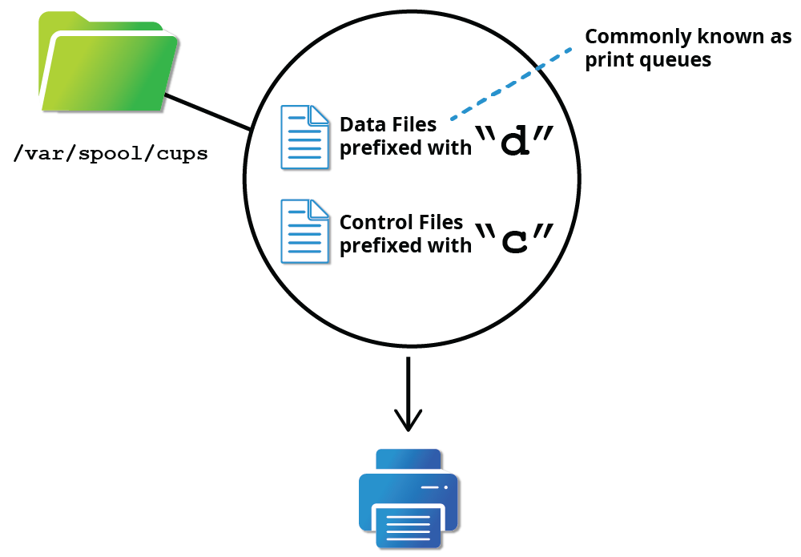

# Introduction to Linux

## 1 - The Linux Foundation

### Introduction to the Linux Foundation

The Linux Foundation is a non-profit consortium that promotes, protects, and advances Linux and collaborative development. It provides a neutral forum for collaboration and education by hosting collaborative projects, organizing events, and providing training and certification programs.

### Linux Distribution Families

A Linux distribution is a collection of software that includes the Linux kernel and additional software such as system libraries, tools, and applications. There are many different Linux distributions, each with its own unique features and characteristics. Some of the most popular Linux distribution families include:

- Debian. Known for its stability and package management system (Ubuntu, Linux Mint)
- Red Hat. Known for its enterprise features and support (Fedora, CentOS)
- Arch. Known for its simplicity and customization options (Arch Linux, Manjaro)
- SUSE. Known for its focus on enterprise and open-source software (openSUSE, SUSE Linux Enterprise)


### The Red Hat Family

Red Hat Enterprise Linux (RHEL) heads the family that includes CentOS, CentOS Stream, Fedora and Oracle Linux.

Fedora has a close relationship with RHEL and contains significantly more software than Red Hat's enterprise version. One reason for this is that a diverse community is involved in building Fedora, with many contributors who do not work for Red Hat. Furthermore, it is used as a testing platform for future RHEL releases.

We will use CentOS Stream and CentOS more often for activities, demonstrations, and labs because there is no cost to the end user, and there is a longer release cycle than for Fedora (which releases a new version every six months or so).

The basic version of CentOS is also virtually identical to RHEL, the most popular Linux distribution in enterprise environments. However, CentOS 8 has no scheduled updates after 2021. The replacement is CentOS 8 Stream. The difference between the two versions is CentOS Stream gets updates before RHEL, while CentOS gets them after. For most purposes this matters very little and not at all for this course. While there are alternatives to CentOS Stream that look more like the older CentOS, for this course we find CentOS 8 Stream works just fine.

Some of the key facts about the Red Hat distribution family are:

- Fedora serves as an upstream testing platform for RHEL.
- CentOS is a close clone of RHEL; in fact, CentOS has been part of Red Hat since 2014.
- A heavily patched version 4.18 kernel is used in RHEL/CentOS 8 Stream, while version 5.14 is used in RHEL/CentOS 9 Stream.
- It supports multiple hardware platforms.
- It uses dnf, the RPM-based package manager (covered in detail later) to install, update, and remove packages in the system.
- RHEL is widely used by enterprises which host their own systems.

### The SUSE Family

The relationship between SUSE (SUSE Linux Enterprise Server, or SLES) and openSUSE is similar to the one described between RHEL, CentOS, and Fedora.

We use openSUSE as the reference distribution for the SUSE family, as it is available to end users at no cost. Because the two products are extremely similar, the material that covers openSUSE can typically be applied to SLES with few problems.

Some of the key facts about the SUSE distribution family are:

- SUSE Linux Enterprise Server (SLES) is upstream for openSUSE.
- Kernel version 5.14 is used in openSUSE Leap 15.4.
- It uses the RPM-based zypper package manager (we cover it in detail later) to install, update, and remove packages in the system.
- It includes the YaST (Yet Another Setup Tool) application for system administration purposes.
- SLES is widely used in retail and many other sectors.

### The Debian Family

The Debian distribution is upstream for several other distributions, including Ubuntu. In turn, Ubuntu is upstream for Linux Mint and a number of other distributions. It is commonly used on both servers and desktop computers. Debian is a pure open source community project (not owned by any corporation) and has a strong focus on stability.

Debian provides by far the largest and most complete software repository to its users of any Linux distribution.

Ubuntu aims at providing a good compromise between long term stability and ease of use. Since Ubuntu gets most of its packages from Debian’s stable branch, it also has access to a very large software repository. For those reasons, we will use Ubuntu LTS (Long Term Support) as the reference to Debian family distributions for this course.

Some key facts about the Debian family are listed below:

- The Debian family is upstream for Ubuntu, and Ubuntu is upstream for Linux Mint and others.
- Kernel version 5.19 is used in Ubuntu 22.04 LTS.
- It uses the DPKG-based APT package manager (using `apt`, `apt-get`, `apt-cache`, etc., which we cover in detail later) to install, update, and remove packages in the system.
- Ubuntu has been widely used for cloud deployments.
- While Ubuntu is built on top of Debian and is GNOME-based under the hood, it differs visually from the interface on standard Debian, as well as other distributions.

## 2 - Linux philosophy and concepts

### Linux History

Linux is an open source computer operating system, initially developed on and for Intel x86-based personal computers. It has been subsequently ported to an astoundingly long list of other hardware platforms, from tiny embedded appliances to the world's largest supercomputers.

Linus Torvalds was a student in Helsinki, Finland, in 1991, when he started a project: writing his own operating system kernel. He also collected together and/or developed the other essential ingredients required to construct an entire operating system with his kernel at the center. It wasn't long before this became known as the Linux kernel.

In 1992, Linux was re-licensed using the General Public License (GPL) by GNU (a project of the Free Software Foundation or FSF, which promotes freely available software), which enabled it to build a worldwide community of developers. By combining the kernel with other system components from the GNU project, numerous other developers created complete systems called Linux Distributions, which first appeared in the mid-90s.

The Linux distributions created in the mid-90s provided the basis for fully free (in the sense of freedom, not zero cost) computing and became a driving force in the open source software movement. In 1998, major companies like IBM and Oracle announced their support for the Linux platform and began major development efforts as well.

Today, Linux powers more than half of the servers on the Internet, the majority of smartphones (via the Android system, which is built on top of Linux), more than 90 percent of the public cloud workload, and all of the world’s most powerful supercomputers.


### Linux Philosophy

Every successful project or organization needs an implicit or explicit philosophy that frames its objectives and projects its growth path. This section contains a description of the philosophy adopted by the Linux community and how it has impacted Linux's amazing evolution.

Linux is constantly enhanced and maintained by a network of developers from all over the world collaborating over the Internet, with Linus Torvalds at the head. Technical skills, a desire to contribute, and the ability to collaborate with others are the only qualifications for participating.

Linux borrows heavily from the well-established family of UNIX operating systems. It was written to be a free and open source alternative; at the time, UNIX was designed for computers much more powerful than PCs, and furthermore, it was quite expensive.

Files are stored in a hierarchical filesystem, with the top node of the system being the root or simply `/`. Whenever possible, Linux makes its components available via files or objects that look like files. Processes, devices, and network sockets are all represented by file-like objects and can often be worked with using the same utilities used for regular files. Linux is a fully multitasking (i.e., multiple threads of execution are performed simultaneously), multiuser operating system with built-in networking and service processes known as daemons in the UNIX world.

### Linux Community

Suppose that, as part of your job, you need to configure a Linux file server, and you run into some difficulties. If you are not able to figure out the answer yourself or get help from a co-worker, the Linux community might just save the day!

There are many ways to engage with the Linux community, even if you are not a developer:

- Post queries on relevant discussion forums.
- Subscribe to discussion threads.
- Join local Linux groups that meet in your area.

The Linux community is a far-reaching ecosystem consisting of developers, system administrators, users, and vendors who use many different forums to connect with one another. Among the most popular are:

- Internet Relay Chat (IRC) software (such as WeeChat, HexChat, Pidgin, and XChat)
- Online communities and discussion boards including Linux User Groups (both local and online)
- Many collaborative projects hosted on services such as GitHub and GitLab
- Newsgroups and mailing lists, including the Linux Kernel Mailing List
- Community events, e.g., Hackathons, Install Fests, Open Source Summits Embedded Linux Conferences, and many other conferences and get-togethers.

A portal to one of the most powerful online user communities can be found at linux.com. This site is hosted by The Linux Foundation and serves over one million unique visitors every month.

### Linux Distributions

The Linux kernel is the core of the operating system. A full Linux distribution consists of the kernel plus a number of other software tools for file-related operations, user management, and software package management. Each of these tools provides a part of the complete system. Each tool is often its own separate project, with its own developers working to perfect that piece of the system.

While the most recent Linux kernel (and earlier versions) can always be found in the Linux Kernel Archives, Linux distributions may be based on different kernel versions. For example, the very popular RHEL 8 distribution is based on the 4.18 kernel, which is not new, but is extremely stable, while the newer RHEL 9 distribution is based on the much later 5.14 kernel. Other distributions may move more quickly in adopting the latest kernel releases. It is important to note that the kernel is not an all-or-nothing proposition. For example, RHEL/CentOS has incorporated many of the more recent kernel improvements into their customized older versions, as have Ubuntu, openSUSE, Fedora, etc.

Examples of other essential tools and ingredients provided by distributions include the C/C++ and Clang compilers, the gdb debugger, the core system libraries applications need to link with in order to run, the low-level interface for drawing graphics on the screen, as well as the higher-level desktop environment, and the system for installing and updating the various components, including the kernel itself. And all distributions come with a rather complete suite of applications already installed.


The vast variety of Linux distributions are designed to cater to many different audiences and organizations according to their specific needs and tastes. However, large organizations, such as companies and governmental institutions, and other entities, tend to choose the major commercially-supported distributions from Red Hat, SUSE, and Canonical (Ubuntu).

CentOS and CentOS Stream are popular free (as in no cost) alternatives to Red Hat Enterprise Linux (RHEL) and are often used by organizations that are comfortable operating without paid technical support. Note that new versions of CentOS disappeared at the end of 2021 in favor of CentOS Stream. However, at least two new RHEL-derived substitutes, Alma Linux and Rocky Linux, have established a healthy foothold.

The RHEL variants, such as CentOS and AlmaLinux, are designed to be binary-compatible with RHEL; i.e., in most cases, binary software packages will install properly across the distributions.

Ubuntu and Fedora are widely used by developers and are also popular in the educational realm. Many commercial distributors, including Red Hat, Ubuntu, SUSE, and Oracle, provide long-term fee-based support for their distributions, as well as hardware and software certification. All major distributors provide update services for keeping your system primed with the latest security and bug fixes and performance enhancements, as well as provide online support resources.


## 3 - Linux basics and system startup

### The Boot Process

The Linux boot process is the procedure for initializing the system. It consists of everything that happens from when the computer power is first switched on until the user interface is fully operational.

Having a good understanding of the steps in the boot process may help you with troubleshooting problems, as well as with tailoring the computer's performance to your needs.

On the other hand, the boot process can be rather technical, and you can start using Linux without knowing all the details.



#### BIOS - First step

While Linux runs on many kinds of hardware, we will concentrate on the x86 family, which is the basis of almost all desktop and laptop PCs. Starting an x86-based Linux system involves a number of steps. When the computer is powered on, the Basic Input/Output System (BIOS) initializes the hardware, including the screen and keyboard, and tests the main memory. This process is also called POST (Power On Self Test).

The BIOS software is stored on a read-only memory (ROM) chip on the motherboard. After this, the remainder of the boot process is controlled by the operating system (OS).


#### Master Boot Record (MBR), EFI Partition and Boot Loader

Once the POST is completed, system control passes from the BIOS to the boot loader. The boot loader is usually stored on one of the system’s storage devices, such as a hard disk or SSD drive, either in the boot sector (for traditional BIOS/MBR systems) or the EFI partition (for more recent (Unified) Extensible Firmware Interface or EFI/UEFI systems). Up to this stage, the machine does not access any mass storage media. Then, information on the date, time, and the most important peripherals are loaded from the CMOS values (after a technology used for the battery-powered memory store, which allows the system to keep track of the date and time even when it is powered off).

A number of boot loaders exist for Linux; the most common ones are GRUB (for GRand Unified Boot loader), ISOLINUX (for booting from removable media), and DAS U-Boot (for booting on embedded devices/appliances). Most Linux boot loaders can present a user interface for choosing alternative options for booting Linux and even other operating systems that might be installed. When booting Linux, the boot loader is responsible for loading the kernel image and the initial RAM disk or filesystem (which contains some critical files and device drivers needed to start the system) into memory.


#### Boot Loader in action

The boot loader has two distinct stages:

For systems using the BIOS/MBR method, the boot loader resides at the first sector of the hard disk, also known as the Master Boot Record (MBR). The size of the MBR is just 512 bytes. In this stage, the boot loader examines the partition table and finds a bootable partition. Once it finds a bootable partition, it then searches for the second stage boot loader, for example GRUB, and loads it into RAM (Random Access Memory). For systems using the EFI/UEFI method, UEFI firmware reads its Boot Manager data to determine which UEFI application is to be launched and from where (i.e., from which disk and partition the EFI partition can be found). The firmware then launches the UEFI application, for example GRUB, as defined in the boot entry in the firmware's boot manager. This procedure is more complicated but more versatile than the older MBR methods.

The second stage boot loader resides under `/boot`. A splash screen is displayed, which allows us to choose which operating system (OS) and/or kernel to boot. After the OS and kernel are selected, the boot loader loads the kernel of the operating system into RAM and passes control to it. Kernels are almost always compressed, so the first job they have is to uncompress themself. After this, it will check and analyze the system hardware and initialize any hardware device drivers built into the kernel.

#### The initial RAM disk (initrd) or initial RAM filesystem (initramfs)

The `initramfs` filesystem image contains programs and binary files that perform all actions needed to mount the proper root filesystem, including providing the kernel functionality required for the specific filesystem that will be used, and loading the device drivers for mass storage controllers, by taking advantage of the `udev` system (for user device), which is responsible for figuring out which devices are present, locating the device drivers they need to operate properly, and loading them. After the root filesystem has been found, it is checked for errors and mounted.

The `mount` program instructs the operating system that a filesystem is ready for use and associates it with a particular point in the overall hierarchy of the filesystem (the mount point). If this is successful, the `initramfs` is cleared from RAM, and the init program on the root filesystem (`/sbin/init`) is executed.

`init` handles the mounting and pivoting over to the final real root filesystem. If special hardware drivers are needed before the mass storage can be accessed, they must be in the `initramfs` image.


#### Text Mode login

Near the end of the boot process, init starts a number of text-mode login prompts. These enable you to type your username, followed by your password, and to eventually get a command shell. However, if you are running a system with a graphical login interface, you will not see these at first.

The terminals which run the command shells can be accessed using the ALT key plus a function key. Most distributions start six text terminals and one graphics terminal starting with F1 or F2. Within a graphical environment, switching to a text console requires pressing CTRL-ALT + the appropriate function key (with F7 or F1 leading to the GUI).

Usually, the default command shell is `bash` (the GNU Bourne Again Shell), but there are a number of other advanced command shells available. The shell prints a text prompt, indicating it is ready to accept commands; after the user types the command and presses `Enter`, the command is executed, and another prompt is displayed after the command is done.


### Kernel, init and Services

#### The Linux Kernel

The boot loader loads both the kernel and an initial RAM–based file system (`initramfs`) into memory, so it can be used directly by the kernel.

When the kernel is loaded in RAM, it immediately initializes and configures the computer’s memory and also configures all the hardware attached to the system. This includes all processors, I/O subsystems, storage devices, etc. The kernel also loads some necessary user space applications.



#### /sbin/init and Services

Once the kernel has set up all its hardware and mounted the root filesystem, the kernel runs `/sbin/init`. This then becomes the initial process, which then starts other processes to get the system running. Most other processes on the system trace their origin ultimately to init; exceptions include the so-called kernel processes. These are started by the kernel directly, and their job is to manage internal operating system details.

Besides starting the system, init is responsible for keeping the system running and for shutting it down cleanly. One of its responsibilities is to act when necessary as a manager for all non-kernel processes; it cleans up after them upon completion, and restarts user login services as needed when users log in and out, and does the same for other background system services.

Traditionally, this process startup was done using conventions that date back to the 1980s and the System V variety of UNIX. This serial process (called `SysVinit`) had the system pass through a sequence of runlevels containing collections of scripts that start and stop services. Each runlevel supported a different mode of running the system. Within each runlevel, individual services could be set to run, or to be shut down if running.

However, all major distributions have moved away from this sequential method of system initialization, although they usually can emulate many System V utilities for compatibility purposes. Next, we discuss the new methods, of which `systemd` has become dominant.


#### Startup Alternatives

`SysVinit` viewed things as a serial process, divided into a series of sequential stages. Each stage required completion before the next could proceed. Thus, startup did not easily take advantage of the parallel processing that could be done with the multiple processors or cores found on modern systems.

Furthermore,  starting up and rebooting were seen as relatively rare events; exactly how long they took was not considered important. This is no longer true, especially with mobile devices and embedded Linux systems. Some modern methods, such as the use of containers, can require almost instantaneous startup times. Thus, systems now require methods with faster and enhanced capabilities. Finally, the older methods required rather complicated startup scripts, which were difficult to keep universal across distribution versions, kernel versions, architectures, and types of systems. The two main alternatives developed were:

##### Upstart

- Developed by Ubuntu and first included in 2006
- Adopted in Fedora 9 (in 2008) and in RHEL 6 and its clones

##### systemd

- Adopted by Fedora first (in 2011)
- Adopted by RHEL 7 and SUSE
- Replaced Upstart in Ubuntu 16.04

While the migration to `systemd` was rather controversial, it has been adopted by all major distributions, and so we will not discuss the older System V method or Upstart, which has become a dead end. Regardless of how one feels about the controversies or the technical methods of `systemd`, almost universal adoption has made learning how to work on Linux systems simpler, as there are fewer differences among distributions. We enumerate `systemd` features next.

#### systemd Features

Systems with `systemd` start up faster than those with earlier `init` methods. This is largely because it replaces a serialized set of steps with aggressive parallelization techniques, which permits multiple services to be initiated simultaneously.

Complicated startup shell scripts are replaced with simpler configuration files, which enumerate what has to be done before a service is started, how to execute service startup, and what conditions the service should indicate have been accomplished when startup is finished. One thing to note is that `/sbin/init` now just points to `/lib/systemd/systemd`; i.e. `systemd` takes over the init process.

One `systemd` command (`systemctl`) is used for most basic tasks. While we have not yet talked about working at the command line, here is a brief listing of its use:

- Starting, stopping, restarting a service (using httpd, the Apache web server, as an example) on a currently running system:

```bash
    sudo systemctl start|stop|restart httpd.service
```

- Enabling or disabling a system service from starting up at system boot:

```bash
    sudo systemctl enable|disable httpd.service
```

- Checking on the status of a service:

```bash
    sudo systemctl status httpd.service
```

In most cases, the `.service` can be omitted. There are many technical differences with older methods that lie beyond the scope of our discussion.


### Linux Filesystem Basics

#### Linux Filesystems

Libraries separate books and other media into multiple sections; this organization will depend on the subject matter, audience, media type, and frequency of retrieval. The same concept applies to a filesystem, which is the embodiment of a method of storing and organizing arbitrary collections of data in a human-usable form.

Different types of filesystems supported by Linux:

- Conventional disk filesystems: `ext3`, `ext4`, `XFS`, `Btrfs`, `JFS`, `NTFS`, `vfat`, `exfat`, etc.
- Flash storage filesystems: `ubifs`, `jffs2`, `yaffs`, etc.
- Database filesystems
- Special purpose filesystems: `procfs`, `sysfs`, `tmpfs`, `squashfs`, `debugfs`, `fuse`, etc.

#### Partitions and Filesystems

A partition is a  dedicated subsection of physical storage media.  Historically this meant a physically contiguous portion of a hard disk; today’s storage devices can be more complicated, but we still think of a partition as a fixed area to be treated as a whole.

A filesystem is just a method of storing and accessing files.

One can think of a partition as a container in which a filesystem resides. However, in some circumstances, a filesystem can span more than one partition if one uses symbolic links, which we will discuss much later.

Make a table comparison between filesystems in Windows and Linux.

|                              | WINDOWS                | LINUX                         |
|------------------------------|------------------------|-------------------------------|
| **Partition**                | `Disk1`, `Disk2`, etc.   | `/dev/sda1`, `/dev/sdb1`, etc.  |
| **Filesystem**               | `NTFS`, `FAT32`, `exFAT` | `ext3`, `ext4`, `XFS`, `Btrfs`, etc.  |
| **Mount point**              | `C:`, `D:`, etc.         | `/`, `/home`, `/var`, etc.      |
| **Base folder**              | `C:\`                    | `/`                             |
| **Path separator**           | `\`                      | `/`                             |

#### Filesystem Hierarchy Standard (FHS)

Linux systems store their important files according to a standard layout called the Filesystem Hierarchy Standard (FHS), which has long been maintained by the Linux Foundation. Having a standard is designed to ensure that users, administrators, and developers can move between distributions without having to re-learn how the system is organized.

Linux uses the `/` character to separate paths (as sis UNIX unlike Windows, which uses `\`) and does not have drive letters. Multiple drives and/or partitions are mounted as directories in the single filesystem. Removable media such as USB drives and CDs, and DVDs will show up as mounted at `/run/media/yourusername/disklabel` for recent Linux systems or under `/media` for older distributions. For example, if your username is student, a USB pen drive labeled FEDORA might end up being found at `/run/media/student/FEDORA`, and a file `README.txt` on that disc would be at `/run/media/student/FEDORA/README.txt`.


All Linux filesystem names are case-sensitive, so `/boot`, `/Boot`, and `/BOOT` represent three different directories (or folders). Many distributions distinguish between core utilities needed for proper system operation and other programs, and place the latter in directories under `/usr` (think user). To get a sense for how the other programs are organized, find the `/usr` directory in the diagram from the previous page and compare the subdirectories with those that exist directly under the system root directory (`/`).

### Linux Distribution Installation

Determining which Linux distribution to deploy requires thoughtful planning. The figure shows some, but not all, choices. Note that many embedded Linux systems use custom-crafted contents rather than Android or Yocto.


The partition layout is best decided at the time of installation; it can be difficult to change later. While Linux systems handle multiple partitions by mounting them at specific points in the filesystem, and you can always modify the design later, it is always easier to try and get it right to begin with.


Nearly all Linux distribution installers provide a reasonable default layout, with either all space dedicated to normal files on one big partition and a smaller swap partition or with separate partitions for some space-sensitive areas like `/home` and `/var`. You may need to override the defaults and do something different if you have special needs or if you want to use more than one disk.

All installations include the bare minimum software for running a Linux distribution.

Distributions also provide options for adding categories of software. Common applications (such as the Firefox web browser and LibreOffice office suite), developer tools (like the vi and emacs text editors, which we will explore later in this course), and other popular services (such as the Apache web server tools or MySQL database) are usually included. In addition, for any system with a graphical desktop, a chosen desktop (such as GNOME or KDE) is installed by default.

Modern distributions tend to do a simple and quick install first and then let you make these choices once the system is running in at least some basic fashion. In earlier times, there were a lot of choices to make during first installation, which could be intimidating and confusing to a new user, and also make the install take a much longer time.

All installers set up some initial security features on the new system. One basic step consists of setting the password for the superuser `root` and setting up an initial user. In some cases (such as with Fedora and Ubuntu), only an initial user is set up; direct root login is not configured, and root access requires logging in first as a normal user and then using `sudo`, as we will describe later. Some distributions will also install more advanced security frameworks, such as SELinux or AppArmor. For example, all Red Hat-based systems, including Fedora and CentOS, always use SELinux by default, and Ubuntu comes with AppArmor up and running.

## 4 - Graphical Interface

- GNOME is a popular desktop environment and graphical user interface that runs on top of the Linux operating system.
- The default display manager for GNOME is called `gdm`.
- The `gdm` display manager presents the user with the login screen, which prompts for the login username and password.
- Logging out through the desktop environment kills all processes in your current X session and returns to the display manager login screen.
- Linux enables users to switch between logged-in sessions.
- Suspending puts the computer into sleep mode.
- For each key task, there is generally a default application installed.
- Every user created in the system will have a home directory.
- The Places menu contains entries that allow you to access different parts of the computer and the network.
- Nautilus gives three formats to view files.
- Most text editors are located in the Accessories submenu.
- Each Linux distribution comes with its own set of desktop backgrounds.
- GNOME comes with a set of different themes which can change the way your applications look.

## 5 - System Configuration

### Installing and Updating Software

Each package in a Linux distribution provides one piece of the system, such as the Linux kernel, the C compiler, utilities for manipulating text or configuring the network, or for your favorite web browsers and email clients.

Packages often depend on each other. For example, because your email client can communicate using SSL/TLS, it will depend on a package that provides the ability to encrypt and decrypt SSL and TLS communication and will not install unless that package is also installed at the same time.

All systems have a lower-level utility that handles the details of unpacking a package and putting the pieces in the right places. However, most of the time, you will be working with a higher-level utility that knows how to download and install packages directly from the Internet and can manage dependencies and groups for you.

In this section, you will learn how to install and update software in Linux using the Debian packaging system (used by systems such as Ubuntu as well) and RPM packaging systems (which are used by both Red Hat and SUSE family systems). These are the main ones in use, although others work well for other distributions which have a smaller user base, such as Archlinux and Gentoo.


#### Debian Package Management

Let’s look at the package management for the Debian family system.

`dpkg` is the underlying package manager for these systems. It can install, remove, and build packages. Unlike higher-level package management systems, it does not automatically download and install packages and satisfy their dependencies.

For Debian-based systems, the higher-level package management system is the Advanced Package Tool (APT) system of utilities. Generally, while each distribution within the Debian family uses APT, it creates its own user interface on top of it (for example, `apt` and `apt-get`, `synaptic`, gnome-software, Ubuntu Software Center, etc). Although `apt` repositories are generally compatible with each other, the software they contain generally is not. Therefore, most repositories target a particular distribution (like Ubuntu), and often software distributors ship with multiple repositories to support multiple distributions. Demonstrations are shown later in this section.


#### Red Hat Package Manager

Red Hat Package Manager (RPM) is the other package management system popular on Linux distributions. It was developed by Red Hat and adopted by a number of other distributions, including Fedora, CentOS, SUSE/openSUSE, Oracle Linux, and others.

The higher-level package manager differs between distributions. Red Hat family distributions historically use RHEL/CentOS, and Fedora uses `dnf`, while SUSE family distributions such as openSUSE also use RPM but use the `zypper` interface.


#### OpenSUSE YaST Software Management

The Yet another Setup Tool (YaST) software manager is similar to other graphical package managers. It is an RPM-based application. You can add, remove, or update packages using this application very easily. To access the YaST software manager:

1. Click Activities
2. In the Search box, type "YaST"
3. Click the YaST icon
4. Click Software Management

You can also find YaST by clicking on Applications > Other-YaST, which is a strange place to put it.

openSUSE’s YaST software management application is similar to the graphical package managers in other distributions. A demonstration of the YaST software manager is shown later in this section.

## 6 - Command Line

The UNIX operating system provides a set of basic commands used for performing system administration tasks. These commands are used to manage files and directories on the system and to carry out system administration tasks.

Basic commands are used to perform tasks such as:

- Navigating the file system.
- Creating, modifying, and deleting files and directories.
- Changing file and directory permissions.
- Viewing file contents.
- Compressing and decompressing files.
- Copying, moving, and renaming files and directories.
- Searching for files and directories.
- Displaying system information.

### Navigating the File System

The `pwd` command is used to display the current working directory. The working directory is the directory where the user is located when they log into the system.

```bash
pwd
```

The `cd` command is used to change directories. The `cd` command is used to move around the file system. To change to the system's root directory, use the `cd` command followed by a slash (/).

```bash
# Change to the system's root directory
cd /
```

The `ls` command is used to display the contents of a directory. The `ls` command lists the files and directories within a directory. To show hidden files and directories, use the `ls` command followed by the `-a` option.

```bash
# Display the contents of the current directory
ls
# Display the contents of the current directory, including hidden files and directories
ls -a
```


### Creating, Modifying, and Deleting Files and Directories

The `touch` command is used to create an empty file. The `touch` command creates an empty file in the current directory. If the file already exists, it updates the file's modification date.

```bash
touch file
```

The `mkdir` command is used to create a directory. The `mkdir` command creates a directory in the current directory. If the directory already exists, an error message is displayed.

```bash
mkdir directory
```

The `rm` command is used to delete a file or directory. The `rm` command deletes a file or directory in the current directory. If the file or directory does not exist, an error message is displayed.

```bash
# Delete a file
rm file
# Delete a directory
rm -r directory
```

### Changing File and Directory Permissions

The `chmod` command is used to change the permissions of a file or directory. The `chmod` command changes the permissions of a file or directory in the current directory. Permissions are specified using an octal number.

The octal number is composed of three digits, representing the permissions of the owner, the group, and other users. Each digit consists of three bits, representing read, write, and execute permissions.

```bash
# Change the permissions of a file to read and write for the owner, and read-only for the group and other users
chmod 644 file
# Change the permissions of a directory to read, write, and execute for the owner, and read and execute for the group and other users
chmod 755 directory
```

### Viewing File Contents

The `cat` command is used to display the contents of a file. The `cat` command shows the contents of a file on the standard output. If the file is very large, the `cat` command will display the file contents on the screen.

```bash
cat file
```

The `more` command is used to display file contents page by page. The `more` command shows the contents of a file page by page on the standard output. If the file is very large, the `more` command will display the file contents page by page.

```bash
more file
```

The `less` command is used to display file contents page by page. The `less` command shows the contents of a file page by page on the standard output. If the file is very large, the `less` command will display the file contents page by page.

```bash
less file
```

### Compressing and Decompressing Files

The `gzip` command is used to compress a file. The `gzip` command compresses a file in the current directory. The `gzip` command creates a compressed file with the `.gz` extension.

```bash
gzip file
```

The `gunzip` command is used to decompress a file. The `gunzip` command decompresses a file in the current directory. The `gunzip` command creates an uncompressed file without the `.gz` extension.

```bash
gunzip file.gz
```

The `tar` command is used to create a tar archive. The `tar` command creates a tar archive in the current directory. The `tar` command creates a tar archive with the specified files and directories.

```bash
tar -cvf archive.tar file1 file2 directory
```

The `tar` command is also used to extract a tar archive. The `tar` command extracts a tar archive in the current directory. The `tar` command extracts a tar archive with the specified files and directories.

```bash
tar -xvf archive.tar
```

### Copying, Moving, and Renaming Files and Directories

The `cp` command is used to copy a file or directory. The `cp` command copies a file or directory in the current directory. The `cp` command creates a copy of the file or directory with the specified name.

```bash
# Copy a file
cp file1 file2
# Copy a directory
cp -r directory1 directory2
```

The `mv` command is used to move a file or directory. The `mv` command moves a file or directory in the current directory. The `mv` command moves the file or directory with the specified name.

```bash
# Move a file
mv file1 file2
# Move a directory
mv directory1 directory2
```

The `mv` command is also used to rename a file or directory. The `mv` command renames a file or directory in the current directory. The `mv` command renames the file or directory with the specified name.

```bash
# Rename a file
mv file1 file2
# Rename a directory
mv directory1 directory2
```

### Searching for Files and Directories

The `find` command is used to search for files and directories. The `find` command searches for files and directories in the file system. The `find` command searches for files and directories that match the specified criteria.

```bash
# Search for files and directories in the current directory
find . -name file
# Search for files and directories in the current directory and subdirectories
find . -name file -type f
```

```bash
# Search for text within files in the current directory
grep text file
# Search for text within files in the current directory and subdirectories
grep -r text directory
```

### System Information

The `date` command is used to display the system date and time. The `date` command shows the system date and time on the standard output. The `date` command displays the date and time in the specified format.

```bash
date
```

The `who` command is used to display the users logged into the system. The `who` command shows the users logged into the system on the standard output. The `who` command displays the users logged into the system with the specified information.

```bash
who
```

The `ps` command is used to display the processes running on the system. The `ps` command shows the processes running on the system on the standard output. The `ps` command displays the processes running on the system with the specified information.

```bash
ps
```

### Redirection and Pipelines

Redirection is used to change the input and output of commands. Redirection is used to send the output of a command to a file and to send the input of a command from a file.

```bash
# Redirect the output of a command to a file
command > file
# Redirect the input of a command from a file
command < file
```

Pipelines are used to combine the output of one command with the input of another command. Pipelines are used to send the output of one command to the input of another command.

```bash
# Combine the output of one command with the input of another command
command1 | command2
```

### Locating applications

Depending on the specifics of your particular distribution's policy, programs and software packages can be installed in various directories. In general, executable programs and scripts should live in the `/bin`, `/usr/bin`, `/sbin`, `/usr/sbin` directories, or somewhere under `/opt`. They can also appear in `/usr/local/bin` and `/usr/local/sbin`, or in a directory in a user's account space, such as `/home/student/bin`.

One way to locate programs is to employ the `which` utility. For example, to find out exactly where the `diff` program resides on the filesystem:

```bash
which application
```

If `which` does not find the program, `whereis` is a good alternative because it looks for packages in a broader range of system directories:

```bash
whereis application
```

Environment variables are used to store information about the system environment. Environment variables are used to store information about the system, such as the username, working directory, and system configuration.

```bash
# Display the value of an environment variable
echo $variable
# Assign a value to an environment variable
variable=value
```

### Steps for Setting Up and Running sudo

If your system does not already have `sudo` set up and enabled, you need to do the following steps:

You will need to make modifications as the administrative, or superuser, `root`. While `sudo` will become the preferred method of doing this, we do not have it set up yet, so we will need to use `su` instead. At the command line prompt, type `su` and press `Enter`. You will then be prompted for the root password, so enter it and press `Enter`. You will notice that nothing is printed; this is so others cannot see the password on the screen. You should end up with a different looking prompt, often ending with `#`. For example:

```bash
su Password:
# 
```

Now, you need to create a configuration file to enable your user account to use `sudo`. Typically, this file is created in the `/etc/sudoers.d/` directory with the name of the file the same as your username. For example, for this demo, let’s say your username is `student`. After doing step 1, you would then create the configuration file for student by doing this:

```bash
echo "student ALL=(ALL) ALL" > /etc/sudoers.d/student
```

Finally, some Linux distributions will complain if you do not also change permissions on the file by doing:

```bash
chmod 440 /etc/sudoers.d/student
```

That should be it. For the rest of this course, if you use `sudo` you should be properly set up. When using `sudo`, by default you will be prompted to give a password (your own user password) at least the first time you do it within a specified time interval. It is possible (though very insecure) to configure `sudo` to not require a password or change the time window in which the password does not have to be repeated with every `sudo` command.

### Turning off the graphical interface

If you are running a graphical interface and want to turn it off, you can do so by running the following command:

```bash
sudo systemctl stop gdm
```

This will stop the graphical interface and return you to the command line. To start the graphical interface again, run the following command:

```bash
sudo systemctl start gdm
```

### Wildcards and matching filenames

Wildcards are used to match filenames. Wildcards are used to match filenames in the file system. Wildcards are used to match filenames that contain a specified pattern.

| Wildcard | Description |
|----------|-------------|
| *        | Matches zero or more characters |
| ?        | Matches a single character |
| [ ]      | Matches a range of characters |
| [! ]     | Matches a character not in the range |

### To find and locate files

find is an extremely useful and often-used utility program in the daily life of a Linux system administrator. It recurses down the filesystem tree from any particular directory (or set of directories) and locates files that match specified conditions. The default pathname is always the present working directory.

For example, administrators sometimes scan for potentially large core files (which contain diagnostic information after a program fails) that are more than several weeks old in order to remove them.

It is also common to remove files non-essential or outdated files in `/tmp` (and other volatile directories, such as those under `/var/cache/` containing dispensable cached files) that have not been accessed recently. Many Linux distributions use shell scripts that run periodically (through `cron` usually) to perform such house cleaning.

```bash
# Search for files and directories in the current directory
find . -name file
# Search for files and directories in the current directory and subdirectories
find . -name file -type f
```

The `locate` command is used to search for files and directories in the file system. The `locate` command searches for files and directories that match the specified criteria.

```bash
# Search for files and directories in the file system
locate file
```

The `{}` (squiggly brackets) is a placeholder that will be filled with all the file names that result from the find expression, and the preceding command will be run on each one individually.

Please note that you have to end the command with either `‘;’` (including the single-quotes) or `\;`. Both forms are fine.

One can also use the `-ok` option, which behaves the same as `-exec`, except that find will prompt you for permission before executing the command. This makes it a good way to test your results before blindly executing any potentially dangerous commands.


### Basic package management

The Advanced Packaging Tool (`apt`) is the underlying package management system that manages software on Debian-based systems. While it forms the backend for graphical package managers, such as the Ubuntu Software Center and `synaptic`, its native user interface is at the command line, with programs that include `apt` (or `apt-get`) and `apt-cache`.

`dnf` is the open source command-line package-management utility for the RPM-compatible Linux systems that belong to the Red Hat family.

`zypper` is the package management system for the SUSE/openSUSE family and is also based on RPM. `zypper` also allows you to manage repositories from the command line. `zypper` is fairly straightforward to use and closely resembles `dnf`.


|Operation | Debian-based | Red Hat-based | SUSE-based |
|----------|---------------|---------------|------------|
|Install package | `sudo apt install package` | `sudo dnf install package` | `sudo zypper install package` |
|Remove package | `sudo apt remove package` | `sudo dnf remove package` | `sudo zypper remove package` |
|Update package | `sudo apt update package` | `sudo dnf update package` | `sudo zypper update package` |
|Search package | `sudo apt search package` | `sudo dnf search package` | `sudo zypper search package` |
|List installed packages | `dpkg -l` | `rpm -qa` | `zypper se --installed-only` |
|Update entire system | `sudo apt update && sudo apt upgrade` | `sudo dnf update` | `sudo zypper update` |
|Show package information | `apt show package` | `dnf info package` | `zypper info package` |

### Summary

- Virtual terminals (VT) in Linux are consoles, or command line terminals that use the connected monitor and keyboard.
- Different Linux distributions start and stop the graphical desktop in different ways.
- A terminal emulator program on the graphical desktop works by emulating a terminal within a window on the desktop.
- The Linux system allows you to either log in via text terminal or remotely via the console.
- When typing your password, nothing is printed to the terminal, not even a generic symbol to indicate that you typed.
- The preferred method to shut down or reboot the system is to use the shutdown command.
- There are two types of pathnames: absolute and relative.
  - An absolute pathname begins with the root directory and follows the tree, branch by branch, until it reaches the desired directory or file.
  - A relative pathname starts from the present working directory.
- Using hard and soft (symbolic) links is extremely useful in Linux.
- `cd` remembers where you were last, and lets you get back there with cd -.
- `locate` performs a database search to find all file names that match a given pattern.
- `find` locates files recursively from a given directory or set of directories.
- `find` is able to run commands on the files that it lists, when used with the -exec option.
- `touch` is used to set the access, change, and edit times of files, as well as to create empty files.
- The Advanced Packaging Tool `apt` package management system is used to manage installed software on Debian-based systems.
- You can use the dnf command-line package management utility for the RPM-based Red Hat Family Linux distributions.

The `zypper` package management system is based on RPM and used for openSUSE.

|Command | Description | Example |
|--------|-------------|---------|
|`pwd` | Display the current working directory | `pwd` |
|`cd` | Change directories | `cd /` |
|`ls` | List files and directories | `ls` |
|`touch` | Create an empty file | `touch file` |
|`mkdir` | Create a directory | `mkdir directory` |
|`rm` | Remove a file or directory | `rm file` |
|`chmod` | Change the permissions of a file or directory | `chmod 644 file` |
|`cat` | Display the contents of a file | `cat file` |
|`more` | Display file contents page by page | `more file` |
|`less` | Display file contents page by page | `less file` |
|`gzip` | Compress a file | `gzip file` |
|`gunzip` | Decompress a file | `gunzip file.gz` |
|`tar` | Create a tar archive | `tar -cvf archive.tar file1 file2 directory` |
|`tar` | Extract a tar archive | `tar -xvf archive.tar` |
|`cp` | Copy a file or directory | `cp file1 file2` |
|`mv` | Move/rename a file or directory | `mv file1 file2` |
|`find` | Search for files and directories from a directory | `find . -name file` |
|`locate` | Search for files and directories throughout a prebuilt database | `locate file` |
|`grep` | Search for text within files | `grep text file` |
|`date` | Display the system date and time | `date` |
|`who` | Display the users logged into the system | `who` |
|`ps` | Display the processes running on the system | `ps` |
|`echo` | Display the value of an environment variable | `echo $variable` |
|`variable=value` | Assign a value to an environment variable | `variable=value` |

Important Linux documentation sources include:

- The `man` pages (short for manual pages)
- GNU Info
- The help command and --help option
- Other documentation sources, e.g., Gentoo Handbook, Ubuntu Documentation, or Fedora Documentation.


## 7 - Processes

### Process Management

A process is simply an instance of one or more related tasks (threads) executing on your computer. It is not the same as a program or a command. A single command may actually start several processes simultaneously. Some processes are independent of each other and others are related. A failure of one process may or may not affect the others running on the system.

Processes use many system resources, such as memory, CPU (central processing unit) cycles, and peripheral devices, such as network cards, hard drives, printers, and displays. The operating system (especially the kernel) is responsible for allocating a proper share of these resources to each process and ensuring overall optimized system utilization.


A terminal window (one kind of command shell) is a process that runs as long as needed. It allows users to execute programs and access resources in an interactive environment. You can also run programs in the background, which means they become detached from the shell.

Processes can be of different types according to the task being performed.

|Process Type | Description | Example |
|-------------|-------------|---------|
| Interactive | Need to be started by a user, either at a command line or through a graphical interface such as an icon or a menu selection.| bash, firefox, Slack |
| Batch | Automatic processes which are scheduled from and then disconnected from the terminal. These tasks are queued and work on a FIFO (First-In, First-Out) basis. | `updatedb`, `backup scripts` |
| Daemons | Server processes that run continuously. Many are launched during system startup and then wait for a user or system request indicating that their service is required | `httpd`, `sshd`, `cupsd` |
| Threads | Lightweight processes. These are tasks that run under the umbrella of a main process, sharing memory and other resources, but are scheduled and run by the system on an individual basis. An individual thread can end without terminating the whole process and a process can create new threads at any time. Many non-trivial programs are multi-threaded. | `dconf-service`, `gnome-terminal-server` |
| Kernel Threads | Kernel tasks that users neither start nor terminate and have little control over. These may perform actions like moving a thread from one CPU to another, or making sure input/output operations to disk are completed.| `kthreadd`, `migration`, `ksoftirqd` |

### Process States

A critical kernel function called the scheduler constantly shifts processes on and off the CPU, sharing time according to relative priority, how much time is needed and how much has already been granted to a task.

When a process is in a so-called running state, it means it is either currently executing instructions on a CPU, or is waiting to be granted a share of time (a time slice) so it can execute. All processes in this state reside on what is called a run queue and on a computer with multiple CPUs, or cores, there is a run queue on each. As noted, the word running is a little misleading as the process may actually be swapped out, waiting its turn to get back in the race.


However, sometimes processes go into what is called a sleep state, generally when they are waiting for something to happen before they can resume, perhaps for the user to type something. In this condition, a process is said to be sitting in a wait queue.

There are some other less frequent process states, especially when a process is terminating. Sometimes, a child process completes, but its parent process has not asked about its state. Amusingly, such a process is said to be in a zombie state; it is not really alive, but still shows up in the system's list of processes.

At any given time, there are always multiple processes being executed. The operating system keeps track of them by assigning each a unique process ID (PID) number. The PID is used to track process state, CPU usage, memory use, precisely where resources are located in memory, and other characteristics.

New PIDs are usually assigned in ascending order as processes are born. Thus, PID 1 denotes the init process (system initialization process), and succeeding processes are gradually assigned higher numbers.

|ID type | Description |
|--------|-------------|
|PID | Unique process ID number |
|PPID | Process (Parent) that started this process. If the parent dies, the PPID will refer to an adoptive parent; on modern kernels, this is kthreadd which has PPID=2|
|TID | Thread ID number. This is the same as the PID for single-threaded processes. For a multi-threaded process, each thread shares the same PID, but has a unique TID.|

To terminate a process, you can use the `kill` command. The `kill` command sends a signal to a process, which can be used to terminate the process. The `kill` command sends a signal to a process with the specified PID.

```bash
# Terminate a process
kill -SIGKILL PID 
kill -9 PID
```

Note, however, you can only kill your own processes; those belonging to another user are off-limits unless you are root (the name kill is historical and somewhat misleading; the command can be used to send any kind of signal to a process, not just a termination one)

### User and Group IDs

Many users can access a system simultaneously, and each user can run multiple processes. The operating system identifies the user who starts the process by the Real User ID (RUID) assigned to the user.

The user who determines the access rights for the users is identified by the Effective UID (EUID). The EUID may or may not be the same as the RUID.

Users can be organized into enumerated groups. Each group is identified by the Real Group ID (RGID). The access rights of the group are determined by the Effective Group ID (EGID). Each user can be a member of one or more groups.

Most of the time we ignore these details and just talk about the User ID (UID) and Group ID (GID).


### Priorities and nice values

At any given time, many processes are running (i.e. in the run queue) on the system. However, a CPU can actually accommodate only one task at a time, just like a car can have only one driver at a time. Some processes are more important than others, so Linux allows you to set and manipulate process priority. Higher priority processes get preferential access to the CPU.

The priority for a process can be set by specifying a nice value, or niceness, for the process. The lower the nice value, the higher the priority. Low values are assigned to important processes, while high values are assigned to processes that can wait longer. A process with a high nice value simply allows other processes to be executed first. In Linux, a nice value of -20 represents the highest priority and +19 represents the lowest. While this may sound backwards, this convention (the nicer the process, the lower the priority) goes back to the earliest days of UNIX.

You can also assign a so-called real-time priority to time-sensitive tasks, such as controlling machines through a computer or collecting incoming data. This is just a very high priority and is not to be confused with what is called hard real-time, which is conceptually different and has more to do with making sure a job gets completed within a very well-defined time window.


Using the renice command, you can change the priority of a running process. The renice command changes the priority of a running process by specifying a nice value.

```bash
# Change the priority of a running process
renice -n value -p PID
```

### Load Average

The load average is the average of the load number for a given period of time. It takes into account processes that are:

- Actively running on a CPU.
- Considered runnable, but waiting on the run queue for a CPU to become available.
- Sleeping: i.e. waiting for some kind of resource (typically, I/O) to become available.

Linux differs from other UNIX-like operating systems in that it includes the sleeping processes. Furthermore, it only includes so-called uninterruptible sleepers, those which cannot be awakened easily.

The load average can be viewed by running `w`, `top` or `uptime`.

The load average is displayed using three numbers (0.45, 0.17, and 0.12) in the below screenshot. Assuming our system is a single-CPU system, the three load average numbers are interpreted as follows:

- 0.45: For the last minute the system has been 45% utilized on average.
- 0.17: For the last 5 minutes utilization has been 17%.
- 0.12: For the last 15 minutes utilization has been 12%.

If we saw a value of 1.00 in the second position, that would imply that the single-CPU system was 100% utilized, on average, over the past 5 minutes; this is good if we want to fully use a system. A value over 1.00 for a single-CPU system implies that the system was over-utilized: there were more processes needing CPU than CPU was available.

If we had more than one CPU, say a quad-CPU system, we would divide the load average numbers by the number of CPUs. In this case, for example, seeing a 1 minute load average of 4.00 implies that the system as a whole was 100% (4.00/4) utilized during the last minute.

Short-term increases are usually not a problem. A high peak you see is likely a burst of activity, not a new level. For example, at start up, many processes start and then activity settles down. If a high peak is seen in the 5 and 15 minute load averages, it may be cause for concern.

### Jobs

Linux supports background and foreground job processing. A job in this context is just a command launched from a terminal window. Foreground jobs run directly from the shell, and when one foreground job is running, other jobs need to wait for shell access (at least in that terminal window if using the GUI) until it is completed. This is fine when jobs complete quickly. But this can have an adverse effect if the current job is going to take a long time (even several hours) to complete.

In such cases, you can run the job in the background and free the shell for other tasks. The background job will be executed at lower priority, which, in turn, will allow smooth execution of the interactive tasks, and you can type other commands in the terminal window while the background job is running. By default, all jobs are executed in the foreground. You can put a job in the background by suffixing `&` to the command, for example: `updatedb &`.

You can use `CTRL-Z` to suspend a foreground job (i.e., put it in background) and `CTRL-C` to terminate it. You can always use the `bg` command to run a suspended process in the background, or the `fg` command to run a background process in the foreground.

The `jobs` utility displays all jobs running in background. The display shows the job ID, state, and command name, as shown here.

`jobs -l` provides the same information as jobs, and adds the PID of the background jobs.

The background jobs are connected to the terminal window, so, if you log off, the jobs utility will not show the ones started from that window.


### Listing processes

`ps` (process status) provides information about currently running processes keyed by PID. If you want a periodic update of this status, you can use top or other commonly installed variants (such as `htop`, `atop`, or `btop`) from the command line, or invoke your distribution's graphical system monitor application (such as `gnome-system-monitor` or `ksysguard`).

`ps` has many options for specifying exactly which tasks to examine, what information to display about them, and precisely what output format should be used.

Without options, `ps` will display all processes running under the current shell. You can use the `-u` option to display information of processes for a specified username. The command `ps -ef` displays all the processes in the system in full detail. The command `ps -eLf` goes one step further and displays one line of information for every thread (remember, a process can contain multiple threads).


`ps` has another style of option specification, which stems from the BSD variety of UNIX, where options are specified without preceding dashes. For example, the command `ps aux` displays all processes of all users. The command `ps axo` allows you to specify which attributes you want to view.

The screenshot shows a sample output of `ps` with the `aux` and `axo` qualifiers.


`pstree` displays the processes running on the system in the form of a tree diagram showing the relationship between a process and its parent process and any other processes that it created. Repeated entries of a process are not displayed, and threads are displayed in curly braces.


While a static view of what the system is doing is useful, monitoring the system performance live over time is also valuable. One option would be to run ps at regular intervals, say, every few seconds. A better alternative is to use `top` to get constant real-time updates (every two seconds by default), until you exit by typing `top` clearly highlights which processes are consuming the most CPU cycles and memory (using appropriate commands from within top).


The first line of the top output displays a quick summary of what is happening in the system, including:

- How long the system has been up
- How many users are logged on
- What is the load average

The load average determines how busy the system is. A load average of 1.00 per CPU indicates a fully subscribed, but not overloaded, system. If the load average goes above this value, it indicates that processes are competing for CPU time. If the load average is very high, it might indicate that the system is having a problem, such as a runaway process (a process in a non-responding state).

The second line of the top output displays the total number of processes, the number of running, sleeping, stopped, and zombie processes. Comparing the number of running processes with the load average helps determine if the system has reached its capacity or perhaps a particular user is running too many processes. The stopped processes should be examined to see if everything is running correctly.

The third line of the top output indicates how the CPU time is being divided between the users (us) and the kernel (sy) by displaying the percentage of CPU time used for each.

The percentage of user jobs running at a lower priority (niceness - ni) is then listed. Idle mode (id) should be low if the load average is high, and vice versa. The percentage of jobs waiting (wa) for I/O is listed. Interrupts include the percentage of hardware (hi) vs. software interrupts (si). Steal time (st) is generally used with virtual machines, which has some of its idle CPU time taken for other uses.

The fourth and fifth lines of the top output indicate memory usage, which is divided in two categories:

- Physical memory (RAM)
- Swap space

Both categories display total memory, used memory, and free space.

You need to monitor memory usage very carefully to ensure good system performance. Once the physical memory is exhausted, the system starts using swap space (temporary storage space on the hard drive) as an extended memory pool, and since accessing disk is much slower than accessing memory, this will negatively affect system performance.

If the system starts using swap often, you can add more swap space. However, adding more physical memory should also be considered.

Each line in the process list of the top output displays information about a process. By default, processes are ordered by highest CPU usage. The following information about each process is displayed:

- Process Identification Number (PID)
- Process owner (USER)
- Priority (PR) and nice values (NI)
- Virtual (VIRT), physical (RES), and shared memory (SHR)
- Status (S)
- Percentage of CPU (%CPU) and memory (%MEM) used
- Execution time (TIME+)
- Command (COMMAND).

Besides reporting information, top can be utilized interactively for monitoring and controlling processes. While top is running in a terminal window, you can enter single-letter commands to change its behavior. For example, you can view the top-ranked processes based on CPU or memory usage. If needed, you can alter the priorities of running processes or you can stop/kill a process.

|Command | Output |
|--------|--------|
| `h` or `?` | Display available interactive keys and their function |
| `t` | Display or hide summary information (rows 1-3) |
| `m` | Display or hide memory information (rows 4-5) |
| `l` | Display or hide load average and uptime information |
| `d` | Change display refresh interval |
| `A` | Sort processes by top CPU consumers |
| `M` | Sort processes by top memory consumers |
| `k` | Kill a process by entering its PID |
| `r` | Renice a process by entering its PID |
| `f` | Enter the top configuration screen |
| `q` | Quit top |
| `o` | Change the order of the displayed columns |

Most of these interactive keys are actually toggles; hitting them a second time reverts to the original display. There are many more interactive options; see the man page for top for a comprehensive list.

There are a number of alternatives to top with both prettier displays and additional capabilities, including atop, btop and htop; each program has its fans. We show a screenshot showing all four programs operating simultaneously to get a sense of what they provide

### Starting processes in the future

Suppose you need to perform a task on a specific day sometime in the future. However, you know you will be away from the machine on that day. How will you perform the task? You can use the `at` utility program to execute any non-interactive command at a specified time, as illustrated in the screenshot below:


`cron` is a time-based scheduling utility program. It can launch routine background jobs at specific times and/or days on an ongoing basis. `cron` is driven by a configuration file called `/etc/crontab` (cron table), which contains the various shell commands that need to be run at the properly scheduled times. There are both system-wide crontab files and individual user-based ones. Each line of a `crontab` file represents a job, and is composed of a so-called CRON expression, followed by a shell command to execute.

Typing `crontab -e` will open the crontab editor to edit existing jobs or to create new jobs. Each line of the crontab file will contain 6 fields:

|Field | Description | Values |
|------|-------------|--------|
|MIN | Minutes | 0-59 |
|HOUR | Hours | 0-23 |
|DOM | Day of the month | 1-31 |
|MON | Month | 1-12 |
|DOW | Day of the week | 0-6 (0=Sunday) |
|CMD | Command to execute | Any command |

```Example: 0 0 * * * /usr/bin/updatedb```

While `cron` has been used in UNIX-like operating systems for decades, modern Linux distributions have moved over to a newer facility: `anacron`. This was because `cron` implicitly assumed the machine was always running. However, If the machine was powered off, scheduled jobs would not run. `anacron` will run the necessary jobs in a controlled and staggered manner when the system is up and running.


Note that `anacron` still makes use of the `cron` infrastructure for submitting jobs on a daily, weekly, and monthly basis, but it defers running them until opportune times when the system is actually alive.

Sometimes, a command or job must be delayed or suspended. Suppose, for example, an application has read and processed the contents of a data file and then needs to save a report on a backup system. If the backup system is currently busy or not available, the application can be made to sleep (`wait`) until it can complete its work. Such a delay might be to mount the backup device and prepare it for writing. An even simpler and frequent case is one where a system process needs to run periodically to take care of any work that has been queued up for it to deal with and then has to lurk in the background until it is needed again.

`sleep` suspends execution for at least the specified period of time, which can be given as the number of seconds (the default), minutes, hours, or days. After that time has passed (or an interrupting signal has been received), execution will resume.

The syntax is:

```bash
sleep time
```

where `time` can be a number followed by a unit (s for seconds, m for minutes, h for hours, d for days).

`sleep` and `at` are quite different; `sleep` delays execution for a specific period, while `at` starts execution at a specific designated later time.

You can see if the job is queued up by using the `atq` command. If you want to remove a job from the queue, you can use the `atrm` command.

Here is a summary of the commands and utilities discussed in this section:

- Processes are used to perform various tasks on the system.
- Processes can be single-threaded or multi-threaded.
- Processes can be of different types, such as interactive and non-interactive.
- Every process has a unique identifier (PID) to enable the operating system to keep track of it.
- The nice value, or niceness, can be used to set priority.
- `ps` provides information about the currently running processes.
- You can use top to get constant real-time updates about overall system performance, as well as - information about the processes running on the system.
- Load average indicates the amount of utilization the system is under at particular times.
- Linux supports background and foreground processing for a job.
- `at` executes any non-interactive command at a specified time.
- `cron` is used to schedule tasks that need to be performed at regular intervals.

## 8 - File Operations

### Filesystems

“Everything is a file” is an often repeated adage quoted by users of Linux (and all UNIX-like operating systems). Whether you are dealing with normal data files and documents, or with devices such as sound cards and printers, this means interaction with them proceeds through the same Input/Output (I/O) operations you commonly use with files. This simplifies things: you open a “file” and perform normal operations like reading and writing it (which is one reason why text editors, which you will learn about in an upcoming section, are so important).

On many systems (including Linux), the filesystem is structured like a tree. The tree is usually portrayed as inverted and starts at what is most often called the root directory, which marks the beginning of the hierarchical filesystem and is also sometimes referred to as the trunk and simply denoted by `/`. The root directory is not the same as the root user. The hierarchical filesystem also contains other elements in the path (directory names), which are separated by forward slashes `/`, as in `/usr/bin/emacs`, where the last element is the actual file name.

Linux supports a number of native filesystem types, expressly created by Linux developers, such as:

- `ext3`
- `ext4`
- `squashfs`
- `btrfs`

It also offers implementations of filesystems used on other alien operating systems, such as those from:

- Windows (`ntfs`, `vfat`, `exfat`)
- SGI (`xfs`)
- IBM (`jfs`)
- MacOS (`hfs`, `hfs+`)

Many older, legacy filesystems, such as `FAT`, are also supported.

It is often the case that more than one filesystem type is used on a machine, based on considerations such as the size of files, how often they are modified, what kind of hardware they sit on and what kind of access speed is needed, etc. The most advanced filesystem types in common use are the journaling varieties: `ext4`, `xfs`, `btrfs`, and `jfs`. These have many state-of-the-art features and high performance, and are not easy to corrupt accidentally.

Linux also makes use of network (or distributed)  filesystems, where all or part of the filesystem is on external machines. Besides NFS (Network File System) whose usage we will discuss, this includes Ceph, Lustre, and OpenAFS.

#### Partitions

In most situations, each filesystem on a Linux system occupies a disk partition. (It is also possible to encapsulate a filesystem in a loopback file residing on another regular partition-based filesystem, but we won’t discuss that here.) Partitions help to organize the contents of disks according to the kind and use of the data contained. For example, important programs required to run the system are often kept on a separate partition (known as `root` or `/`) than the one that contains files owned by regular users of that system (`/home`). In addition, temporary files created and destroyed during the normal operation of Linux may be located on dedicated partitions. One advantage of this kind of isolation by type and variability is that when all available space on a particular partition is exhausted, the system may still operate normally. Furthermore, if data is either corrupted through error or hardware failure, or breached through a security problem, it might be possible to confine problems to an area smaller than the entire system.

The picture shows the use of the GParted utility, which displays the partition layout on a laptop system that has two operating systems on it: RHEL9 and RHEL 8.


#### Mounting and unmounting filesystems

Before you can start using a filesystem, you need to mount it on the filesystem tree at a mount point. This is simply a directory (which may or may not be empty) where the filesystem is to be grafted on. Sometimes, you may need to create the directory if it does not already exist.

If you mount a filesystem on a non-empty directory, the former contents of that directory are covered-up and not accessible until the filesystem is unmounted. Thus, mount points are usually empty directories.


The `mount` command is used to attach a filesystem (which can be local to the computer or on a network) somewhere within the filesystem tree. The basic arguments are the device node and mount point. For example,

```bash
mount /dev/sda5 /home
```

will attach the filesystem contained in the disk partition associated with the `/dev/sda5` device node into the filesystem tree at the `/home` mount point. There are other ways to specify the partition other than the device node, such as using the disk label or UUID (Universally Unique IDentifier).

To unmount the partition, the command would be:

```bash
umount /home
```

Note the command is `umount`, not unmount! Only a root user (logged in as root, or using `sudo`) has the privilege to run these commands, unless the system has been otherwise configured.

If you want it to be automatically available every time the system starts up, you need to edit `/etc/fstab` accordingly (the name is short for filesystem table). Looking at this file will show you the configuration of all pre-configured filesystems.

Executing `mount` without any arguments will show all presently mounted filesystems.

The command `df -Th` (disk free) will display information about mounted filesystems, including the filesystem type, and usage statistics about currently used and available space.


You may notice a number of entries of type `tmpfs`. These are not real physical filesystems but are parts of system memory that are represented as such to take advantage of certain programming features.

#### Network Filesystems

It is often necessary to share data across physical systems which may be either in the same location or anywhere that can be reached by the Internet. A network (also sometimes called distributed) filesystem may have all its data on one machine or have it spread out on more than one network node. A variety of different filesystems can be used locally on individual machines; a network filesystem can be thought of as a grouping of lower-level filesystems of varying types.


Many system administrators mount remote users' home directories on a server in order to give them access to the same files and configuration files across multiple client systems. This allows the users to log in to different computers, yet still have access to the same files and resources.

The most common such filesystem is named simply NFS (the Network Filesystem). It has a very long history and was first developed by Sun Microsystems. Another common implementation is CIFS (also termed SAMBA), which has Microsoft roots. We will restrict our attention in what follows to NFS.

We will now look in detail at how to use NFS on the server.

On the server machine, NFS uses daemons (built-in networking and service processes in Linux) and other system servers are started at the command line by typing:

```bash
sudo systemctl start nfs-server
```

The text file `/etc/exports` contains the directories and permissions that a host is willing to share with other systems over NFS. A very simple entry in this file may look like the following:

```bash
/projects *.example.com(rw)
```

This entry allows the directory `/projects` to be mounted using NFS with read and write (rw) permissions and shared with other hosts in the [example.com] domain. As we will detail in the next chapter, every file in Linux has three possible permissions: read (r), write (w) and execute (x).

After modifying the `/etc/exports` file, you can type `exportfs -av` to notify Linux about the directories you are allowing to be remotely mounted using NFS. You can also restart NFS with `sudo systemctl restart nfs`, but this is heavier, as it halts NFS for a short while before starting it up again. To make sure the NFS service starts whenever the system is booted, issue `sudo systemctl enable nfs`.


On the client machine, if it is desired to have the remote filesystem mounted automatically upon system boot, `/etc/fstab` is modified to accomplish this. For example, an entry in the client's `/etc/fstab` might look like the following:

```bash
servername:/projects /mnt/nfs/projects nfs defaults 0 0
```

You can also mount the remote filesystem without a reboot or as a one-time mount by directly using the `mount` command:
  
```bash
sudo mount servername:/projects /mnt/nfs/projects
```

Remember, if `/etc/fstab` is not modified, this remote mount will not be present the next time the system is restarted. Furthermore, you may want to use the `nofail` option in `fstab` in case the NFS server is not live at boot.


### Filesystem layout

Each user has a home directory, usually placed under `/home`. The `/root` ("slash-root") directory on modern Linux systems is no more than the home directory of the root user (or superuser or system administrator account).

On multi-user systems, the `/home` directory infrastructure may be mounted as a separate filesystem on its own partition or even exported (shared) remotely on a network through NFS.

Sometimes, you may group users based on their department or function. You can then create subdirectories under the `/home` directory for each of these groups. For example, a school may organize `/home` with something like the following:

```bash
/home/students
/home/faculty
/home/staff
```

The `/bin` directory contains executable binaries, essential commands used to boot the system or in single-user mode, and essential commands required by all system users, such as `cat`, `cp`, `ls`, `mv`, `ps`, and `rm`.


Likewise, the `/sbin` directory is intended for essential binaries related to system administration, such as `fsck` and `ip`.


Commands that are not essential (theoretically) for the system to boot or operate in single-user mode are placed in the `/usr/bin` and `/usr/sbin` directories. Historically, this was done so `/usr` could reside on a separate filesystem that could be mounted at a later stage of system startup or even over a network. However, nowadays most find this distinction to be obsolete. In fact, many distributions have been discovered to be unable to boot with this separation, as this modality had not been used or tested for a long time.

Thus, on most Linux distributions today, `/usr/bin` and `/bin` are actually just symbolically linked together, as are `/usr/sbin` and `/sbin`, so there are really just two directories, not four.

Certain filesystems, like the one mounted at `/proc`, are called pseudo-filesystems because they have no actual permanent presence anywhere on the disk.

The `/proc` filesystem contains virtual files (files that exist only in memory) that permit viewing constantly changing kernel data. `/proc` contains files and directories that mimic kernel structures and configuration information. It does not contain real files, but runtime system information, e.g. system memory, devices mounted, hardware configuration, etc. Some important entries in `/proc` are:

- `/proc/cpuinfo` Information about the CPU
- `/proc/meminfo` Information about memory usage
- `/proc/version` Kernel version
- `/proc/filesystems` Filesystems supported by the kernel
- `/proc/net` Network status
- `/proc/sys` Kernel parameters
- `/proc/interrupts` Interrupts in use
- `/proc/mounts` Mounted filesystems
- `/proc/partitions` Partitions on the system

`/proc` has subdirectories for each process running on the system, named by their process ID (PID). Each of these directories contains information about the process, such as the command `line` used to start the process, the environment variables, and the file descriptors used by the process.

The first example shows there is a directory for every process running on the system, which contains vital information about it. The second example shows a virtual directory that contains a lot of information about the entire system, in particular its hardware and configuration. The `/proc` filesystem is very useful because the information it reports is gathered only as needed and never needs storage on the disk.


The `/dev` directory contains device nodes, a type of pseudo-file used by most hardware and software devices, except for network devices. This directory is:

- Empty on the disk partition when it is not mounted
- Contains entries which are created by the `udev` system, which creates and manages device nodes on Linux, creating them dynamically when devices are found. The `/dev` directory contains items such as:
  - `/dev/sda1` (first partition on the first hard disk)
  - `/dev/lp1` (second printer)
  - `/dev/random` (a source of random numbers).

The `/var` directory contains files that are expected to change in size and content as the system is running (var stands for variable), such as the entries in the following directories:

- `/var/log` Log files
- `/var/spool` Spool files (e.g., print queues)
- `/var/tmp` Temporary files
- `/var/run` Information about the running system since last boot
- `/var/lib` State information about packages installed on the system


The `/var` directory may be put on its own filesystem so that growth of the files can be accommodated and any exploding file sizes do not fatally affect the system. Network services directories such as `/var/ftp` (the FTP service) and `/var/www` (the HTTP web service) are also found under `/var`.


The `/etc` directory is the home for system configuration files. It contains no binary programs, although there are some executable scripts. For example, `/etc/resolv.conf` tells the system where to go on the network to obtain host name to IP address mappings (DNS). Files like `passwd`, `shadow` and `group` for managing user accounts are found in the `/etc` directory. While some distributions have historically had their own extensive infrastructure under `/etc` (for example, Red Hat and SUSE have used `/etc/sysconfig`), with the advent of `systemd` there is much more uniformity among distributions today.

Note that `/etc` is for system-wide configuration files and only the superuser can modify files there. User-specific configuration files are always found under their home directory.


The `/boot` directory contains the few essential files needed to boot the system. For every alternative kernel installed on the system there are four files:

- `vmlinuz` The compressed Linux kernel, required for booting.
- `initramfs` The initial ram filesystem, required for booting, sometimes called `initrd`, not `initramfs`.
- `config` The kernel configuration file, only used for debugging and bookkeeping.
- `System.map` Kernel symbol table, only used for debugging.

Each of these files has a kernel version appended to its name.

The Grand Unified Bootloader (GRUB) files such as `/boot/grub/grub.conf` or `/boot/grub2/grub2.cfg` are also found under the `/boot` directory.

The screenshot shows an example listing of the `/boot` directory, taken from a RHEL system that has multiple installed kernels, including both distribution-supplied and custom-compiled ones. Names will vary and things will tend to look somewhat different on a different distribution.



`/lib` contains libraries (common code shared by applications and needed for them to run) for the essential programs in `/bin` and `/sbin`. These library filenames either start with `ld` or `lib`. For example, `/lib/libncurses.so.5.9`.

Most of these are what is known as dynamically loaded libraries (also known as shared libraries or Shared Objects (SO)). On some Linux distributions there exists a `/lib64` directory containing 64-bit libraries, while `/lib` contains 32-bit versions.

On recent Linux distributions, one finds:


i.e., just like for `/bin` and `/sbin`, the directories just point to those under `/usr`.

Kernel modules (kernel code, often device drivers, that can be loaded and unloaded without re-starting the system) are located in `/lib/modules/[kernel-version-number]`


One often uses removable media, such as USB drives, CDs and DVDs. To make the material accessible through the regular filesystem, it has to be mounted at a convenient location. Most Linux systems are configured so any removable media are automatically mounted when the system notices something has been plugged in.

While historically this was done under the `/media` directory, modern Linux distributions place these mount points under the `/run` directory. For example, a USB pen drive with a label `myusbdrive` for a user named `student` would be mounted at `/run/media/student/myusbdrive`.

The `/mnt` directory has been used since the early days of UNIX for temporarily mounting filesystems. These can be those on removable media, but more often might be network filesystems, which are not normally mounted. Or these can be temporary partitions, or so-called loopback filesystems, which are files which pretend to be partitions.


There are other directories that are not part of the standard Linux filesystem layout, but are often found on Linux systems. These include:

|Directory | Description |
|----------|-------------|
| `/opt` | Optional software packages |
| `/srv` | Site-specific data served up by the system Seldom used |
| `/tmp` | Temporary files; on some distributions erased across a reboot and/or may actually be a ramdisk in memory |
| `/usr` | Multi-user applications, utilities and data|
| `/lost+found` | Recovered files |
| `/sys` | Virtual pseudo-filesystem giving information about the system and the hardware Can be used to alter system parameters and for debugging purposes |

The `/usr` directory tree contains theoretically non-essential programs and scripts (in the sense that they should not be needed to initially boot the system) and has at least the following sub-directories:

|Directory | Usage |
|----------|-------|
| `/usr/bin` | This is the primary directory of executable programs and scripts|
| `/usr/sbin` | Non-essential system binaries, such as system daemons, and scripts |
| `/usr/lib` | Libraries for `/usr/bin` and `/usr/sbin` |
| `/usr/lib64` | 64-bit libraries for `/usr/bin` and `/usr/sbin` |
| `/usr/local` | Data and programs specific to the local machine; subdirectories include `bin`, `sbin`, `lib`, `share`, `include`, etc.|
| `/usr/share` | Shared data used by applications, generally architecture-independent |
| `/usr/src` | Source code, usually for the Linux kernel |
| `/usr/include` | Header files used to compile applications |

### Comparing files and file types

Now that you know about the filesystem and its structure, let’s learn how to manage files and directories.

`diff` is used to compare files and directories. This often-used utility program has many useful options including:

|Option | Usage |
|-------|-------|
| `-q` | Only report when files differ |
| `-r` | Recursively compare directories |
| `-u` | Output in unified format |
| `-y` | Output in two columns |
| `-c` | Provides a listing of differences that include three lines of context before and after the lines differing in content|
| `-i` | Ignore case |
| `-w` | Ignore white space |

To compare two files, at the command prompt, type `diff [options] [filename1] [filename2]`. `diff` is meant to be used for text files; for binary files, one can use `cmp`.

If you prefer, there are multiple graphical interfaces to `diff`, including `diffuse`, `vimdiff`, and `meld`.

In Linux, a file's extension does not, by default, categorize its nature the way it might in other operating systems. For example, one cannot assume that a file named `file.txt` is a text file and not an executable program. In Linux, a filename is generally more meaningful to the user of the system than the system itself. In fact, most applications directly examine a file's contents to see what kind of object it is rather than relying on an extension. This is very different from the way Windows handles filenames, where a filename ending with `.exe`, for example, represents an executable binary file.

The real nature of a file can be ascertained by using the file utility. For the file names given as arguments, it examines the contents and certain characteristics to determine whether the files are plain text, shared libraries, executable programs, scripts, or something else.


### Backing up

There are many ways you can back up data or even your entire system. Basic ways to do so include the use of simple copying with `cp` and use of the more robust `rsync`.

Both can be used to synchronize entire directory trees. However, `rsync` is more efficient, because it checks if the file being copied already exists. If the file exists and there is no change in size or modification time, `rsync` will avoid an unnecessary copy and save time. Furthermore, because `rsync` copies only the parts of files that have actually changed, it can be very fast.

`cp` can only copy files to and from destinations on the local machine (unless you are copying to or from a filesystem mounted using NFS), but `rsync` can also be used to copy files from one machine to another. Locations are designated in the `target:path` form, where `target` can be in the form of `someone@host`. The `someone@` part is optional and used if the remote user is different from the local user.

`rsync` is very efficient when recursively copying one directory tree to another, because only the differences are transmitted over the network. One often synchronizes the destination directory tree with the origin, using the `-r` option to recursively walk down the directory tree copying all files and directories below the one listed as the source.

`rsync` is a very powerful utility. For example, a very useful way to back up a project directory might be to use the following command:

```bash
rsync -av /home/student/project /mnt/backup
```

Note that `rsync` can be very destructive! Accidental misuse can do a lot of harm to data and programs, by inadvertently copying changes to where they are not wanted. Take care to specify the correct options and paths. It is highly recommended that you first test your `rsync` command using the `-dry-run` option to ensure that it provides the results that you want.

To use `rsync` at the command prompt, type `rsync sourcefile destinationfile`, where either file can be on the local machine or on a networked machine; the contents of sourcefile will be copied to destinationfile.

A good combination of options is shown in:

```bash
rsync --progress -avrxH  --delete sourcedir destdir
```

The `dd` program is very useful for making copies of raw disk space. For example, to back up your Master Boot Record (MBR) (the first 512-byte sector on the disk that contains a table describing the partitions on that disk), you might type:

```bash
dd if=/dev/sda of=sda.mbr bs=512 count=1
```

Typing:

```bash
dd if=/dev/sda of=/dev/sdb
```

to make a copy of one disk onto another, will delete everything that previously existed on the second disk.

An exact copy of the first disk device is created on the second disk device.

Do not experiment with this command as written above, as it can erase a hard disk!

Exactly what the name dd stands for is an often-argued item. The words data definition is the most popular theory and has roots in early IBM history. Often, people joke that it means disk destroyer and other variants such as delete data!

### Compressing data

File data is often compressed to save disk space and reduce the time it takes to transmit files over networks.

Linux uses a number of methods to perform this compression, including:

|Command | Usage |
|--------|-------|
| `gzip` | The most frequently used Linux compression utility|
| `bzip2` | Produces files significantly smaller than those produced by `gzip`|
| `xz` | The most space-efficient compression utility used in Linux |
| `zip` | Is often required to examine and decompress archives from other operating systems |

These techniques vary in the efficiency of the compression (how much space is saved) and in how long they take to compress; generally, the more efficient techniques take longer. Decompression time does not vary as much across different methods.

In addition, the `tar` utility is often used to group files in an archive and then compress the whole archive at once.

`gzip` has historically been the most widely used Linux compression utility. It compresses well and is very fast. The following table provides some usage examples:

|Command | Usage |
|--------|-------|
| `gzip file` | Compresses file and renames it `file.gz` |
| `gzip -r directory` | Compresses all files in the directory and its subdirectories |
| `gzip -9 file` | Compresses file with maximum compression |
| `gzip -d file.gz` | Decompresses `file.gz` and renames it file |
| `gunzip file.gz` | Decompresses `file.gz` and renames it file |

`bzip2` has a syntax that is similar to `gzip` but it uses a different compression algorithm and produces significantly smaller files, at the price of taking a longer time to do its work. Thus, it is more likely to be used to compress larger files.

Examples of common usage are also similar to `gzip`:

|Command | Usage |
|--------|-------|
| `bzip2 file` | Compresses file and renames it `file.bz2` |
| `bzip2 -d file.bz2` | Decompresses `file.bz2` and renames it file |
| `bunzip2 file.bz2` | Decompresses `file.bz2` and renames it file |

`bzip2` has lately become deprecated due to lack of maintenance and the superior compression ratios of `xz` which is actively maintained. While it should no longer be used for compressing files, you are likely to still need it to decompress files you encounter with the bz2 extension.

`xz` is the most space-efficient compression utility frequently used in Linux and is the choice for distributing and storing archives of the Linux kernel. Once again, it trades a slower compression speed for an even higher compression ratio. It is gradually becoming the dominant compression method, especially for large files which may need to be downloaded from the Internet.

|Command | Usage |
|--------|-------|
| `xz *` | Compresses all files in the current directory |
| `xz file` | Compresses file and renames it `file.xz` |
| `xz -d file.xz` | Decompresses `file.xz` and renames it file |
| `xz -dk file.xz` | Decompresses `file.xz` and renames it file, keeping the original file |
| `xz -dcf file.xz` | Decompresses `file.xz` and sends the output to the standard output |

While, the `zip` program is rarely used to compress files in Linux, it may be needed to examine and decompress archives from other operating systems. It is only used in Linux when you get a zipped file from a Windows user or environment or from Internet downloads. It is a legacy program. It is neither fast nor efficient.

|Command | Usage |
|--------|-------|
| `zip file.zip file` | Compresses file and renames it `file.zip` |
| `zip -r directory.zip directory` | Compresses all files in the directory and its subdirectories |
| `unzip file.zip` | Decompresses `file.zip` and renames it file |

Historically, `tar` stood for "tape archive" and was used to archive files to a magnetic tape. It allows you to create or extract files from an archive file, often called a `tarball`. At the same time, you can optionally compress while creating the archive, and decompress while extracting its contents.

|Command | Usage |
|--------|-------|
| `tar xvf mydir.tar` | Extract all the files in `mydir.tar` into the `mydir` directory |
| `tar zcvf mydir.tar.gz mydir` | Create the archive and compress with `gzip` |
| `tar jcvf mydir.tar.bz2 mydir` | Create the archive and compress with `bz2` |
| `tar Jcvf mydir.tar.xz mydir` | Create the archive and compress with `xz` |
| `tar xvf mydir.tar.gz` | Extract all the files in `mydir.tar.gz` into the `mydir` directory |

Use of a dash (`“-”`) before options is often done, although it is usually unnecessary, as in `tar -xvf mydir.tar`.

You can separate out the archiving and compression stages, as in:

```bash
tar cvf mydir.tar mydir
gzip mydir.tar
```

but this is slower and wastes space by creating an unneeded intermediary `.tar` file.

To demonstrate the relative efficiency of `gzip`, `bzip2`, and `xz`, the following screenshot shows the results of compressing a purely text file directory tree (the include directory from the kernel source) using the three methods.


This shows that as compression factors go up, CPU time does as well (i.e., producing smaller archives takes longer).

## 9 - User environment

### Acounts

Linux is a multi-user operating system, meaning more than one user can log on at the same time.

- To identify the current user, type `whoami`.
- To list the currently logged-on users, type `who`.

Giving who the `-a` option will give more detailed information


In Linux, the command shell program (generally `bash`) uses one or more startup files to configure the user environment. Files in the `/etc` directory define global settings for all users, while initialization files in the user's home directory can include and/or override the global settings.

The startup files can do anything the user would like to do in every command shell, such as:

- Customizing the prompt
- Defining command line shortcuts and aliases
- Setting the default text editor
- Setting the path for where to find executable programs

The standard prescription is that when you first login to Linux, `/etc/profile` is read and evaluated, after which the following files are searched (if they exist) in the listed order:

- `~/.bash_profile`
- `~/.bash_login`
- `~/.profile`

where `~/` denotes the user's home directory. The Linux login shell evaluates whatever startup file that it comes across first and ignores the rest. This means that if it finds `~/.bash_profile`, it ignores `~/.bash_login` and `~/.profile`. Different distributions may use different startup files.

However, every time you create a new shell, or terminal window, etc., you do not perform a full system login; only a file named `~/.bashrc` file is read and evaluated. Although this file is not read and evaluated along with the login shell, most distributions and/or users include the `~/.bashrc` file from within one of the three user-owned startup files.

Most commonly, users only fiddle with `~/.bashrc`, as it is invoked every time a new command line shell initiates, or another program is launched from a terminal window, while the other files are read and executed only when the user first logs onto the system.

Recent distributions sometimes do not even have `.bash_profile` and/or `.bash_login`, and some just do little more than include `.bashrc`.


You can create customized commands or modify the behavior of already existing ones by creating aliases. Most often, these aliases are placed in your `~/.bashrc` file so they are available to any command shells you create. `unalias` removes an alias.

Typing `alias` with no arguments will list currently defined aliases.

Please note there should not be any spaces on either side of the equal sign and the alias definition needs to be placed within either single or double quotes if it contains any spaces.


### Users and Groups

All Linux users are assigned a unique user ID (uid), which is just an integer; normal users start with a uid of 1000 or greater.

Linux uses groups for organizing users. Groups are collections of accounts with certain shared permissions; they are used to establish a set of users who have common interests for the purposes of access rights, privileges, and security considerations. Access rights to files (and devices) are granted on the basis of the user and the group they belong to.

Control of group membership is administered through the `/etc/group` file, which shows the list of groups and their members. By default, every user belongs to a default (primary) group. When a user logs in, the group membership is set for their primary group, and all the members enjoy the same level of access and privilege. Permissions on various files and directories can be modified at the group level.

Users also have one or more group IDs (gid), including a default one that is the same as the user ID. These numbers are associated with names through the files `/etc/passwd` and `/etc/group`.

For example, `/etc/passwd` might contain `john:x:1002:1002:John Garfield:/home/john:/bin/bash`, and `/etc/group might contain john:x:1002`.


Distributions have straightforward graphical interfaces for creating and removing users and groups and manipulating group membership. However, it is often useful to do it from the command `line` or from within shell scripts. Only the root user can add and remove users and groups.

Adding a new user is done with `useradd` and removing an existing user is done with `userdel`. In the simplest form, an account for the new user `bjmoose` would be done with:

```bash
sudo useradd bjmoose
```

which, by default, sets the home directory to `/home/bjmoose`, populates it with some basic files (copied from `/etc/skel`) and adds a line to `/etc/passwd` such as:

```bash
bjmoose:x:1001:1001::/home/bjmoose:/bin/bash
```

and sets the default shell to `/bin/bash`. Removing a user account is as easy as typing `userdel bjmoose`. However, this will leave the `/home/bjmoose` directory intact. This might be useful if it is a temporary inactivation. To remove the home directory while removing the account one needs to use the `-r` option to userdel.

Typing `id` with no argument gives information about the current user, as in:

```bash
$ id
uid=1000(john) gid=1000(john) groups=1000(john),4(adm),24(cdrom),27(sudo),30(dip),46(plugdev),113(lpadmin),128(sambashare)
```

If given the name of another user as an argument, id will report information about that other user.


Adding a new group is done with `groupadd` and removing an existing group is done with `groupdel`. In the simplest form, a group named `newgroup` would be created with:

```bash
sudo groupadd newgroup
```

Adding a user to a group is done with `usermod`. For example, you would first look at what groups the user already belongs to:

```bash
groups bjmoose
```

and then add the user to the `newgroup` with:

```bash
sudo usermod -a -G newgroup bjmoose
```

These utilities update `/etc/group` as necessary. Make sure to use the `-a` option, for append, so as to avoid removing already existing groups. `groupmod` can be used to change group properties, such as the Group ID (gid) with the -g option or its name with then `-n` option.

Removing a user from the group is somewhat trickier. The `-G` option to `usermod` must give a complete list of groups. Thus, if you do:

```bash
sudo usermod -G group1,group2,group3 bjmoose
```

you will remove `bjmoose` from all groups except `group1`, `group2`, and `group3`. If you want to remove `bjmoose` from `group2`, you must list all the groups except `group2`. This is a common source of errors.


The root account is very powerful and has full access to the system. Other operating systems often call this the administrator account; in Linux, it is often called the superuser account. You must be extremely cautious before granting full root access to a user; it is rarely, if ever, justified. External attacks often consist of tricks used to elevate to the root account.  

However, you can use `sudo` to assign more limited privileges to user accounts:

- Only on a temporary basis
- Only for a specific subset of commands.

When assigning elevated privileges, you can use the command `su` (switch or substitute user) to launch a new shell running as another user (you must type the password of the user you are becoming). Most often, this other user is root, and the new shell allows the use of elevated privileges until it is exited. It is almost always a bad (dangerous for both security and stability) practice to use `su` to become root. Resulting errors can include deletion of vital files from the system and security breaches.

Granting privileges using `sudo` is less dangerous and is preferred. By default, `sudo` must be enabled on a per-user basis. However, some distributions (such as Ubuntu) enable it by default for at least one main user, or give this as an installation option.

To temporarily become the superuser for a series of commands, you can type `su` and then be prompted for the root password.

To execute just one command with root privilege type `sudo command`. When the command is complete, you will return to being a normal unprivileged user.

`sudo` configuration files are stored in the `/etc/sudoers` file and in the `/etc/sudoers.d/` directory. By default, the `sudoers.d` directory is empty.

### Environment Variables

Environment variables are quantities that have specific values which may be utilized by the command shell, such as `bash`, or other utilities and applications. Some environment variables are given preset values by the system (which can usually be overridden), while others are set directly by the user, either at the command line or within startup and other scripts.

An environment variable is actually just a character string that contains information used by one or more applications. There are a number of ways to view the values of currently set environment variables; one can type `set`, `env`, or `export`. Depending on the state of your system, set may print out many more lines than the other two methods.


By default, variables created within a script are only available to the current shell; child processes (sub-shells) will not have access to values that have been set or modified. Allowing child processes to see the values requires use of the export command.

|Task | Command |
|-----|---------|
| Show the value of a variable | `echo $VARIABLE` |
| Set a variable | `export VARIABLE=value (or VARIABLE=value; export VARIABLE)` |
| Unset a variable | `unset VARIABLE` |
| Add a variable permanently | Add the export command to the `~/.bashrc` file |

You can also set environment variables to be fed as a one shot to a command as in:

```bash
SDIRS="s_0*" KROOT=/lib/modules/$(uname -r)/build make modules_install
```

This will set the `SDIRS` and `KROOT` variables for the make command only.

`HOME` is an environment variable that represents the home (or login) directory of the user. `cd` without arguments will change the current working directory to the value of `HOME`. Note the tilde character (`~`) is often used as an abbreviation for `$HOME`. Thus, `cd $HOME` and `cd ~` are completely equivalent statements.

|Command | Explanation |
|--------|-------------|
| `echo $HOME` | Displays the value of the HOME variable |
| `cd $HOME` | Changes the current working directory to the home directory |
| `cd ~` | Changes the current working directory to the home directory |
| `pwd` | Shows the current working directory |



`PATH` is an ordered list of directories (the path) which is scanned when a command is given to find the appropriate program or script to run. Each directory in the path is separated by colons (`:`). A `null` (empty) directory name (or `./`) indicates the current directory at any given time.

- `:path1:path2`
- `path1::path2`

In the example `:path1:path2`, there is a `null` directory before the first colon (`:`). Similarly, for `path1::path2` there is a `null` directory between `path1` and `path2`.

To prefix a private bin directory to your path:
  
```bash
export PATH=$HOME/bin:$PATH
```


The environment variable `SHELL` points to the user's default command shell (the program that is handling whatever you type in a command window, usually `bash`) and contains the full pathname to the shell:

```bash
echo $SHELL
```

Prompt Statement (`PS`) is used to customize your prompt string in your terminal windows to display the information you want.

`PS1` is the primary prompt variable which controls what your command line prompt looks like. The following special characters can be included in `PS1`:

|Key | Usage |
|----|-------|
| `\u` | User name |
| `\h` | Host name |
| `\w` | Current working directory |
| `\!` | History number of this command |
| `\d` | Date |

They must be surrounded in single quotes when they are used, as in the following example:

```bash
export PS1='\u@\h:\w\$ '
```

This will set the prompt to look like:

```bash
john@myhost:/home/john$
```


`bash` keeps track of previously entered commands and statements in a history buffer. You can recall previously used commands simply by using the Up and Down cursor keys. To view the list of previously executed commands, you can just type history at the command line.

The list of commands is displayed with the most recent command appearing last in the list. This information is stored in `~/.bash_history`. If you have multiple terminals open, the commands typed in each session are not saved until the session terminates.


Several associated environment variables can be used to get information about the history file.

- `HISTFILE` The location of the history file.
- `HISTFILESIZE` The maximum number of lines in the history file (default 500).
- `HISTSIZE` The maximum number of commands in the history file.
- `HISTCONTROL` How commands are stored.
- `HISTIGNORE` Which command lines can be unsaved.

|Key | Usage |
|----|-------|
| `Ctrl + r` | Search backward in history |
| `Ctrl + s` | Search forward in history |
| `Ctrl + p` | Previous command |
| `!!` | Repeat the last command |
| `!n` | Repeat the nth command in history |
| `!$` | Last argument of the previous command |
| `!string` | Repeat the last command starting with `string` |
| `!?string` | Repeat the last command containing `string` |

If you want to recall a command in the history list, but do not want to press the arrow key repeatedly, you can press `CTRL-R` to do a reverse intelligent search.

As you start typing, the search goes back in reverse order to the first command that matches the letters you have typed. By typing more successive letters, you make the match more and more specific.

The following is an example of how you can use the `CTRL-R` command to search through the command history:
  
You can use keyboard shortcuts to perform different tasks quickly. The table lists some of these keyboard shortcuts and their uses. Note the case of the "hotkey" does not matter, e.g. doing `CTRL-a` is the same as doing `CTRL-A`.

|Key | Usage |
|----|-------|
| `Ctrl + a` | Move to the beginning of the line |
| `Ctrl + e` | Move to the end of the line |
| `Ctrl + u` | Delete from the cursor to the beginning of the line |
| `Ctrl + k` | Delete from the cursor to the end of the line |
| `Ctrl + w` | Delete the word before the cursor |
| `Ctrl + y` | Paste the last deleted text |
| `Ctrl + l` | Clear the screen |
| `Ctrl + c` | Kill the current process |
| `Ctrl + z` | Suspend the current process |
| `Ctrl + d` | Log out of the current session |
| `Ctrl + t` | Swap the last two characters before the cursor |

### File permissions

In Linux and other UNIX-based operating systems, every file is associated with a user who is the owner. Every file is also associated with a group (a subset of all users) which has an interest in the file and certain rights, or permissions: read, write, and execute.

The following utility programs involve user and group ownership and permission setting.

|Command | Usage |
|--------|-------|
| `chown` | Change the owner of a file |
| `chgrp` | Change the group of a file |
| `chmod` | Change the permissions of a file |

Files have three kinds of permissions: read `r`, write `w`, execute `x`. These are generally represented as in `rwx`. These permissions affect three groups of owners: user/owner `u`, group `g`, and others `o`.

There are a number of different ways to use chmod. For instance, to give the owner and others execute permission and remove the group write permission:

```bash
chmod u+x,o+x,g-w file
```

where `u` stands for user (owner), `o` stands for other (world), and `g` stands for group.

This kind of syntax can be difficult to type and remember, so one often uses a shorthand which lets you set all the permissions in one step. This is done with a simple algorithm, and a single digit suffices to specify all three permission bits for each entity. This digit is the sum of:

- 4 if read permission is desired
- 2 if write permission is desired
- 1 if execute permission is desired

Thus, 7 means read/write/execute, 6 means read/write, and 5 means read/execute.

When you apply this to the chmod command, you have to give three digits for each degree of freedom, such as in:

```bash
chmod 755 file
```


Let's see an example of changing file ownership using `chown`, as shown in the screenshot to the right. First, we create two empty files using `touch`.

Notice it requires `sudo` to change the owner of `file2` to `root`. The second `chown` command changes both owner and group at the same time!

Finally, only the superuser can remove the files.


Now, let’s see an example of changing the group ownership using `chgrp`:


## 10 - Manipulating text

### Text display

Irrespective of the role you play with Linux (system administrator, developer, or user), you often need to browse through and parse text files and/or extract data from them. Thus, it is essential for Linux users functioning in any of these capacities to become adept at performing these file manipulation operations. Most of the time, such file manipulation is done at the command line, which allows users to perform tasks more efficiently than while using a GUI. Furthermore, the command line is more suitable for automating often-executed tasks.

Indeed, experienced system administrators write customized scripts to accomplish such repetitive tasks, standardized for each particular environment. We will discuss such scripting in detail in a later section.

Here, we will concentrate on command line utilities employed to perform file and text manipulation.

The `cat` command is short for concatenate and is one of the most frequently used Linux command line utilities. It is often used to read and print files, as well as for simply viewing file contents. To view a file, use the following command:

```bash
cat filename
```

For example, `cat readme.txt` will display the contents of `readme.txt` on the terminal. However, the main purpose of cat is often to combine (concatenate) multiple files together. You can perform the actions listed in the table using `cat`.

The `tac` command (cat spelled backwards) prints the lines of a file in reverse order. Each line remains the same, but the order of lines is inverted. The syntax of `tac` is exactly the same as for `cat`, as in:

```bash
tac filename
```

|Command | Usage |
|--------|-------|
| `cat file1 file2` | Concatenates file1 and file2 and displays the output |
| `cat file1 file2 > file3` | Concatenates file1 and file2 and saves the output to file3 |
| `cat file1 file2 >> file3` | Concatenates file1 and file2 and appends the output to file3 |
| `cat > file` | Creates a new file and allows you to enter text |
| `cat >> file` | Appends text to an existing file |
| `cat file \| command` | Pipes the output of cat to a command |

`cat` can be used to read from standard input (such as the terminal window) if no files are specified. You can use the `>` operator to create and add lines into a new file, and the `>>` operator to append lines (or files) to an existing file. We mentioned this when talking about how to create files without an editor.

To create a new file, at the command prompt type `cat > [filename]` and press the `Enter` key.

This command creates a new file and waits for the user to edit/enter the text. After you finish typing the required text, press `CTRL-D` at the beginning of the next line to save and exit the editing.

Another way to create a file at the terminal is `cat > [filename] << EOF`. A new file is created and you can type the required input. To exit, enter `EOF` at the beginning of a line.

Note that `EOF` is case sensitive. One can also use another word, such as `STOP`.


`echo` simply displays (echoes) text. It is used simply, as in:

```bash
echo "Hello, World!"
```

`echo` can be used to display a string on standard output (i.e. the terminal) or to place in a new file (using the `>` operator) or append to an already existing file (using the `>>` operator).

The `–e` option, along with the following switches, is used to enable special character sequences, such as the newline character or horizontal tab:

- `\n` represents newline
- `\t` represents horizontal tab.

`echo` is particularly useful for viewing the values of environment variables (built-in shell variables). For example, `echo $USERNAME` will print the name of the user who has logged into the current terminal.

The following table lists echo commands and their usage.

|Command | Usage |
|--------|-------|
| `echo string > file` | Writes string to file |
| `echo string >> file` | Appends string to file |
| `echo -e "string1\nstring2"` | Prints string1 and string2 on separate lines |
| `echo $variable` | Prints the value of the variable |

System administrators need to work with configuration files, text files, documentation files, and log files. Some of these files may be large or become quite large as they accumulate data with time. These files will require both viewing and administrative updating.

For example, a system might maintain one simple large log file to record details of all system warnings and errors. (Modern systems tend to have more fine-grained logging facilities but still may have some large logging files.) Due to a security attack or a malfunction, the administrator might be forced to check for some data by navigating within the file. In such cases, directly opening the file in an editor will probably be inefficient (due to high memory utilization) because most text editors usually try to read the whole file into memory first. Instead, one can use `less` to view the contents of such a large file, scrolling up and down page by page, without the system having to place the entire file in memory before starting. This is much faster than using a text editor.

Viewing somefile can be done by typing either of the two following commands:

```bash
less somefile
cat somefile | less
```

By default, `man` pages are sent through the `less` command. You may have encountered the older, more utility, which has the same basic function but fewer capabilities: i.e., less is more!

`head` reads the first few lines of each named file (10 by default) and displays it on standard output. You can give a different number of lines in an option.

For example, if you want to print the first 5 lines from `/etc/default/grub`, use the following command:

```bash
head -5 /etc/default/grub
```


`tail` prints the last few lines of each named file and displays it on standard output. By default, it displays the last 10 lines. You can give a different number of lines as an option. `tail` is especially useful when you are troubleshooting any issue using log files, as you probably want to see the most recent lines of output.

For example, to display the last 15 lines of `somefile.log`, use the following command:

```bash
tail -15 somefile.log
```

To continually monitor new output in a growing log file:

```bash
tail -f somefile.log
```

This command will continuously display any new lines of output in somefile.log as soon as they appear. Thus, it enables you to monitor any current activity that is being reported and recorded.


When working with compressed files, many standard commands cannot be used directly. For many commonly-used file and text manipulation programs, there is also a version especially designed to work directly with compressed files. These associated utilities often have the letter "z" prefixed to their name. For example, we have utility programs such as:

Here is a table listing some z family commands.

|Command | Usage |
|--------|-------|
| `zcat file.gz` | Displays the contents of a compressed file |
| `zless file.gz` | Displays the contents of a compressed file one screen at a time |
| `zgrep pattern file.gz` | Searches for a pattern in a compressed file |
| `zdiff file1.gz file2.gz` | Compares two compressed files |
| `zmore file.gz` | Displays the contents of a compressed file one screen at a time |

Note that if you run `zless` on an uncompressed file, it will still work and ignore the decompression stage. There are also equivalent utility programs for other compression methods besides `gzip` (e.g., `xz` or `bzip2`); we have `xzcat`, `xzless`, and `xzdiff` associated with `xz` and `bzcat`, `bzless` and `bzdiff` associated with `bzip2`.

### Text editing

It is very common to create and then repeatedly edit and/or extract contents from a file. Let’s learn how to use `sed` and `awk` to easily perform such operations.

Note that many Linux users and administrators will write scripts using comprehensive scripting languages such as Python and perl, rather than use `sed` and `awk` (and some other utilities we will discuss later). Using such utilities is certainly fine in most circumstances; one should always feel free to use the tools one is experienced with. However, the utilities that are described here are much lighter; i.e. they use fewer system resources, and execute faster. There are situations (such as during booting the system) where a lot of time would be wasted using the more complicated tools, and the system may not even be able to run them. So, the simpler tools will always be needed.

`sed` is a powerful text processing tool and is one of the oldest, earliest and most popular UNIX utilities. It is used to modify the contents of a file or input stream, usually placing the contents into a new file or output stream. Its name is an abbreviation for stream editor.


`sed` can filter text, as well as perform substitutions in data streams.

Data from an input source/file (or stream) is taken and moved to a working space. The entire list of operations/modifications is applied over the data in the working space and the final contents are moved to the standard output space (or stream).

You can invoke `sed` using commands like those listed in the accompanying table.

|Command | Usage |
|--------|-------|
| `sed 's/old/new/' file` | Replaces the first occurrence of old with new in file |
| `sed 's/old/new/g' file` | Replaces all occurrences of old with new in file |
| `sed -e command file` | Applies multiple sed commands to a file |
| `sed -f scriptfile file` | Applies sed commands from a file to another file |

The `-e` option allows you to specify multiple editing commands simultaneously at the command line. It is unnecessary if you only have one operation invoked.


Now that you know that you can perform multiple editing and filtering operations with `sed`, let’s explain some of them in more detail. The table explains some basic operations, where `pattern` is the current string and `replace_string` is the new string.

|Command | Explanation |
|--------|-------------|
| `sed s/pattern/replace_string/ file` | Replaces the first occurrence of pattern with replace_string in file |
| `sed s/pattern/replace_string/g file` | Replaces all occurrences of pattern with replace_string in file |
| `sed s/pattern/replace_string/ file > newfile` | Replaces the first occurrence of pattern with replace_string in file and saves the output to newfile |
| `sed s/pattern/replace_string/g file > newfile` | Replaces all occurrences of pattern with replace_string in file and saves the output to newfile |
| `sed -i s/pattern/replace_string/ file` | Replaces the first occurrence of pattern with replace_string in file and saves the changes to file |

You must use the `-i` option with care, because the action is not reversible. It is always safer to use sed without the `–i` option and then replace the file yourself, as shown in the following example:

```bash
sed s/pattern/replace_string/ file > newfile
mv newfile file
```

The above command will replace all occurrences of `pattern` with `replace_string` in file1 and move the contents to file2. The contents of file2 can be viewed with cat file2. If you approve, you can then overwrite the original file with `mv file2 file1`.

`awk` is used to extract and then print specific contents of a file and is often used to construct reports. It was created at Bell Labs in the 1970s and derived its name from the last names of its authors: Alfred Aho, Peter Weinberger, and Brian Kernighan.

`awk` has the following features:

- It is a powerful utility and interpreted programming language.
- It is used to manipulate data files, and for retrieving and processing text.
- It works well with fields (containing a single piece of data, essentially a column) and records (a - collection of fields, essentially a line in a file).

`awk` is invoked as shown in the following:


As with `sed`, short `awk` commands can be specified directly at the command line, but a more complex script can be saved in a file that you can specify using the `-f` option.

The table explains the basic tasks that can be performed using `awk`. The input file is read one line at a time, and, for each line, `awk` matches the given pattern in the given order and performs the requested action. The `-F` option allows you to specify a particular field separator character. For example, the `/etc/passwd` file uses `:` to separate the fields, so the `-F` option is used with the `/etc/passwd` file.

The command/action in `awk` needs to be surrounded with apostrophes (or single-quote `'`). awk can be used as follows:

|Command | Usage |
|--------|-------|
| `awk '{print $1}' /etc/passwd` | Prints the first field of each line in /etc/passwd |
| `awk -f scriptfile file` | Applies awk commands from a file to another file |

### File manipulation

In managing your files, you may need to perform tasks such as sorting data and copying data from one location to another. Linux provides numerous file manipulation utilities that you can use while working with text files. In this section, you will learn about the following file manipulation programs:

- `sort`
- `uniq`
- `paste`
- `join`
- `split`

`sort` is used to rearrange the lines of a text file, in either ascending or descending order according to a `sort` key. You can apply the key t to sort according to a particular field (column) in a file. The default sort key is the order of the ASCII characters (i.e. essentially alphabetically).

|Command | Usage |
|--------|-------|
| `sort file` | Sorts the contents of file |
| `sort -r file` | Sorts the contents of file in reverse order |
| `sort -n file` | Sorts the contents of file numerically |
| `sort -k 2 file` | Sorts the contents of file according to the second field |

When used with the `-u` option, `sort` checks for unique values after sorting the records (lines). It is equivalent to running `uniq` (which we shall discuss) on the output of `sort`.


`uniq` removes duplicate consecutive lines in a text file and is useful for simplifying the text display.

Because `uniq` requires that the duplicate entries must be consecutive, one often runs sort first and then pipes the output into `uniq`; if `sort` is used with the `-u` option, it can do all this in one step.

To remove duplicate entries from multiple files at once, use the following command:

```bash
sort file1 file2 | uniq
```

To count the number of duplicate entries, use the following command:

```bash
sort file1 file2 | uniq -c
```


Suppose you have a file that contains the full name of all employees and another file that lists their phone numbers and Employee IDs. You want to create a new file that contains all the data listed in three columns: name, employee ID, and phone number. How can you do this effectively without investing too much time?

`paste` can be used to create a single file containing all three columns. The different columns are identified based on delimiters (spacing used to separate two fields). For example, delimiters can be a blank space, a tab, or an `Enter`. In the image provided, a single space is used as the delimiter in all files.

`paste` accepts the following options:

- `-d` delimiters, which specify a list of delimiters to be used instead of tabs for separating consecutive values on a single line. Each delimiter is used in turn; when the list has been exhausted, `paste` begins again at the first delimiter.
- `-s`, which causes `paste` to append the data in series rather than in parallel; that is, in a horizontal rather than vertical fashion.


`paste` can be used to combine fields (such as name or phone number) from different files, as well as combine lines from multiple files. For example, line one from file1 can be combined with line one of file2, line two from file1 can be combined with line two of file2, and so on.

To paste contents from two files one can do:

```bash
paste file1 file2
```

The syntax to use a different delimiter is as follows:

```bash
paste -d: file1 file2
```

Common delimiters are a space, a tab, and a colon.


Suppose you have two files with some similar columns. You have saved employees’ phone numbers in two files, one with their first name and the other with their last name. You want to combine the files without repeating the data of common columns. How do you achieve this?

The above task can be achieved using `join`, which is essentially an enhanced version of `paste`. It first checks whether the files share common fields, such as names or phone numbers, and then joins the lines in two files based on a common field.


To combine two files on a common field, at the command prompt type `join file1 file2` and press the `Enter` key.

For example, the common field (i.e. it contains the same values) among the phonebook and cities files is the phone number, and the result of joining these two files is shown in the screen capture.



`split` is used to break up (or split) a file into equal-sized segments for easier viewing and manipulation, and is generally used only on relatively large files. By default, `split` breaks up a file into 1000-line segments. The original file remains unchanged, and a set of new files with the same name plus an added prefix is created. By default, the x prefix is added. To split a file into segments, use the command `split infile`.

To split a file into segments using a different prefix, use the command `split infile [prefix]`.


We will apply `split` to a dictionary file of almost 500,000 lines:

```bash
wc -l /usr/share/dict/words
```

where we have used wc (word count, soon to be discussed) to report on the number of lines in the file. Then, typing:

```bash
split -l 100000 /usr/share/dict/words
```


`grep` is extensively used as a primary text searching tool. It scans files for specified patterns and can be used with regular expressions, as well as simple strings, as shown in the table:

|Command | Usage |
|--------|-------|
| `grep pattern file` | Searches for a pattern in a file |
| `grep -i pattern file` | Searches for a pattern in a file (case-insensitive) |
| `grep -r pattern directory` | Searches for a pattern in a directory and its subdirectories |
| `grep -v pattern file` | Displays lines that do not contain the pattern |
| `grep -c pattern file` | Displays the number of lines that contain the pattern |
| `grep [0-9] file` | Searches for lines containing any digit in a file |
| `grep -e pattern1 -e pattern2 file` | Searches for multiple patterns in a file |

`strings` is used to extract all printable character strings found in the file or files given as arguments. It is useful in locating human-readable content embedded in binary files; for text files one can just use `grep`.

For example, to search for the string my_string in a spreadsheet

```bash
strings spreadsheet | grep my_string
```

The screenshot shows a search of a number of programs to see which ones have GPL licenses of various versions.


### Regular expressions

Regular expressions are text strings used for matching a specific pattern, or to search for a specific location, such as the start or end of a line or a word. Regular expressions can contain both normal characters or so-called meta-characters, such as `*` and `$`.

Many text editors and utilities such as `vi`, `sed`, `awk`, find and grep work extensively with regular expressions. Some of the popular computer languages that use regular expressions include Perl, Python and Ruby. It can get rather complicated and there are whole books written about regular expressions. Thus, we will do no more than skim the surface here.

These regular expressions are different from the wildcards (or meta-characters) used in filename matching in command shells such as `bash` (which were covered in the Command-Line Operations chapter). The table lists search patterns and their usage.

|Pattern | Explanation |
|--------|-------------|
| `.` | Matches any single character |
| `^` | Matches the beginning of a line |
| `$` | Matches the end of a line |
| `*` | Matches zero or more occurrences of the previous character |
| `[ ]` | Matches any one of the enclosed characters |
| `a\|b` | Matches either a or b |

For example, consider the following sentence: _the quick brown fox jumped over the lazy dog_

Some of the patterns that can be applied to this sentence are as follows:

|Command | Usage |
|--------|-------|
| `a..` | Matches azy |
| `b.\|j.` | Matches both br and ju |
| `..$` | Matches og |
| `l.*` | Matches lazy dog |
| `l.*y` | Matches lazy |
| `the.*` | Matches the entire sentence |

### Text utilities

In this section, you will learn about some additional text utilities that you can use for performing various actions on your Linux files, such as changing the case of letters or determining the count of words, lines, and characters in a file.


The `tr` utility is used to translate specified characters into other characters or to delete them. The general syntax is as follows:

```bash
tr [options] set1 [set2]
```

The items in the square brackets are optional. `tr` requires at least one argument and accepts a maximum of two. The first, designated set1 in the example, lists the characters in the text to be replaced or removed. The second, set2, lists the characters that are to be substituted for the characters listed in the first argument. Sometimes these sets need to be surrounded by apostrophes (or single-quotes `'`) in order to have the shell ignore that they mean something special to the shell. It is usually safe (and may be required) to use the single-quotes around each of the sets as you will see in the examples below.

For example, suppose you have a file named city containing several lines of text in mixed case. To translate all lower case characters to upper case, at the command prompt type `cat city | tr a-z A-Z` and press the `Enter` key.

| Command | Usage |
|---------|-------|
| `tr a-z A-Z < file` | Translates all lower case characters to upper case |
| `tr -d 0-9 < file` | Deletes all digits from the file |
| `tr -d [:space:] < file` | Deletes all spaces from the file |
| `tr -d [:punct:] < file` | Deletes all punctuation marks from the file |
| `tr '{}' '()' < file` | Translates all curly braces to parentheses |
| `echo "Hello" \| tr -d 'l'` | Deletes all occurrences of the letter l from the word Hello |
| `tr -cd '[:print:]' < file` | Deletes all non-printable characters from the file |
| `tr -s ' ' < file` | Squeezes multiple spaces into one space |

`tee` takes the output from any command, and, while sending it to standard output, it also saves it to a file. In other words, it tees the output stream from the command: one stream is displayed on the standard output and the other is saved to a file.

For example, to list the contents of a directory on the screen and save the output to a file, at the command prompt type `ls -l | tee newfile` and press the `Enter` key.

Typing `cat newfile` will then display the output of `ls –l`.


`wc` (word count) counts the number of lines, words, and characters in a file or list of files. Options are given in the table below.

| Option | Explanation |
|--------|-------------|
| `-l` | Counts the number of lines |
| `-w` | Counts the number of words |
| `-c` | Counts the number of characters |

By default, all three of these options are active.

For example, to print only the number of lines contained in a file, type `wc -l filename` and press the `Enter` key


`cut` is used for manipulating column-based files and is designed to extract specific columns. The default column separator is the `TAB` character. A different delimiter can be given as a command option.

For example, to display the third column delimited by a blank space, at the command prompt type `ls -l | cut -d" " -f3` and press the `Enter` key.



## 11 - Network operations

### Network basics and DNS

Devices attached to a network must have at least one unique network address identifier known as the IP (Internet Protocol) address. This address is essential for routing packets of information through the network.

Exchanging information across the network requires using streams of small packets, each of which contains a piece of the information going from one machine to another. These packets contain data buffers, together with headers which contain information about where the packet is going to and coming from and where it fits in the sequence of packets that constitute the stream. Networking protocols and software are rather complicated due to the diversity of machines and operating systems they must deal with, as well as the fact that even very old standards must be supported.


There are two different types of IP addresses available: IPv4 (version 4) and IPv6 (version 6). IPv4 is older and by far the more widely used, while IPv6 is newer and is designed to get past limitations inherent in the older standard and furnish many more possible addresses.

IPv4 uses 32-bits for addresses; there are only 4.3 billion unique addresses available. Furthermore, many addresses are allotted and reserved, but not actually used. IPv4 is considered inadequate for meeting future needs because the number of devices available on the global network has increased enormously in recent years.

IPv6 uses 128-bits for addresses; this allows for 3.4 X 10^38 unique addresses. If you have a larger network of computers and want to add more, you might want to move to IPv6 because it provides more unique addresses. However, it can be complex to migrate to IPv6; the two protocols do not always inter-operate well. Thus, moving equipment and addresses to IPv6 requires significant effort and has not been quite as fast as was originally intended. We will discuss IPv4 more than IPv6 as you are more likely to deal with it.


One reason IPv4 has not disappeared is there are widely-used ways to effectively make many more addresses available by methods such as NAT (Network Address Translation). NAT enables sharing one IP address among many locally connected computers, each of which has a unique address only seen on the local network. While this is used in organizational settings, it is also used in simple home networks. For example, if you have a router hooked up to your Internet Provider (such as a cable system) it gives you one externally visible address, but issues each device in your home an individual local address, which is invisible to the outside world.


A 32-bit IPv4 address is divided into four 8-bit sections called octets or bytes.

_Example:_  
_IP address: 172.16.254.1_  
_Binary:     10101100.00010000.11111110.00000001_  

Network addresses are divided into five classes: A, B, C, D and E. Classes A, B and C are classified into two parts: Network addresses (Net ID) and Host address (Host ID). The Net ID is used to identify the network, while the Host ID is used to identify a host in the network. Class D is used for special multicast applications (information is broadcast to multiple computers simultaneously) and Class E is reserved for future use.


#### Class A

Class A addresses use the first octet of an IP address as their Net ID and use the other three octets as the Host ID. The first bit of the first octet is always set to zero. So you can use only 7-bits for unique network numbers. As a result, there are a maximum of 126 Class A networks available (the addresses 0000000 and 1111111 are reserved). Not surprisingly, this was only feasible when there were very few unique networks with large numbers of hosts. As the use of the Internet expanded, Classes B and C were added in order to accommodate the growing demand for independent networks.

Each Class A network can have up to 16.7 million unique hosts on its network. The range of host addresses is from 1.0.0.0 to 127.255.255.255.


#### Class B

Class B addresses use the first two octets of the IP address as their Net ID and the last two octets as the Host ID. The first two bits of the first octet are always set to binary 10, so there are a maximum of 16,384 (14-bits) Class B networks. The first octet of a Class B address has values from 128 to 191. The introduction of Class B networks expanded the number of networks but it soon became clear that a further level would be needed.

Each Class B network can support a maximum of 65,536 unique hosts on its network. The range of host addresses is from 128.0.0.0 to 191.255.255.255.


#### Class C

Class C addresses use the first three octets of the IP address as their Net ID and the last octet as their Host ID. The first three bits of the first octet are set to binary 110, so almost 2.1 million (21-bits) Class C networks are available. The first octet of a Class C address has values from 192 to 223. These are most common for smaller networks which don't have many unique hosts.

Each Class C network can support up to 256 (8-bits) unique hosts. The range of host addresses is from 192.0.0.0 to 223.255.255.255.


#### DNS

Typically, a range of IP addresses are requested from your Internet Service Provider (ISP) by your organization's network administrator. Often, your choice of which class of IP address you are given depends on the size of your network and expected growth needs. If NAT is in operation, such as in a home network, you only get one externally visible address!


You can assign IP addresses to computers over a network either manually or dynamically. Manual assignment adds static (never changing) addresses to the network. Dynamically assigned addresses can change every time you reboot or even more often; the Dynamic Host Configuration Protocol (DHCP) is used to assign IP addresses.

Name Resolution is used to convert numerical IP address values into a human-readable format known as the hostname. For example, 3.13.31.214 is the numerical IP address that refers to the hostname linuxfoundation.org. Hostnames are much easier to remember!

Given an IP address, you can obtain its corresponding hostname. Accessing the machine over the network becomes easier when you can type the `hostname` instead of the IP address.

You can view your system’s hostname simply by typing `hostname` with no argument.

The special hostname localhost is associated with the IP address 127.0.0.1 and describes the machine you are currently on (which normally has additional network-related IP addresses).

### Networking configuration and tools

Network configuration files are essential to ensure that interfaces function correctly. They are located in the `/etc` directory tree. However, the exact files used have historically been dependent on the particular Linux distribution and version being used.

For Debian family configurations, the basic network configuration files could be found under `/etc/network/`, while for Red Hat and SUSE family systems one needed to inspect `/etc/sysconfig/network`.

Modern systems emphasize the use of Network Manager, which we briefly discussed when we considered graphical system administration, rather than try to keep up with the vagaries of the files in `/etc`. While the graphical versions of Network Manager do look somewhat different in different distributions, the nmtui utility (shown in the screenshot) varies almost not at all, as does the even more sparse nmcli (command line interface) utility. If you are proficient in the use of the GUIs, by all means, use them. If you are working on a variety of systems, the lower level utilities may make lif


Recent Ubuntu distributions include netplan, which is turned on by default, and supplants Network Manager. Since no other distribution has shown interest, and since it can easily be disabled if it bothers you, we will ignore it.

Network interfaces are a connection channel between a device and a network. Physically, network interfaces can proceed through a network interface card (NIC) or can be more abstractly implemented as software. You can have multiple network interfaces operating at once. Specific interfaces can be brought up (activated) or brought down (deactivated) at any time.

Information about a particular network interface or all network interfaces can be reported by the `ip` and `ifconfig` utilities, which you may have to run as the superuser, or at least, give the full path, i.e. `/sbin/ifconfig`, on some distributions. `ip` is newer than `ifconfig` and has far more capabilities, but its output is uglier to the human eye. Some new Linux distributions do not install the older net-tools package to which `ifconfig` belongs, and so you would have to install it if you want to use it.


To view the IP address:

```bash
/sbin/ip addr show
```

To view the routing table:

```bash
/sbin/ip route show
```

`ip` is a very powerful program that can do many things. Older (and more specific) utilities such as `ifconfig` and route are often used to accomplish similar tasks. A look at the relevant man pages can tell you much more about these utilities.


`ping` is used to check whether or not a machine attached to the network can receive and send data; i.e. it confirms that the remote host is online and is responding.

To check the status of the remote host, at the command prompt, type `ping [hostname]`.

`ping` is frequently used for network testing and management; however, its usage can increase network load unacceptably. Hence, you can abort the execution of `ping` by typing `CTRL-C`, or by using the `-c` option, which limits the number of packets that `ping` will send before it quits. When execution stops, a summary is displayed. Some hosts refuse to answer `ping` requests.


A network requires the connection of many nodes. Data moves from source to destination by passing through a series of routers and potentially across multiple networks. Servers maintain routing tables containing the addresses of each node in the network. The IP routing protocols enable routers to build up a forwarding table that correlates final destinations with the next hop addresses.


One can use the `route` utility (or the newer `ip route` command) to view or change the IP routing table to add, delete, or modify specific (static) routes to specific hosts or networks. The table explains some commands that can be used to manage IP routing:

| Command | Usage |
|---------|-------|
| `route -n` | Displays the routing table in numeric format |
| `route add -net address netmask mask gw gateway` | Adds a new route to the routing table |
| `route del -net address netmask mask` | Deletes a route from the routing table |

`traceroute` is used to inspect the route which the data packet takes to reach the destination host, which makes it quite useful for troubleshooting network delays and errors. By using `traceroute`, you can isolate connectivity issues between hops, which helps resolve them faster.

To print the route taken by the packet to reach the network host, at the command prompt, type `traceroute [address]`.

Now, let’s learn about some additional networking tools. Networking tools are very useful for monitoring and debugging network problems, such as network connectivity and network traffic.

| Command | Description |
|---------|-------------|
| `netstat` | Displays network connections, routing tables, interface statistics, masquerade connections, and multicast memberships |
| `ss` | A utility to investigate sockets |
| `nmap` | A network scanning tool used to discover hosts and services on a computer network |
| `tcpdump` | A network packet analyzer that captures and displays the packets transmitted over a network |
| `ethtool` | A utility used to view and modify network interface settings |
| `mtu` | A utility used to view and modify the Maximum Transmission Unit (MTU) size of network interfaces |
| `mtr` | A network diagnostic tool that combines the functionality of the traceroute and ping utilities |
| `iptraf` | A network monitoring tool that displays general network statistics, such as IP traffic, TCP/UDP traffic, and so on |
| `dig` | A utility used to query DNS servers and perform DNS lookups |

Sometimes, you need to download files and information, but a browser is not the best choice, either because you want to download multiple files and/or directories, or you want to perform the action from a command line or a script. `wget` is a command line utility that can capably handle the following types of downloads:

- Large file downloads
- Recursive downloads, where a web page refers to other web pages and all are downloaded at once
- Password-required downloads
- Multiple file downloads.

To download a web page, you can simply type `wget [url]`, and then you can read the downloaded page as a local file using a graphical or non-graphical browser.


Besides downloading, you may want to obtain information about a URL, such as the source code being used. curl can be used from the command line or a script to read such information. curl also allows you to save the contents of a web page to a file, as does `wget`.

You can read a URL using curl [URL]. For example, if you want to read <http://www.linuxfoundation.org>, type curl ht‌tp://www.linuxfoundation.org.

To get the contents of a web page and store it to a file, type `curl -o saved.html ht‌tp://www.mysite.com`. The contents of the main index file at the website will be saved in saved.html.


### Transfering files

When you are connected to a network, you may need to transfer files from one machine to another. File Transfer Protocol (FTP) is a well-known and popular method for transferring files between computers using the Internet. This method is built on a client-server model. FTP can be used within a browser or with stand-alone client programs.

FTP is one of the oldest methods of network data transfer, dating back to the early 1970s. As such, it is considered inadequate for modern needs, as well as being intrinsically insecure. However, it is still in use and when security is not a concern (such as with so-called anonymous FTP) it can make sense. However, many websites, such as kernel.org, have abandoned its use.


FTP clients enable you to transfer files with remote computers using the FTP protocol. These clients can be either graphical or command line tools. Filezilla, for example, allows the use of the drag-and-drop approach to transfer files between hosts. All web browsers support FTP; all you have to do is give a URL like [ftp://ftp.kernel.org] where the usual `http://` becomes `ftp://`.

Some command line FTP clients are:

- `ftp`
- `sftp`
- `ncftp`
- `yafc` (Yet Another FTP Client).

FTP is one of the oldest methods of network data transfer, dating back to the early 1970s. As such, it is considered inadequate for modern needs, as well as being intrinsically insecure. However, it is still in use, unfortunately.  Most modern websites (such as kernel.org) have abandoned its use.

The reason FTP has fallen into disfavor on modern systems is that it is intrinsically insecure; passwords are user credentials that can be transmitted without encryption and are thus prone to interception. Thus, it was removed in favor of using rsync and web browser https access for example. As an alternative, sftp is a very secure mode of connection, which uses the Secure Shell (`ssh`) protocol, which we will discuss shortly. sftp encrypts its data and thus sensitive information is transmitted more securely. However, it does not work with so-called anonymous FTP (guest user credentials).


Secure Shell (SSH) is a cryptographic network protocol used for secure data communication. It is also used for remote services and other secure services between devices on the network and is very useful for administering systems which are not easily available to physically work on, but to which you have remote access.


To login to a remote system using your same user name you can just type `ssh some_system` and press `Enter`. `ssh` then prompts you for the remote password. You can also configure `ssh` to securely allow your remote access without typing a password each time.

If you want to run as another user, you can do either `ssh -l someone some_system` or `ssh someone@some_system`. To run a command on a remote system via SSH, at the command prompt, you can type `ssh some_system my_command`.

We can also move files securely using Secure Copy (`scp`) between two networked hosts. `scp` uses the SSH protocol for transferring data.

To copy a local file to a remote system, at the command prompt, type `scp [localfile] <user@remotesystem>:/home/user/` and press `Enter`.

You will receive a prompt for the remote password. You can also configure `scp` so that it does not prompt for a password for each transfer.


## 12 - Shell scripting

### Introduction

Suppose you want to look up a filename, check if the associated file exists, and then respond accordingly, displaying a message confirming or not confirming the file's existence. If you only need to do it once, you can just type a sequence of commands at a terminal. However, if you need to do this multiple times, automation is the way to go. In order to automate sets of commands, you will need to learn how to write shell scripts. Most commonly in Linux, these scripts are developed to be run under the `bash` command shell interpreter. The graphic illustrates several of the benefits of deploying scripts.


The command interpreter is tasked with executing statements that follow it in the script. Commonly used interpreters include: `/usr/bin/perl`, `/bin/bash`, `/bin/csh`, `/usr/bin/python` and `/bin/sh`.

Typing a long sequence of commands at a terminal window can be complicated, time consuming, and error prone. By deploying shell scripts, using the command line becomes an efficient and quick way to launch complex sequences of steps. The fact that shell scripts are saved in a file also makes it easy to use them to create new script variations and share standard procedures with several users.

Linux provides a wide choice of shells; exactly what is available on the system is listed in `/etc/shells`. Typical choices are:

- `/bin/sh`
- `/bin/bash`
- `/bin/tcsh`
- `/bin/csh`
- `/bin/ksh`
- `/bin/zsh`

Most Linux users use the default `bash` shell, but those with long UNIX backgrounds with other shells may want to override the default.


A shell is simply a command line interpreter which provides the user interface for terminal windows. A command shell can also be used to run scripts, even in non-interactive sessions without a terminal window, as if the commands were being directly typed in. For example, typing `find . -name "*.c" -ls` at the command line accomplishes the same thing as executing a script file containing the lines:

```bash
#!/bin/bash
find . -name "*.c" -ls
```

The first line of the script, which starts with `#!`, contains the full path of the command interpreter (in this case `/bin/bash`) that is to be used on the file. You have quite a few choices for the scripting language you can use, such as `/usr/bin/perl`, `/bin/csh`, `/usr/bin/python`, etc. The special two-character sequence, `#!`, is often called a shebang, and avoids the usual rule that the pound sign, `#`, delineates the following text as a comment.


Now, let's see how to create a more interactive example using a `bash` script. The user will be prompted to enter a value, which is then displayed on the screen. The value is stored in a temporary variable, name. We can reference the value of a shell variable by using a `$` in front of the variable name, such as `$name`. To create this script, you need to create a file named `getname.sh` in your favorite editor with the following content:

```bash
#!/bin/bash
echo "Enter your name: "
read name
echo "Hello $name, welcome to Linux Academy!"
```

The hash-tag/pound-sign/number-sign `#` is used to start comments in the script and can be placed anywhere in the line (the rest of the line is considered a comment). However, note the special magic combination of `#!` (shebang) used on the first line, is a unique exception to this rule.

All shell scripts generate a return value upon finishing execution, which can be explicitly set with the exit statement. Return values permit a process to monitor the exit state of another process, often in a parent-child relationship. Knowing how the process terminates enables taking any appropriate steps which are necessary or contingent on success or failure.


As a script executes, one can check for a specific value or condition and return success or failure as the result. By convention, success is returned as zero (0), and failure is returned as any non-zero value. An easy way to demonstrate success and failure completion is to execute the `ls` program on a file that exists as well as one that does not. The return value is stored in the environment variable represented by `$?`:

```bash
ls /etc/passwd
echo $?
```

When run on a non-existing file, it returns 2. Applications often translate these return values into meaningful messages easily understood by the user. Usually, the specific values that can be returned and their meanings are explained in the `man` page for the program as in:


### Syntax

Scripts require you to follow a standard language syntax. Rules delineate how to define variables and how to construct and format allowed statements, etc. The table lists some special character usages within `bash` scripts:

| Character | Description |
|-----------|-------------|
| `#` | Used to start a comment |
| `$` | Used to reference a variable |
| `;` | Used to separate commands |
| `\|` | Used to pipe the output of one command to another |
| `&` | Used to run a command in the background |
| `&&` | Used to run a command only if the previous command was successful |
| `>` | Used to redirect output to a file |
| `<` | Used to redirect input from a file |
| `>>` | Used to append output to a file |

There are other special characters and character combinations and constructs that scripts understand, such as (..), {..}, [..], &&, ||, ', ", $((...)), some of which we will discuss later.

Sometimes, commands are too long to either easily type on one line, or to grasp and understand (even though there is no real practical limit to the length of a command line).  

In this case, the concatenation operator `\`, the backslash character, is used to continue long commands over several lines.

Here is an example of a command installing a long list of packages on a system using Debian package management:

```bash
sudo apt install autoconf automake bison build-essential \
    chrpath curl diffstat emacs flex gcc-multilib g++-multilib \ 
    libsdl1.2-dev libtool lzop make mc patch \
    screen socat sudo tar texinfo tofrodos u-boot-tools unzip \
    vim wget xterm zip
```

The command is divided into multiple lines to make it look readable and easier to understand. The `\` operator at the end of each line causes the shell to combine (concatenate) multiple lines and execute them as one single command.


Users sometimes need to combine several commands and statements and even conditionally execute them based on the behavior of operators used in between them. This method is called chaining of commands.

There are several different ways to do this, depending on what you want to do. The `;` (semicolon) character is used to separate these commands and execute them sequentially, as if they had been typed on separate lines. Each ensuing command is executed whether or not the preceding one succeeded.

Thus, the three commands in the following example will all execute, even if the ones preceding them fail:

```bash
ls /etc/passwd; ls /etc/shadow; ls /etc/group
```

However, you may want to abort subsequent commands when an earlier one fails. You can do this using the `&&` (and) operator as in:

```bash
ls /etc/passwd && ls /etc/shadow && ls /etc/group
```

If the first command fails, the second one will never be executed. A final refinement is to use the `||` (or) operator, as in:

```bash
ls /etc/passwd || ls /etc/shadow || ls /etc/group
```

In this case, you proceed until something succeeds and then you stop executing any further steps.

Chaining commands is not the same as piping them; in the later case succeeding commands begin operating on data streams produced by earlier ones before they complete, while in chaining each step exits before the next one starts.

Most operating systems accept input from the keyboard and display the output on the terminal. However, with shell commands and scripts you can send the output to a file. The process of diverting the output to a file is called output redirection. We have already used this facility in our earlier sections on how to use the command line.

The `>` character is used to write output to a file. For example, the following command sends the output of free to `/tmp/free.out`:

```bash
free > /tmp/free.out
```

To check the contents of `/tmp/free.out`, at the command prompt type `cat /tmp/free.out`.

Two `>` characters `>>` will append output to a file if it exists, and act just like `>` if the file does not already exist.


Just as the output can be redirected to a file, the input of a command can be read from a file. The process of reading input from a file is called input redirection and uses the `<` character.

The following three commands (using `wc` to count the number of lines, words and characters in a file) are entirely equivalent and involve input redirection, and a command operating on the contents of a file:

```bash
wc < /etc/passwd
wc /etc/passwd
cat /etc/passwd | wc
```

Shell scripts execute sequences of commands and other types of statements. These commands can be:

- Compiled applications
- Built-in bash commands
- Shell scripts or scripts from other interpreted languages, such as perl and Python.

Compiled applications are binary executable files, usually residing on the filesystem in well-known directories such as `/usr/bin`. Shell scripts always have access to applications in the default path, such as `rm`, `ls`, `df`, `vi`, and `gzip`, which are programs compiled from lower-level programming languages such as C.

In addition, `bash` has many built-in commands, which can only be used to display the output within a terminal shell or shell script. Sometimes, these commands have the same name as executable programs on the system, which can lead to subtle problems. These built-in commands include `cd`, `pwd`, `echo`, `read`, `logout`, `printf`, `let`, `time`, and `ulimit`. Thus, slightly different behavior can be expected from the built-in version of a command such as `echo` as compared to `/bin/echo`.

A complete list of `bash` built-in commands can be found in the bash `man` page, or by simply typing help, as we review on the next page.


We already enumerated which commands have versions internal to `bash` in our earlier discussion of how to get help on Linux systems. Once again, here is a screenshot listing exactly which commands are available.


Users often need to pass parameter values to a script, such as a filename, date, etc. Scripts will take different paths or arrive at different results according to the parameters (command arguments) that are passed to them. These values can be text or numbers as in:

```bash
./myscript.sh arg1 arg2 arg3
```

Within a script, the parameter or an argument is represented with a $ and a number or special character. The table lists some of these parameters.

| Parameter | Description |
|-----------|-------------|
| `$0` | The name of the script |
| `$1` | The first argument passed to the script |
| `$2, $3, ...` | The second, third, etc. arguments passed to the script |
| `$#` | The total number of arguments passed to the script |
| `$*` | All the arguments passed to the script |

At times, you may need to substitute the result of a command as a portion of another command. It can be done in two ways:

- By enclosing the inner command in `$( )`
- By enclosing the inner command with backticks ```

The second form using backticks is deprecated, and its use should be avoided in new scripts and commands. No matter which method is used, the specified command will be executed in a newly launched shell environment, and the standard output of the shell will be inserted where the command substitution is done.

Virtually any command can be executed this way. While both of these methods enable command substitution, the `$( )` method allows command nesting, while the use of backticks does not because the right and left delimiters are identical. New scripts should always use this more modern method. For example:

```bash
ls /lib/modules/$(uname -r)/
```

In the above example, the output of the command `uname –r` (which will be something like 6.2.4) is inserted into the argument for the `ls` command.


### Environment variables

Most scripts use variables containing a value, which can be used anywhere in the script. These variables can either be user or system-defined. Many applications use such environment variables (already covered in some detail in the User Environment chapter) for supplying inputs, validation, and controlling behavior.

As we discussed earlier, some examples of standard environment variables are `HOME`, `PATH`, and `HOST`. When referenced, environment variables must be prefixed with the $ symbol, as in `$HOME`. You can view and set the value of environment variables. For example, the following command displays the value stored in the`PATH` variable:

```bash
echo $PATH
```

However, no prefix is required when setting or modifying the variable value. For example, the following command sets the value of the `MYCOLOR` variable to blue.

```bash
MYCOLOR=blue
```

You can get a list of environment variables with the `env`, `set`, or `printenv` commands.


While we discussed the export of environment variables in the section on the "User Environment", it is worth reviewing this topic in the context of writing `bash` scripts.

By default, the variables created within a script are available only to the subsequent steps of that script. Any child processes (sub-shells) do not have automatic access to the values of these variables. To make them available to child processes, they must be promoted to environment variables using the export statement, as in:

```bash
export MYCOLOR
```

While child processes are allowed to modify the value of exported variables, the parent will not see any changes; exported variables are not shared, they are only copied and inherited.

Typing export with no arguments will give a list of all currently exported environment variables.


### Functions

A function is a code block that implements a set of operations. Functions are useful for executing procedures multiple times, perhaps with varying input variables. Functions are also often called subroutines. Using functions in scripts requires two steps:

- Declaring a function
- Calling a function

The function declaration requires a name which is used to invoke it. The proper syntax is:

`
function_name () {
   command...
}
`

For example, the following function is named display:

```bash
display () {
   echo "This is a sample function that just displays a string"
}
```

The function can be as long as desired and have many statements. Once defined, the function can be called later as many times as necessary. In the full example shown in the figure, we are also showing an often-used refinement: how to pass an argument to the function. The first argument can be referred to as `$1`, the second as `$2`, etc.


### Constructs

Conditional decision making, using an if statement, is a basic construct that any useful programming or scripting language must have.

When an if statement is used, the ensuing actions depend on the evaluation of specified conditions, such as:

- Numerical or string comparisons
- Return value of a command (0 for success)
- File existence or permissions

In compact form, the syntax of an if statement is:

```bash
if [ condition ]
then
   command...
fi
```


In the following example, an if statement checks to see if a certain file exists, and if the file is found, it displays a message indicating success or failure:

```bash
if [ -f "$1" ]
then
   echo "File $1 exists."
else
   echo "File $1 does not exist."
fi
```

We really should also check first that there is an argument passed to the script ($1) and abort if not.

Notice the use of the square brackets `[]` to delineate the test condition. There are many other kinds of tests you can perform, such as checking whether two numbers are equal to, greater than, or less than each other and make a decision accordingly; we will discuss these other tests.

In modern scripts, you may see doubled brackets as in `[[ -f /etc/passwd ]]`. This is not an error. It is never wrong to do so and it avoids some subtle problems, such as referring to an empty environment variable without surrounding it in double quotes; we will not talk about this here.

You can use the elif statement to perform more complicated tests, and take action appropriate actions. The basic syntax is:

```bash
if [ condition ]
then
   command...
elif [ condition ]
then
   command...
else
   command...
fi
```

In the example shown we use strings tests which we will explain shortly, and show how to pull in an environment variable with the read statement.


`bash` provides a set of file conditionals, that can be used with the if statement, including those in the table.

You can use the if statement to test for file attributes, such as:

- File or directory existence
- Read or write permission
- Executable permission.

For example, in the following example:

```bash
if [ -x /etc/passwd ] ; then
  echo "File /etc/passwd is executable."
else
  echo "File /etc/passwd is not executable."
fi
```

the if statement checks if the file `/etc/passwd` is executable, which it is not.

| Condition | Meaning |
|-----------|---------|
| `-e file` | True if file exists |
| `-f file` | True if file is a regular file |
| `-d file` | True if file is a directory |
| `-r file` | True if file is readable |
| `-w file` | True if file is writable |
| `-x file` | True if file is executable |
| `-s file` | True if file has a size greater than zero |
| `-g file` | True if file has the set-group-id bit set |
| `-u file` | True if file has the set-user-id bit set |

Boolean expressions evaluate to either TRUE or FALSE, and results are obtained using the various Boolean operators listed in the table.

| Operator | Operation | Description |
|----------|-----------|-------------|
| `!` | NOT | Reverses the result of the condition |
| `&&` | AND | Returns TRUE if both conditions are TRUE |
| `\|\|` | OR | Returns TRUE if either condition is TRUE |

Note that if you have multiple conditions strung together with the `&&` operator, processing stops as soon as a condition evaluates to false. For example, if you have `A && B && C` and A is true but B is false, C will never be executed.

Likewise, if you are using the `||` operator, processing stops as soon as anything is true. For example, if you have `A || B || C` and A is false and B is true, you will also never execute C.

Boolean expressions return either TRUE or FALSE. We can use such expressions when working with multiple data types, including strings or numbers, as well as with files. For example, to check if a file exists, use the following conditional test:

```bash
if [ -e /etc/passwd ]
then
   echo "File /etc/passwd exists."
fi
```

Similarly, to check if the value of number1 is greater than the value of number2, use the following conditional test:

```bash
if [ $number1 -gt $number2 ]
then
   echo "$number1 is greater than $number2."
fi
```

You can use the if statement to compare strings using the operator `==` (two equal signs). The syntax is as follows:

```bash
if [ string1 == string2 ]
then
   command...
fi
```

Note that using one `=` sign will also work, but some consider it deprecated usage. Let’s now consider an example of testing strings.

In the example illustrated here, the if statement is used to compare the input provided by the user and accordingly display the result.


You can use specially defined operators with the if statement to compare numbers. The various operators that are available are listed in the table:

| Operator | Meaning |
|----------|---------|
| `-eq` | Equal to |
| `-ne` | Not equal to |
| `-gt` | Greater than |
| `-lt` | Less than |
| `-ge` | Greater than or equal to |
| `-le` | Less than or equal to |


Arithmetic expressions can be evaluated in the following three ways (spaces are important!):

- Using the `expr` utility. For example, `echo $(expr 2 + 2)` will output 4.
- Using the `let` built-in command. For example, `let "a=2+2"` will set the variable a to 4.
- Using the double parentheses `( )` construct. For example, `a=$((2 + 2))` will set the variable a to 4.


### String manipulation

Let’s go deeper and find out how to work with strings in scripts.

A string variable contains a sequence of text characters. It can include letters, numbers, symbols and punctuation marks. Some examples include: abcde, 123, abcde 123, abcde-123, &acbde=%123.

String operators include those that do comparison, sorting, and finding the length. The following table demonstrates the use of some basic string operators:

| Operator | Meaning |
|----------|---------|
| `[[ string1 == string2 ]]` | True if the strings are equal |
| `[[ string1 != string2 ]]` | True if the strings are not equal |
| `[[ string1 < string2 ]]` | True if string1 sorts before string2 |
| `[[ string1 > string2 ]]` | True if string1 sorts after string2 |
| `[[ myLen1=${#string1} ]]` | Stores the length of string1 in myLen1 |

Remember, in most cases, we can use single square brackets `[ ]` instead of double `[[ ]]` in comparisons and logical tests, but the more modern doubled form helps avoid some errors, such as those that can arise when doing a comparison with empty strings and environment variables.

In the first example, we compare two strings and display an appropriate message using the if statement. In the results shown, note the third test where there is an error if we use single brackets and do not put the variable name in quotes.


In the second example, we pass in a file name and see if that file exists or not.


At times, you may not need to compare or use an entire string. To extract the first n characters of a string, we can specify: `${string:0:n}`. Here, 0 is the offset in the string (i.e., which character to begin from) where the extraction needs to start, and n is the number of characters to be extracted.

To extract all characters in a string after a dot `.`, use the following expression: `${string#*.}`.


### Case statement

he case statement is used in scenarios where the actual value of a variable can lead to different execution paths. case statements are often used to handle command-line options.

Below are some of the advantages of using the case statement:

- It is easier to read and write and is a good alternative to nested, multi-level if-then-else-fi code blocks.
- It enables you to compare a variable against several values at once.
- It reduces the complexity of a program.


The case statement is used to match a value against a list of patterns. The syntax is as follows:

```bash
case expression in
   pattern1 )
      command...
      ;;
   pattern2 )
      command...
      ;;
   ...
esac
```

Note that as soon as the expression matches a pattern successfully, the execution path exits; i.e., the further tests are neither executed nor evaluated. If none of the tests return success, the final choice will execute, which can be to do nothing.


### Loops

By using looping constructs, you can execute one or more lines of code repetitively, usually on a selection of values of data such as individual files. Usually, you do this until a conditional test returns either true or false, as is required.

Three frequently used types of loops are often used in `bash` and in many programming languages:

- The for loop
- The while loop
- The until loop

All these loops are easily used for repeatedly executing one or more statements until the exit condition is true.  Each has an easily understood structural form.

The for loop operates on each element of a list of items. The syntax for the for loop is:

```bash
for variable in list
do
   command...
done
```

In this case, the variable is assigned the value of each element in the list, and the command is executed for each value.


The while loop repeats a set of statements as long as the control command returns true. The syntax is:

```bash
while [ condition ]
do
   command...
done
```

The set of commands that need to be repeated should be enclosed between do and done. You can use any command or operator as the condition. Often, it is enclosed within square brackets ([]).


The until loop repeats a set of statements as long as the control command is false. Thus, it is essentially the opposite of the while loop. The syntax is:

```bash
until [ condition ]
do
   command...
done
```

Similar to the while loop, the set of commands that need to be repeated should be enclosed between do and done. You can use any command or operator as the condition.


### Debugging

While working with scripts and commands, you are likely to incur errors. These may be due to an error in the script, such as incorrect syntax, or other ingredients, such as a missing file or insufficient permission to do an operation. These errors may be reported with a specific error code but often yield incorrect or confusing output. So, how do you go about identifying and fixing an error?

Debugging helps troubleshoot and resolve such errors and is one of the most important tasks a system administrator performs.

Before fixing an error (or bug), it is vital to locate the source.

You can run a `bash` script in debug mode either by doing `bash –x ./script_file`, or bracketing parts of the script with set `-x` and set `+x`. The debug mode helps identify the error because:

- It traces and prefixes each command with the + character.
- It displays each command before executing it.
- It can debug only selected parts of a script (if desired) with:

```bash
set -x
command...
set +x
```

In UNIX/Linux, all programs that run are given three open file streams when they are started as listed in the table:

| File Stream | Description | File Descriptor |
|-------------|-------------|-----------------|
| `stdin` | Standard input, by default the keyboard | 0 |
| `stdout` | Standard output, by default the terminal | 1 |
| `stderr` | Standard error, by default the terminal | 2 |

By using redirection, we can save the standard output and error streams to one file or two separate files for later analysis after a program or command is executed.


### Useful techniques

Consider a situation where you want to retrieve 100 lines from a file with 10,000 lines. You will need a place to store the extracted information, perhaps in a temporary file, while you do further processing on it.

Temporary files (and directories) are meant to store data for a short time. Usually, one arranges it so that these files disappear when the program using them terminates. While you can also use touch to create a temporary file, in some circumstances, this may make it easy for hackers to gain access to your data. This is particularly true if the name and the file location of the temporary file are predictable.

The best practice is to create random and unpredictable filenames for temporary storage. One way to do this is with the `mktemp` utility, as in the following examples.

The `XXXXXXXX` is replaced by `mktemp` with random characters to ensure the name of the temporary file cannot be easily predicted and is only known within your program. You have to have at least 3 Xs in the supplied template, and the number of random characters will be equal to the number of Xs given.

| Command | Usage |
|---------|-------|
| `TEMP=$(mktemp /tmp/tempfile.XXXXXX)` | Creates a temporary file in /tmp |
| `TEMPDIR=$(mktemp -d /tmp/tempdir.XXXXXX)` | Creates a temporary directory in /tmp |

Sloppiness in creation of temporary files can lead to real damage, either by accident or if there is a malicious actor. For example, if someone were to create a symbolic link from a known temporary file used by root to the `/etc/passwd` file, like this:

```bash
ln -s /etc/passwd /tmp/tempfile
```

There could be a big problem if a script run by root has a line in it like this:

```bash
echo $VAR > /tmp/tempfile
```

The password file will be overwritten by the temporary file contents.

To prevent such a situation, make sure you randomize your temporary file names by replacing the above line with the following lines:

```bash
TEMP=$(mktemp /tmp/tempfile.XXXXXX)
echo $VAR > $TEMP
```


Certain commands (such as find) are quite capable of spewing voluminous and overwhelming amounts of output. To avoid this, we can redirect the large output to a special file (a device node) called `/dev/null`. This pseudofile is also called the bit bucket or black hole.

All data written to `/dev/null` is discarded.  Furthermore, write operations never return failure conditions. Using the proper redirection operators, it can make the uninteresting output disappear from commands that would normally generate output to `stdout` and/or `stderr`:

```bash
ls -lR /tmp > /dev/null
```

In the above command, the entire standard output stream is ignored, but any errors will still appear on the console. However, if one does:

```bash
ls -lR /tmp >& /dev/null
```

Both the standard output and standard error streams are ignored.


It is often useful to generate random numbers and other random data when performing tasks such as:

- Performing security-related tasks
- Reinitializing storage devices
- Erasing and/or obscuring existing data
- Generating meaningless data to be used for tests

Such random numbers can be generated by using the `$RANDOM` environment variable, which is derived from the Linux kernel’s built-in random number generator, or by the OpenSSL library function, which uses the FIPS140 (Federal Information Processing Standard) algorithm to generate random numbers for encryption.


Some servers have hardware random number generators that take as input different types of noise signals, such as thermal noise and photoelectric effect. A transducer converts this noise into an electric signal, which is again converted into a digital number by an A-D converter. This number is considered random. However, most common computers do not contain such specialized hardware and, instead, rely on events created during booting to create the raw data needed.

Regardless of which of these two sources is used, the system maintains a so-called entropy pool of these digital numbers/random bits. Random numbers are created from this entropy pool.

The Linux kernel offers the `/dev/random` and `/dev/urandom` device nodes, which draw on the entropy pool to provide random numbers which are drawn from the estimated number of bits of noise in the entropy pool.

`/dev/random` is used where very high-quality randomness is required, such as a one-time pad or key generation, but it is relatively slow to provide values. `/dev/urandom` is faster and suitable (good enough) for most cryptographic purposes.

Furthermore, when the entropy pool is empty, `/dev/random` is blocked and does not generate any number until additional environmental noise (network traffic, mouse movement, etc.) is gathered, whereas `/dev/urandom` reuses the internal pool to produce more pseudo-random bits.


## 13 - Printing

### Configuration

To manage printers and print either directly from a local computer or across a networked environment, you need to know how to configure and install a printer. Printing itself requires software that converts information from the application you are using to a language your printer can understand. The Linux standard for printing software is the Common UNIX Printing System (CUPS).

Modern Linux desktop systems make installing and administering printers simple and intuitive. Nevertheless, it is instructive to understand the underpinnings of how it is done in Linux.

CUPS is the underlying software Linux systems use to print from applications, including any web browser such as Thunderbird or google-chrome, office suite such as LibreOffice, or pdf document viewer such as evince. It interprets page descriptions produced by your application (put a paragraph here, draw a line there, and so forth) and then sends the information to the printer. It acts as a print server for both local and network printers.

Printers manufactured by different companies may use their own particular print languages and formats. CUPS uses a modular printing system that accommodates a wide variety of printers and also processes various data formats. This makes the printing process simpler; you can concentrate more on printing and less on how to print.

Generally, the only time you should need to configure your printer is when you use it for the first time. In fact, CUPS often figures things out on its own by detecting and configuring any printers it locates.

CUPS carries out the printing process with the help of its various components:

- Configuration files
- Scheduler
- Job files
- Log files
- Filter
- Printer drivers
- Backend


CUPS is designed around a print scheduler that manages print jobs, handles administrative commands, allows users to query the printer status, and manages the flow of data through all CUPS components.

The print scheduler reads server settings from several configuration files, the two most important of which are `cupsd.conf` and `printers.conf`. These and all other CUPS-related configuration files are stored under the `/etc/cups/` directory.

`cupsd.conf` is where most system-wide settings are located; it does not contain any printer-specific details. Most of the settings available in this file relate to network security, i.e., which systems can access CUPS network capabilities, how printers are advertised on the local network, what management features are offered, and so on.

`printers.conf` is where you will find the printer-specific settings. For every printer connected to the system, a corresponding section describes the printer’s status and capabilities. This file is generated or modified only after adding a printer to the system and should not be modified by hand.

You can view the full list of configuration files by typing `ls -lF /etc/cups`.


CUPS stores print requests as files under the `/var/spool/cups` directory (these can actually be accessed before a document is sent to a printer). Data files are prefixed with the letter d, while control files are prefixed with the letter `c`.


After a printer successfully handles a job, data files are automatically removed. These data files belong to what is commonly known as the print queue.



Log files are placed in `/var/log/cups` and are used by the scheduler to record activities that have taken place. These files include access, error, and page records.

To view what log files exist, type:

```bash
ls -l /var/log/cups
```

Note on some distributions permissions are set such that you do not need to use sudo. You can view the log files with the usual tools.

CUPS uses filters to convert job file formats to printable formats. Printer drivers contain descriptions for currently connected and configured printers, and are usually stored under `/etc/cups/ppd/`. The print data is then sent to the printer through a filter, and via a backend that helps to locate devices connected to the system.

So, in short, when you execute a print command, the scheduler validates the command and processes the print job, creating job files according to the settings specified in the configuration files. Simultaneously, the scheduler records activities in the log files. Job files are processed with the help of the filter, printer driver, and backend, and then sent to the printer.

Assuming CUPS has been installed you'll need to start and manage the CUPS daemon so that CUPS is ready for configuring a printer. Managing the CUPS daemon is simple; all management features can be done with the `systemctl` utility:

```bash
sudo systemctl status cups
sudo systemctl enable cups
sudo systemctl start cups
```

Each Linux distribution has a graphical configuration application that lets you add, remove, and configure local or remote printers. If you make sure the device is currently turned on and connected to the system; if so it should show up in the printer selection menu. If the printer is not visible, you may want to troubleshoot using tools that will determine if the printer is connected. For common USB printers, for example, the `lsusb` utility will show a line for the printer. Some printer manufacturers also require some extra software to be installed in order to make the printer visible to CUPS, however, due to the standardization these days, this is rarely required.


Many users do not know CUPS comes with its own web server, which makes a configuration interface available via a set of CGI scripts.

This web interface allows you to:

- Add and remove local/remote printers
- Configure printers:
  - Local/remote printers
  - Share a printer as a CUPS server
- Control print jobs:
  - Monitor jobs
  - Show completed or pending jobs
  - Cancel or move jobs

The CUPS web interface is available on your browser at [http://localhost:631/].

Some pages require a username and password to perform certain actions, for example to add a printer. For most Linux distributions, you must use the root password to add, modify, or delete printers or classes.


### Printing operations

Many graphical applications allow users to access printing features using the CTRL-P shortcut. To print a file, you first need to specify the printer (or a file name and location if you are printing to a file instead) you want to use; and then select the page setup, quality, and color options. After selecting the required options, you can submit the document for printing. The document is then submitted to CUPS. You can use your browser to access the CUPS web interface at [http://localhost:631/] to monitor the status of the printing job. Now that you have configured the printer, you can print using either the Graphical or Command Line interfaces.

CUPS provides two command-line interfaces, descended from the System V and BSD flavors of UNIX. This means that you can use either `lp` (System V) or `lpr` (BSD) to print. You can use these commands to print text, PostScript, PDF, and image files.

These commands are useful in cases where printing operations must be automated (from shell scripts, for instance, which contain multiple commands in one file).

`lp` is just a command line front-end to the lpr utility that passes input to lpr. Thus, we will discuss only `lp` in detail. In the example shown here, the task is to print `$HOME/.emacs`.


`lp` and `lpr` accept command line options that help you perform all operations that the GUI can accomplish. `lp` is typically used with a file name as an argument.

Some `lp` commands and other printing utilities you can use are listed in the table:

| Command | Description |
|---------|-------------|
| `lp filename` | Print a file |
| `lp -d printername filename` | Print a file to a specific printer |
| `lp -n number filename` | Print multiple copies of a file |
| `lp -o option filename` | Print a file with specific options |
| `lp -q priority filename` | Print a file with a specific priority |
| `program \| lp` | Print a file from a program |
| `lpoptions -d printername` | Set the default printer |
| `lpq -a` | Show all print jobs |
| `lpadmin` | Configure printer queues |

`lpoptions` can be used to set printer options and defaults. Each printer has a set of tags associated with it, such as the default number of copies and authentication requirements. You can type `lpoptions` help to obtain a list of supported options. `lpoptions` can also be used to set system-wide values, such as the default printer.

You send a file to the shared printer. But when you go there to collect the printout, you discover another user has just started a 200 page job that is not time sensitive. Your file cannot be printed until this print job is complete. What do you do now?

In Linux, command line print job management commands allow you to monitor the job state as well as managing the listing of all printers and checking their status, and canceling or moving print jobs to another printer.

Some of these commands are listed in the table.

| Command | Usage |
|---------|-------|
| `lpstat -p -d` | Show all printers and the default printer |
| `lpstat -o` | Show all print jobs |
| `lpstat -W completed -o` | Show all completed print jobs |
| `lpstat -a` | Show all available printers |
| `lprm jobnumber` | Remove a print job |
| `lpmove jobnumber printername` | Move a print job to another printer |

### Manipulating postscript and PDF files

PostScript is a standard page description language. It effectively manages scaling of fonts and vector graphics to provide quality printouts. It is purely a text format that contains the data fed to a PostScript interpreter. The format itself is a language that Adobe developed in the early 1980s to enable the transfer of data to printers.


Features of PostScript are:

- It can be used on any printer that is PostScript-compatible, i.e., any modern printer.
- Any program that understands the PostScript specification can print to it.
- Information about page appearance, etc., is embedded in the page.

Postscript has been, for the most part, superseded by the PDF format (Portable Document Format), which produces far smaller files in a compressed format for which support has been integrated into many applications. However, one still has to deal with postscript documents, often as an intermediate format, on the way to producing final documents.

`enscript` is a tool that is used to convert a text file to PostScript and other formats. It also supports Rich Text Format (RTF) and HyperText Markup Language (HTML). For example, you can convert a text file to two columns (-2) formatted PostScript using the command:

```bash
enscript -2 -r -p output.ps input.txt
```

This command will also rotate `-r` the output to print so the width of the paper is greater than the height (aka landscape mode) thereby reducing the number of pages required for printing.

The commands that can be used with `enscript` are listed in the table below (for a file called `textfile.txt`).

| Command | Usage |
|---------|-------|
| `enscript -p output.ps textfile.txt` | Convert a text file to PostScript |
| `enscript -n -p output.ps textfile.txt` | Convert a text file to PostScript with line numbers |
| `enscript textfile.txt` | Convert a text file to PostScript with default settings |

Most users today are far more accustomed to working with files in PDF format, viewing them easily either on the Internet through their browser or locally on their machine. The PostScript format is still important for various technical reasons that the general user will rarely have to deal with.

From time to time, you may need to convert files from one format to the other, and there are very simple utilities for accomplishing that task. `ps2pdf` and `pdf2ps` are part of the ghostscript package installed on or available on all Linux distributions. As an alternative, there are `pstopdf` and pdftops which are usually part of the poppler package, which may need to be added through your package manager. Unless you are doing a lot of conversions or need some of the fancier options (which you can read about in the `man` pages for these utilities), it really does not matter which ones you use.

Another possibility is to use the very powerful convert program, which is part of the ImageMagick package. Some newer distributions have replaced this with Graphics Magick, and the command to use is `gm convert`.

Some usage examples:

| Command | Usage |
|---------|-------|
| `ps2pdf input.ps output.pdf` | Convert a PostScript file to PDF |
| `pdf2ps input.pdf output.ps` | Convert a PDF file to PostScript |
| `convert input.ps output.pdf` | Convert a PostScript file to PDF |
| `convert input.pdf output.ps` | Convert a PDF file to PostScript |
| `pdftops input.pdf output.ps` | Convert a PDF file to PostScript |
| `pstopdf input.ps output.pdf` | Convert a PostScript file to PDF |

Linux has many standard programs that can read PDF files, as well as many applications that can easily create them, including all available office suites, such as LibreOffice.

The most common Linux PDF readers are:

- `evince` is available on virtually all distributions and is the most widely used program.
- `okular` is based on the older kpdf and is available on any distribution that provides the KDE environment.

These open source PDF readers support and can read files following the PostScript standard. The proprietary Adobe Acrobat Reader, which was once widely used on Linux systems, is fortunately no longer available, as it did defective rendering and was unstable and poorly maintained. Even if you are using Windows, it is broken badly, so we advise not to use it.

At times, you may want to merge, split, or rotate PDF files; not all of these operations can be achieved while using a PDF viewer. Some of these operations include:

- Merging/splitting/rotating PDF documents
- Repairing corrupted PDF pages
- Pulling single pages from a file
- Encrypting and decrypting PDF files
- Adding, updating, and exporting a PDF’s metadata
- Exporting bookmarks to a text file
- Filling out PDF forms.

In order to accomplish these tasks, there are several programs available:

- `qpdf`
- `pdftk`
- `ghostscript`

`qpdf` is widely available on Linux distributions and is very full-featured. `pdftk` was once very popular but depended on an obsolete unmaintained package `libgcj`, and a number of distributions dropped it.  However, it has now been reimplemented in Java and is available again on most distributions under the name `pdftk-java`. Ghostscript (often invoked using `gs`) is widely available and well-maintained. However, its usage is a little complex.

You can accomplish a wide variety of tasks using `qpdf` including:

| Command | Usage |
|---------|-------|
| `qpdf --empty --pages file1.pdf file2.pdf -- file3.pdf` | Merge two PDF files into a third file |
| `qpdf --empty --pages file1.pdf 1-3 -- file2.pdf` | Extract pages 1-3 from file1.pdf into file2.pdf |
| `qpdf --rotate=+90:1 file1.pdf file2.pdf` | Rotate page 1 of file1.pdf by 90 degrees and save it as file2.pdf |
| `qpdf --encrypt userpass ownerpass 256 -- file1.pdf file2.pdf` | Encrypt file1.pdf with user password userpass and owner password ownerpass and save it as file2.pdf |
| `qpdf --decrypt --password=userpass file1.pdf file2.pdf` | Decrypt file1.pdf with password userpass and save it as file2.pdf |

As mentioned earlier, Marc Vinyals has developed and maintained a port to Java for pdftk which can be found on GitLab, together with instructions for installation. Some distributions, such as Ubuntu, may install this version only.

You can accomplish a wide variety of tasks using pdftk.

| Command | Usage |
|---------|-------|
| `pdftk file1.pdf file2.pdf cat output file3.pdf` | Merge two PDF files into a third file |
| `pdftk file1.pdf cat 1-3 output file2.pdf` | Extract pages 1-3 from file1.pdf into file2.pdf |
| `pdftk file1.pdf cat 1-endwest output file2.pdf` | Rotate all pages in file1.pdf by 90 degrees and save it as file2.pdf |

If you’re working with PDF files that contain confidential information and you want to ensure that only certain people can view the PDF file, you can apply a password to it using the `user_pw` option. One can do this by issuing a command such as:

```bash
pdftk file1.pdf output file2.pdf user_pw PROMPT
```

When you run this command, you will receive a prompt asking you to enter a password. This password will be used to encrypt the PDF file.

Ghostscript is widely available as an interpreter for the Postscript and PDF languages. The executable program associated with it is abbreviated to `gs`.  

This utility can do most of the operations `qpdf` and `pdftk` can, as well as many others; see `man gs` for details. Use is somewhat complicated by the rather long nature of the options. For example:

```bash
# Merge two PDF files into a third file
gs -sDEVICE=pdfwrite -dCompatibilityLevel=1.4 -dPDFSETTINGS=/ebook -dNOPAUSE -dQUIET -dBATCH -sOutputFile=output.pdf input.pdf
```

```bash
# Extract pages 1-3 from file1.pdf into file2.pdf
gs -sDEVICE=pdfwrite -dCompatibilityLevel=1.4 -dPDFSETTINGS=/ebook -dNOPAUSE -dQUIET -dBATCH -sOutputFile=output.pdf input.pdf
```

You can use other tools to work with PDF files, such as:

- `pdfinfo` It can extract information about PDF files, especially when the files are very large or when a graphical interface is not available.
- `flpsed` It can add data to a PostScript document. This tool is specifically useful for filling in forms or adding short comments into the document.
- `pdfmod` It is a simple application that provides a graphical interface for modifying PDF documents. Using this tool, you can reorder, rotate, and remove pages; export images from a document; edit the title, subject, and author; add keywords; and combine documents using drag-and-drop action.

For example, to collect the details of a document, you can use the following command:

```bash
pdfinfo file.pdf
```


## 14 - Local Security

### Linux security

The Linux kernel allows properly authenticated users to access files and applications. While each user is identified by a unique integer (the user id or UID), a separate database associates a username with each UID. Upon account creation, new user information is added to the user database and the user's home directory must be created and populated with some essential files. Command line programs such as useradd and userdel as well as GUI tools are used for creating and removing accounts.

For each user, the following seven fields are maintained in the /etc/passwd file:

| Field | Details | Remarks |
|-------|---------|---------|
| Username | The name of the user | Should be between 1 and 32 characters long |
| Password | The user's password | Encrypted and stored in /etc/shadow |
| UID | The user's unique identification number | Should be between 1000 and 60000 |
| GID | The user's primary group identification number | Should be between 1000 and 60000 |
| GECOS | The user's full name | Can be any string |
| Home directory | The user's home directory | Should be /home/username |
| Shell | The user's default shell | Should be /bin/bash |

By default, Linux distinguishes between several account types in order to isolate processes and workloads. Linux has four types of accounts:

- root
- System
- Normal
- Network

For a safe working environment, it is advised to grant the minimum privileges possible and necessary to accounts, and remove inactive accounts. The last utility, which shows the last time each user logged into the system, can be used to help identify potentially inactive accounts which are candidates for system removal.

Keep in mind that practices you use on multi-user business systems are more strict than practices you can use on personal desktop systems that only affect the casual user. This is especially true with security. We hope to show you practices applicable to enterprise servers that you can use on all systems, but understand that you may choose to relax these rules on your own personal system.

### Root privileges

root is the most privileged account on a Linux/UNIX system. This account has the ability to carry out all facets of system administration, including adding accounts, changing user passwords, examining log files, installing software, etc. Utmost care must be taken when using this account. It has no security restrictions imposed upon it.

When you are signed in as, or acting as root, the shell prompt displays '#' (if you are using `bash` and you have not customized the prompt, as we have discussed previously). This convention is intended to serve as a warning to you of the absolute power of this account.

root privileges are required to perform operations such as:

- Creating, removing and managing user accounts
- Managing software packages
- Removing or modifying system files
- Restarting system services.

Regular account users of Linux distributions might be allowed to install software packages, update some settings, use some peripheral devices, and apply various kinds of changes to the system. However, root privilege is required for performing administration tasks such as restarting most services, manually installing packages and managing parts of the filesystem that are outside the normal user’s directories.


A regular account user can perform some operations requiring special permissions; however, the system configuration must allow such abilities to be exercised.

SUID (Set owner User ID upon execution - similar to the Windows "run as" feature) is a special kind of file permission given to a file. Use of SUID provides temporary permissions to a user to run a program with the permissions of the file owner (which may be root) instead of the permissions held by the user.

The table provides examples of operations which do not require root privileges:

| Operation | Example |
|-----------|---------|
| Running a network service | A user can run a web server on port 8080 |
| Using devices such as printers | A user can print a document |
| Operations on files that the user owns | A user can modify a file in their home directory |
| Running a program that has the SUID bit set | A user can run a program that has the SUID bit set |

### Process isolation

In Linux you can use either `su` or `sudo` to temporarily grant root access to a normal user. However, these methods are actually quite different. Listed below are the differences between the two commands.

| SU | SUDO |
|----|------|
| When elevating privilege, you need to enter the root password. Giving the root password to a normal user should never, ever be done. | When elevating privilege, you need to enter the user’s password and not the root password.|
| Once a user elevates to the root account using `su`, the user can do anything that the root user can do for as long as the user wants, without being asked again for a password.| Offers more features and is considered more secure and more configurable. Exactly what the user is allowed to do can be precisely controlled and limited. By default the user will either always have to keep giving their password to do further operations with sudo, or can avoid doing so for a configurable time interval. |
| The command has limited logging features. | The command has detailed logging features. |

`sudo` has the ability to keep track of unsuccessful attempts at gaining root access. Users' authorization for using `sudo` is based on configuration information stored in the `/etc/sudoers` file and in the `/etc/sudoers.d` directory.

A message such as the following would appear in a system log file (usually `/var/log/secure`) when trying to execute sudo for badperson without successfully authenticating the user:

```bash
sudo: badperson : 1 incorrect password attempt ; TTY=pts/0 ; PWD=/home/badperson ; USER=root ; COMMAND=/bin/bash
```


Whenever `sudo` is invoked, a trigger will look at `/etc/sudoers` and the files in `/etc/sudoers.d` to determine if the user has the right to use sudo and what the scope of their privilege is. Unknown user requests and requests to do operations not allowed to the user even with `sudo` are reported. The basic structure of entries in these files is:

```bash
who where = (as_whom) what
```

`/etc/sudoers` contains a lot of documentation in it about how to customize. Most Linux distributions now prefer you add a file in the directory `/etc/sudoers.d` with a name the same as the user. This file contains the individual user's `sudo` configuration, and one should leave the main configuration file untouched except for changes that affect all users.

You should edit any of these configuration files by using visudo, which ensures that only one person is editing the file at a time, has the proper permissions, and refuses to write out the file and exit if there are syntax errors in the changes made. The editing can be accomplished by doing a command such as the following ones:

```bash
sudo visudo /etc/sudoers
sudo visudo /etc/sudoers.d/username
```

The actual specific editor invoked will depend on the setting of your EDITOR environment variable.

By default, sudo commands and any failures are logged in `/var/log/auth.log` under the Debian distribution family, and in `/var/log/messages` and/or `/var/log/secure` on other systems. This is an important safeguard to allow for tracking and accountability of `sudo` use. A typical entry of the message contains:

- Calling username
- Terminal info
- Working directory
- User account invoked
- Command with arguments


Linux is considered to be more secure than many other operating systems because processes are naturally isolated from each other. One process normally cannot access the resources of another process, even when that process is running with the same user privileges. Linux thus makes it difficult (though certainly not impossible) for viruses and security exploits to access and attack random resources on a system.

More recent additional security mechanisms that limit risks even further include:

- Control Groups (cgroups). Allows system administrators to group processes and associate finite resources to each cgroup.
- Containers. Makes it possible to run multiple isolated Linux systems (containers) on a single system by relying on cgroups.
- Virtualization. Hardware is emulated in such a way that not only can processes be isolated, but entire systems are run simultaneously as isolated and insulated guests (virtual machines) on one physical host.


Linux limits user access to non-networking hardware devices in a manner that is extremely similar to regular file access. Applications interact by engaging the filesystem layer (which is independent of the actual device or hardware the file resides on). This layer will then open a device special file (often called a device node) under the `/dev` directory that corresponds to the device being accessed. Each device special file has standard owner, group and world permission fields. Security is naturally enforced just as it is when standard files are accessed.

Hard disks, for example, are represented as `/dev/sd*`. While a root user can read and write to the disk in a raw fashion, for example, by doing something like:

```bash
dd if=/dev/sda of=/dev/sdb
```

The standard permissions, as shown in the figure, make it impossible for regular users to do so. Writing to a device in this fashion can easily obliterate the filesystem stored on it in a way that cannot be repaired without great effort, if at all. The normal reading and writing of files on the hard disk by applications is done at a higher level through the filesystem and never through direct access to the device node.


When security problems in either the Linux kernel or applications and libraries are discovered, Linux distributions have a good record of reacting quickly and pushing out fixes to all systems by updating their software repositories and sending notifications to update immediately. The same thing is true with bug fixes and performance improvements that are not security related.

However, it is well known that many systems do not get updated frequently enough and problems which have already been cured are allowed to remain on computers for a long time; this is particularly true with proprietary operating systems where users are either uninformed or distrustful of the vendor's patching policy as sometimes updates can cause new problems and break existing operations. Many of the most successful attack vectors come from exploiting security holes for which fixes are already known but not universally deployed.

So the best practice is to take advantage of your Linux distribution's mechanism for automatic updates and never postpone them. It is extremely rare that such an update will cause new problems.

### Passwords

The system verifies authenticity and identity using user credentials.

Originally, encrypted passwords were stored in the `/etc/passwd` file, which was readable by everyone. This made it rather easy for passwords to be cracked.

On modern systems, passwords are actually stored in an encrypted format in a secondary file named `/etc/shadow`. Only those with root access can read or modify this file.


Protecting passwords has become a crucial element of security. Most Linux distributions rely on a modern password encryption algorithm called SHA-512 (Secure Hashing Algorithm 512 bits), developed by the U.S. National Security Agency (NSA) to encrypt passwords.

The SHA-512 algorithm is widely used for security applications and protocols. These security applications and protocols include TLS, SSL, PHP, SSH, S/MIME and IPSec. SHA-512 is one of the most tested hashing algorithms.

For example, if you wish to experiment with SHA-512 encoding, the word "test" can be encoded using the program sha512sum to produce the SHA-512 form (see graphic):


IT professionals follow several good practices for securing the data and the password of every user.

- Password aging is a method to ensure that users get prompts that remind them to create a new password after a specific period. This can ensure that passwords, if cracked, will only be usable for a limited amount of time. This feature is implemented using chage, which configures the password expiry information for a user.
- Another method is to force users to set strong passwords using Pluggable Authentication Modules (PAM). PAM can be configured to automatically verify that a password created or modified using the passwd utility is sufficiently strong. PAM configuration is implemented using a library called pam_cracklib.so, which can also be replaced by pam_passwdqc.so to take advantage of more options.
- One can also install password cracking programs, such as John The Ripper, to secure the password file and detect weak password entries. It is recommended that written authorization be obtained before installing such tools on any system that you do not own.

You can secure the boot process with a secure password to prevent someone from bypassing the user authentication step. This can work in conjunction with password protection for the BIOS. Note that while using a bootloader password alone will stop a user from editing the bootloader configuration during the boot process, it will not prevent a user from booting from an alternative boot media such as optical disks or pen drives. Thus, it should be used with a BIOS password for full protection.

For the older GRUB 1 boot method, it was relatively easy to set a password for grub. However, for the GRUB 2 version, things became more complicated. However, you have more flexibility, and can take advantage of more advanced features, such as user-specific passwords (which can be their normal login ones).

Furthermore, you never edit `grub.cfg` directly; instead, you can modify the configuration files in `/etc/grub.d` and `/etc/defaults/grub`, and then run `update-grub`, or `grub2-mkconfig` and save the new configuration file.

When hardware is physically accessible, security can be compromised by:

- Key logging. Recording the real-time activity of a computer user, including the keys they press. The captured data can either be stored locally or transmitted to remote machines.
- Network sniffing. Capturing and viewing the network packet level data on your network.
- Booting with a live or rescue disk
- Remounting and modifying disk content.

Your IT security policy should start with requirements on how to properly secure physical access to servers and workstations. Physical access to a system makes it possible for attackers to easily leverage several attack vectors in a way that makes all operating system level recommendations irrelevant.

The guidelines of security are:

- Lock down workstations and servers.
- Protect your network links such that it cannot be accessed by people you do not trust.
- Protect your keyboards where passwords are entered to ensure the keyboards cannot be tampered with.
- Ensure a password protects the BIOS in such a way that the system cannot be booted with a live or rescue DVD or USB key.

For single-user computers and those in a home environment, some of the above features (like preventing booting from removable media) can be excessive, and you can avoid implementing them. However, if sensitive information is on your system that requires careful protection, either it shouldn't be there, or it should be better protected by following the above guidelines.


Like all software, hackers occasionally find weaknesses in the Linux ecosystem. The strength of Linux (and open source community in general) is the speed with which such vulnerabilities are exposed and remediated. Specific coverage of vulnerabilities is beyond the scope of this course, but the Discussion Board can be used to carry out further discussion.
